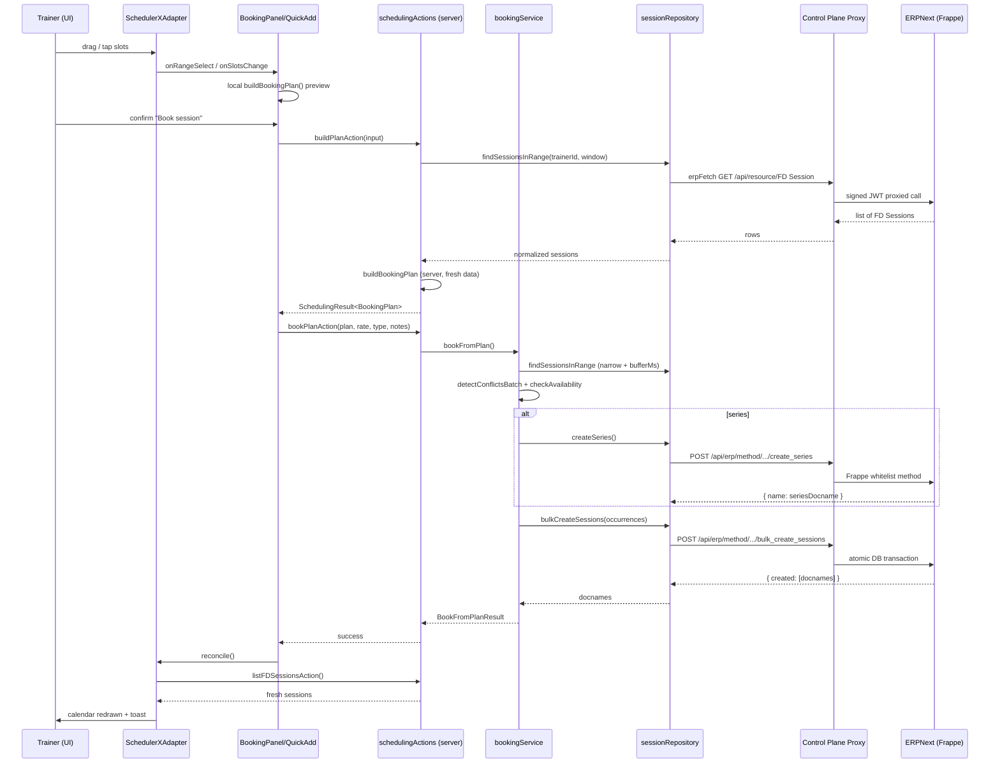

# FitDesk Scheduling & Planning System — Full Technical Handover Report

**Author role:** Senior SaaS Architect / Scheduling Systems Analyst
**Repository scanned:** `C:\Users\Lenovo\Dev\axis-erp` (read-only)
**Date:** 2026-05-11
**Scope:** All scheduling/planning code currently in `FitDesk/` (Next.js app) and the ERPNext-side surface in `provisioning_api/`.
**No code was modified.**

---

## 1. Executive Summary

FitDesk has a **production-grade-shaped, pilot-ready scheduling engine** built around two ERPNext custom DocTypes (`FD Session`, `FD Session Series`) and a strictly-typed, side-effect-free TypeScript engine. The implementation is unusually clean for its stage: the pure planning logic is fully separated from data access, the same `buildBookingPlan()` function runs on the client (preview) and the server (authority), and the server re-validates every plan against a fresh ERP fetch before persisting.

**Maturity level: Pilot-ready (Phase 1 + Phase A + Phase B).**
- Single & recurring booking, conflict + buffer detection, working-hours gate, reschedule, cancel, mark-complete (with auto Draft Sales Invoice), mark-no-show, optimistic concurrency via `version` field — all implemented and unit-tested (≈187 test cases across 5 scheduling test files).
- UI has been migrated to **Schedule-X** (Phases 1–13, see [scheduler-rollback.md](FitDesk/docs/scheduler-rollback.md)) and now supports drag-to-create, drag-to-reschedule, week/day/month views, quick-add popover and a full Booking Panel with by-week preview.

**Where it is not yet finished**: per-day working hours (collapsed to a single global window), package balance enforcement on booking (display-only), WhatsApp/session-reminder automation (no scheduled reminders wired up to FD Sessions), payment flow from completion (only a Draft Sales Invoice is created), per-series-level edits ("edit this and following"), waitlists, blackout dates, holidays, multi-trainer, and resource/room booking.

This system is the strongest product asset in the repo. It is ready for a closed pilot. It is **not** ready to be marketed as a smart-scheduling platform yet; that is the natural next phase.

---

## 2. Current Scheduling Architecture

```
┌─────────────────────────────────────────────────────────────────────────┐
│ UI                                                                     │
│   app/dashboard/schedule/page.tsx (RSC)                                │
│   components/modules/ScheduleView.tsx (Client orchestrator)            │
│   ├─ components/scheduling/SchedulerXAdapter.tsx  (Schedule-X bridge)  │
│   ├─ components/scheduling/BookingPanel.tsx       (multi-slot booking) │
│   ├─ components/scheduling/QuickAddPopover.tsx    (drag-to-create)     │
│   ├─ components/scheduling/SessionDetailsSheet.tsx (edit/cancel/done)  │
│   ├─ components/scheduling/SessionPreviewByWeek.tsx                    │
│   └─ components/scheduling/SchedulerErrorBoundary.tsx                  │
└──────────────────────────────────────────────┬──────────────────────────┘
                                               │ server actions
┌──────────────────────────────────────────────▼──────────────────────────┐
│ Server actions (Next.js 'use server')                                   │
│   actions/schedulingActions.ts                                          │
│     getSchedulerConfig | buildPlanAction | bookPlanAction               │
│     rescheduleSessionAction | cancelSessionAction                       │
│     completeSessionAction  | markNoShowAction | listFDSessionsAction    │
└──────────────────────────────────────────────┬──────────────────────────┘
                                               │
┌──────────────────────────────────────────────▼──────────────────────────┐
│ Domain services (server-only)                                           │
│   lib/scheduling/bookingService.ts   bookFromPlan() + ConflictError /   │
│                                       OutOfHoursError                   │
│   lib/scheduling/sessionService.ts   rescheduleOne / cancelSession /    │
│                                       completeSession / markNoShow      │
│   lib/scheduling/trainerConfig.ts    Trainer Settings → TrainerConfig   │
│                                       (React.cache per request)        │
└──────────────────────────────────────────────┬──────────────────────────┘
                                               │
┌──────────────────────────────────────────────▼──────────────────────────┐
│ Pure engine (isomorphic, no I/O)                                        │
│   lib/scheduling/engine.ts                                              │
│     resolveToUtc / toZonedParts / expandPattern                         │
│     detectConflict / detectConflictsBatch / checkAvailability           │
│     buildBookingPlan         (Luxon for timezone arithmetic)            │
└──────────────────────────────────────────────┬──────────────────────────┘
                                               │
┌──────────────────────────────────────────────▼──────────────────────────┐
│ Data access                                                             │
│   lib/scheduling/sessionRepository.ts                                   │
│   lib/erpnext/client.ts (erpFetch → Control Plane JWT proxy → Frappe)   │
└──────────────────────────────────────────────┬──────────────────────────┘
                                               │
┌──────────────────────────────────────────────▼──────────────────────────┐
│ ERPNext / Frappe (system of record)                                     │
│   provisioning_api/api/scheduling.py                                    │
│     bulk_create_sessions, create_series  (atomic, allow_guest=False)    │
│   DocType FD Session         (provisioning_api/api/doctype/fd_session)  │
│   DocType FD Session Series  (.../fd_session_series)                    │
│   Sales Invoice (Draft) via createInvoice() on completion               │
└─────────────────────────────────────────────────────────────────────────┘
```

### Layer-by-layer summary

- **UI layer** — Schedule-X based, dark theme, mobile-first. Drag-to-create, drag-to-reschedule (optimistic), tap-to-toggle 30-min slots for multi-select.
- **Server actions layer** ([actions/schedulingActions.ts](FitDesk/actions/schedulingActions.ts)) — Auth gate, trainer resolution, narrow-window fetch sizing, error mapping to typed `SchedulingErrorCode` (`AUTH | CONFLICT | OUT_OF_HOURS | VERSION_CONFLICT | IMMUTABLE_STATUS | EMPTY_PLAN | ERR`).
- **Scheduling engine** ([lib/scheduling/engine.ts](FitDesk/lib/scheduling/engine.ts)) — Pure, deterministic, Luxon-based, isomorphic. The same `buildBookingPlan()` powers the live preview and the server-side authority check.
- **Booking orchestration** ([lib/scheduling/bookingService.ts](FitDesk/lib/scheduling/bookingService.ts)) — 5-step atomic flow: narrow fetch → conflict re-check → availability re-check → create series doc (if any) → bulk create sessions (one Frappe whitelisted call, single DB tx).
- **Session repository** ([lib/scheduling/sessionRepository.ts](FitDesk/lib/scheduling/sessionRepository.ts)) — CRUD only, no business logic. UTC-string conversion to/from Frappe (`'YYYY-MM-DD HH:MM:SS'`).
- **ERPNext/control-plane integration** — Goes through the CP `/api/erp/...` proxy with a 5-min HS256 JWT (`signTenantJwt`). FitDesk never holds ERP API keys.
- **Notification/payment dependencies** — `completeSession` creates a Draft Sales Invoice via `createInvoice()` (item code `TRAINING-SESSION`); **no WhatsApp / reminder side-effect is wired to FD Session events anywhere**.

---

## 3. Core Scheduling Models Built So Far

### 3.1 Single session booking (one-off)

- **Purpose:** Book a single dated session for a client.
- **Files:** [engine.ts:335](FitDesk/lib/scheduling/engine.ts:335) `buildBookingPlan` (returns `kind: 'one_off'`), [bookingService.ts:79](FitDesk/lib/scheduling/bookingService.ts:79) `bookFromPlan`, [schedulingActions.ts:215](FitDesk/actions/schedulingActions.ts:215) `bookPlanAction`, UI: [QuickAddPopover.tsx](FitDesk/components/scheduling/QuickAddPopover.tsx), [BookingPanel.tsx](FitDesk/components/scheduling/BookingPanel.tsx).
- **Data flow:** UI builds local plan → user confirms → server `buildPlanAction` rebuilds plan with fresh data → `bookPlanAction` calls `bookFromPlan` → repository writes one `FD Session` doc with `seriesId = null`.
- **Strengths:** Same engine runs preview and authority. Conflicts/out-of-hours are visible before submit.
- **Limitations:** No waitlist; no package/credit consumption.
- **Improvements:** Hook into client package balance; emit a WhatsApp booking confirmation; add idempotency key.

### 3.2 Recurring session series

- **Purpose:** Weekly recurring sessions for N weeks across one or more weekday+time slots.
- **Files:** [engine.ts:107](FitDesk/lib/scheduling/engine.ts:107) `expandPattern`, [bookingService.ts:130](FitDesk/lib/scheduling/bookingService.ts:130) (createSeries → bulkCreateSessions), [sessionRepository.ts:258](FitDesk/lib/scheduling/sessionRepository.ts:258) `createSeries`, ERP: [scheduling.py:50](provisioning_api/provisioning_api/api/scheduling.py:50) `create_series`.
- **Data flow:** Plan classified as `'series'` when `selectedSlots.length > 1 || recurrenceWeeks != null` → derive `SeriesPattern` (unique weekday/time pairs) → expand to occurrences → conflict/availability check → `createSeries` first → `bulkCreateSessions` second (Frappe wraps in a single DB transaction, [scheduling.py:18](provisioning_api/provisioning_api/api/scheduling.py:18)).
- **Strengths:** Atomic per-batch insert at the DB; deterministic `occurrenceKey` (`YYYY-MM-DD:HH:mm`) enforced unique within a series in [fd_session.py:12](provisioning_api/provisioning_api/api/doctype/fd_session/fd_session.py:12); MAX_SERIES_WEEKS = 12 cap.
- **Limitations:** Only weekly frequency (`SeriesPattern.frequency: 'weekly'`); no monthly / daily / bi-weekly chip in the UI (engine supports `interval` but UI hard-codes 1); no "edit this and following" — only single occurrence override; series cannot be ended early or paused.
- **Improvements:** Surface `interval` in the UI; "edit series", "end series", "pause series" actions; "skip on holidays".

### 3.3 Session lifecycle

- **Purpose:** Model the state of every session.
- **Files:** [types/scheduling.ts:81](FitDesk/types/scheduling.ts:81) `FDSessionStatus`; transitions in [sessionService.ts](FitDesk/lib/scheduling/sessionService.ts).
- **States:** `scheduled | confirmed | completed | cancelled | no_show | skipped`.
- **Allowed mutations:** Only `scheduled` and `confirmed` are mutable (`MUTABLE_STATUSES` in [sessionService.ts:54](FitDesk/lib/scheduling/sessionService.ts:54)).
- **Strengths:** Explicit `ImmutableSessionError` for invalid transitions; preserves audit history (cancellation does not delete).
- **Limitations:** No `client_confirmed` distinct state (confirmed = trainer-only intent); `skipped` is defined but not produced by any current code path; no late-cancel policy.
- **Improvements:** Two-party confirmation; auto-`skipped` on detected schedule conflict during series operations.

### 3.4 Conflict detection

- **Purpose:** Prevent double-booking and respect buffer time.
- **Files:** [engine.ts:191](FitDesk/lib/scheduling/engine.ts:191) `detectConflict`, [engine.ts:223](FitDesk/lib/scheduling/engine.ts:223) `detectConflictsBatch`.
- **Mechanics:** Half-open interval test `cs < ee && ce > es` for overlap; buffer test expands existing intervals by `bufferMs`. Returns `'overlap' | 'buffer' | null`. Batch detection includes **intra-batch self-conflict** (each accepted candidate is added to the comparison set for the next candidate).
- **Strengths:** Pure, fast, fully test-covered; same logic on client and server; conflicts are surfaced visually on each row in `SessionPreviewByWeek`.
- **Limitations:** No per-trainer-conflict vs per-client-conflict separation — current scheduler is single-trainer; client conflicts are not detected at all (a client could in theory be double-booked across two trainers, but the platform is single-trainer per tenant today).
- **Improvements:** Add client-side overlap check when multi-trainer launches.

### 3.5 Trainer availability (working days / working hours)

- **Purpose:** Reject bookings outside the trainer's working window.
- **Files:** [engine.ts:251](FitDesk/lib/scheduling/engine.ts:251) `checkAvailability`, [trainerConfig.ts](FitDesk/lib/scheduling/trainerConfig.ts) (ERP→TrainerConfig mapper), [WorkingDaysEditor.tsx](FitDesk/components/modules/WorkingDaysEditor.tsx) (write path).
- **Data flow:** ERPNext `FitDesk Trainer Settings` (singleton) ← read on every render via `React.cache`-deduped fetch → `mapTrainerSettings` collapses **per-day windows** to a **single global** `startTime/endTime` using `min(start)` and `max(end)` across enabled days → `TrainerConfig`.
- **Strengths:** Single source of truth in ERPNext; graceful fallback to defaults (Mon–Fri 09:00–20:00, 15-min buffer) on ERP failure so the schedule page still renders.
- **Limitations (significant):**
  - Per-day windows are **lost** in the collapse to global min/max — a trainer who works 09:00–13:00 Mon and 16:00–20:00 Tue is allowed to book 14:00 Mon (in-window when collapsed) and the engine will not reject it.
  - No blackout dates, holidays, or vacation windows.
  - No multiple windows per day (e.g. AM + PM with a midday gap).
- **Improvements:** Extend `TrainerConfig` to per-day windows and per-day start/end; add `unavailable_dates` table; honor those in `checkAvailability`.

### 3.6 Buffers

- **Purpose:** Force a minimum gap between sessions.
- **Files:** [engine.ts:191](FitDesk/lib/scheduling/engine.ts:191) (buffer math); fed from `TrainerConfig.bufferMinutes` (default 15).
- **Strengths:** Single configurable knob; surfaced to the user when violated.
- **Limitations:** Global only — no per-client or per-session-type buffer.

### 3.7 Duration handling

- **Files:** UI chips `[30, 45, 60, 90]` in [BookingPanel.tsx:18](FitDesk/components/scheduling/BookingPanel.tsx:18); QuickAdd derives duration from drag distance; service stores `durationMinutes` on each session.
- **Strengths:** Drag-to-create produces an arbitrary duration in 30-min increments.
- **Limitations:** Reschedule does not currently allow duration change in the action (the planner-v2 plan flags adding `newDurationMinutes` to `rescheduleOne`, **not yet implemented**); BookingPanel uses fixed chips, no free-form input.

### 3.8 Rescheduling

- **Files:** [sessionService.ts:100](FitDesk/lib/scheduling/sessionService.ts:100) `rescheduleOne`, [schedulingActions.ts:246](FitDesk/actions/schedulingActions.ts:246) `rescheduleSessionAction`, UI: drag-and-drop in [SchedulerXAdapter.tsx:261](FitDesk/components/scheduling/SchedulerXAdapter.tsx:261) (`onEventUpdate`) and form-based in [SessionDetailsSheet.tsx:70](FitDesk/components/scheduling/SessionDetailsSheet.tsx:70).
- **Mechanics:** 6 guards — version check → immutable-state check → DST_SKIP check → narrow-window conflict re-check (excluding self) → availability re-check → persist with `isOverride: true` and `version + 1`.
- **Strengths:** Optimistic concurrency, DST handling, optimistic UI update with rollback on server failure.
- **Limitations:** Cannot reschedule a series-level pattern; cross-day drag suppressed by `columnDate !== startDateStr` guard ([SchedulerXAdapter.tsx:228](FitDesk/components/scheduling/SchedulerXAdapter.tsx:228)) for drag-create, but DnD reschedule on existing events does cross days via Schedule-X. **Needs verification** that the cross-day path validates against working-days config (it does, server-side, via `checkAvailability`).

### 3.9 Cancellation

- **Files:** [sessionService.ts:195](FitDesk/lib/scheduling/sessionService.ts:195) `cancelSession`, action wrapper at [schedulingActions.ts:272](FitDesk/actions/schedulingActions.ts:272).
- **Mechanics:** Version guard + immutable guard → status flipped to `cancelled`. Row retained.
- **Limitations:** No "cancel and refund credit"; no cancellation reason; no client-facing cancellation notice.

### 3.10 Completion

- **Files:** [sessionService.ts:228](FitDesk/lib/scheduling/sessionService.ts:228) `completeSession`.
- **Mechanics:** Version + immutable guards → if no existing invoice, `createInvoice()` is called with item code `TRAINING-SESSION`, qty 1, `rate = session.rate`, posting/due date = today → `updateSession({ status: 'completed', invoiceId })`.
- **Strengths:** Idempotent re-completion (reuses an existing `invoiceId` rather than creating duplicates); invoice creation happens **before** status flip so failures leave the session retryable.
- **Limitations:**
  - Hard-codes the same `posting_date` and `due_date` (today) — no payment terms.
  - The created invoice is **Draft** by default (Frappe default); no submission, no payment link generation.
  - No package-balance decrement.
  - No WhatsApp side effect (e.g., "Session complete, here's your invoice").
- **Improvements:** Configurable invoice posting policy; auto-submit; trigger payment-link creation; trigger optional WhatsApp.

### 3.11 No-show

- **Files:** [sessionService.ts:268](FitDesk/lib/scheduling/sessionService.ts:268) `markNoShow`. Status flip only; no invoice, no policy.
- **Limitation:** No "no-show fee" policy; no analytics view by client of no-show rates.

### 3.12 Invoice generation (from session)

- **Files:** [sessionService.ts:240](FitDesk/lib/scheduling/sessionService.ts:240); ERP write via `lib/erpnext/client.ts → createInvoice`. Hard dependency on a provisioned Item with code `TRAINING-SESSION` ([sessionService.ts:32](FitDesk/lib/scheduling/sessionService.ts:32)).
- **Strengths:** Clean separation — the scheduler does not duplicate invoice fields; the ERP doctype holds them.
- **Limitations:** See 3.10; also `tenantId` field on `FDSession` is hard-coded to empty string in the normalizer ([sessionRepository.ts:71](FitDesk/lib/scheduling/sessionRepository.ts:71)) — multi-tenant context lives in the JWT, not the row.

### 3.13 Payment relationship

- **Current state:** None at the scheduling layer. Session has an `invoice_id` field. Whether the invoice is paid is a separate UI surface (Invoices view). No "session marked paid" status or webhook.

### 3.14 WhatsApp / reminder relationship

- **Current state:** **No scheduled reminders are fired from FD Sessions.** Search confirms there is no `session_reminder` cron, no booking-confirmation send, and no completion-message send anywhere in scheduling code.
- WhatsApp templates `session_reminder` and `missed_session` are defined in `types/index.ts` and the messaging skill — but only the **manual** Messages view uses them. Reminder rules in `types/settings.ts:194` are typed but no consumer.
- This is the single biggest "implied but not built" feature.

---

## 4. Planning Models Built So Far

### 4.1 Drag-to-create

- File: [SchedulerXAdapter.tsx:212](FitDesk/components/scheduling/SchedulerXAdapter.tsx:212) (`onMouseDownDateTime` → drag-vs-tap threshold at 20px → `onRangeSelect`). Emits `{ date, startTime, endTime, anchorRect }`.

### 4.2 Calendar slot selection

- Tap-to-toggle multi-slot selection ([SchedulerXAdapter.tsx:247](FitDesk/components/scheduling/SchedulerXAdapter.tsx:247) `onClickDateTime`). Mobile users get multi-select without needing drag.

### 4.3 Booking preview (server-trustable)

- Same engine (`buildBookingPlan`) on the client → preview shows total sessions, weekly pattern chips, per-row conflict tags, summary stats.

### 4.4 Recurrence preview

- `SessionPreviewByWeek` ([components/scheduling/SessionPreviewByWeek.tsx](FitDesk/components/scheduling/SessionPreviewByWeek.tsx)) groups occurrences by Mon-Sun week with sticky week headers. Blocked rows tinted red with a "Blocked" badge.

### 4.5 Conflict preview

- Live in BookingPanel; blocking error banners before submit; same on QuickAdd.

### 4.6 Weekly planning

- Schedule-X week view is the default; day and month views are also wired in `createViewDay()` / `createViewMonthGrid()`.

### 4.7 Package / session balance awareness

- [BookingPanel.tsx:138](FitDesk/components/scheduling/BookingPanel.tsx:138) calls `fetchClientById` to fetch `remainingSessions`; this is **passed to `SmartClientPicker`** for display but does **not** block a booking from exceeding remaining sessions. This is "informed selection" rather than "enforced balance."

### 4.8 Client/session planning flow

- The picker (`SmartClientPicker`) is used in both BookingPanel and QuickAdd. Deep-linking via `/dashboard/schedule?client=<id>` pre-selects the client.

### 4.9 Future smart-scheduling direction implied by the code

- The `planner-v2.plan.md` document explicitly itemizes the next phases: **drag-to-create** (shipped), **DnD reschedule + resize** (DnD shipped, resize and `newDurationMinutes` **not yet implemented**), **waterfall overlap layout** (Schedule-X does this natively), **month view** (shipped, native), **Now line** (Schedule-X has this), **Smart-skip recurrence** (`onConflict: 'skip'` option in engine — **not implemented**), **keyboard shortcuts** (not implemented), **Natural language input** with `chrono-node` (not added — not in `package.json`).

---

## 5. Booking Flow — Current Implementation

### 5.1 Step-by-step

1. **User starts booking** — taps a cell or drags across multiple cells on the Schedule-X calendar.
2. **Selection routed**:
   - Drag (> 20px, ≥ 30 min): `onRangeSelect` → `QuickAddPopover` (fast inline path).
   - Tap or multi-tap: slots accumulate in `selectedSlots`; opens `BookingPanel` automatically when `selectedSlots.length > 0`.
3. **Client / duration / recurrence selected** — chips in BookingPanel (`SESSION_DURATIONS = [30, 45, 60, 90]`, `DURATION_WEEKS_OPTIONS = [2, 4, 8]`).
4. **Plan generated** — `buildBookingPlan()` runs locally with `existingSessions` from the in-memory state. Live conflict/availability preview.
5. **Conflicts checked client-side** — blocking error banner if any occurrence overlaps or violates the buffer (`bufferMinutes` from `TrainerConfig`).
6. **User confirms (Book session)** — `buildPlanAction()` is called server-side.
7. **Server revalidates** — `getSchedulerConfig` resolves trainer + auth → `findSessionsInRange` narrow fetch → re-build plan with **fresh** ERP data → return.
8. **Server books** — `bookPlanAction` → `bookFromPlan`:
   1. Narrow-window fetch widened by `bufferMs` on both sides.
   2. `detectConflictsBatch` server-side.
   3. `checkAvailability` server-side per occurrence.
   4. For series: `createSeries` ([scheduling.py:50](provisioning_api/provisioning_api/api/scheduling.py:50)) → returns docname.
   5. `bulkCreateSessions` ([scheduling.py:17](provisioning_api/provisioning_api/api/scheduling.py:17)) — single atomic Frappe call; the Frappe `validate()` hook in `FDSession` ensures `(series_id, occurrence_key)` uniqueness within a series.
9. **UI updates** — `onBooked()` triggers `reconcile()` → `listFDSessionsAction()` → calendar refreshes with the new sessions; toast confirmation; ICS download for single-session bookings.
10. **Downstream hooks**:
    - Invoice: **only** on `completeSession`, **not** on booking. Creates a Draft Sales Invoice.
    - Reminder/WhatsApp: **none** wired.
    - Calendar export: `.ics` file download + Google Calendar URL link surfaced (client-only; no server-side sync).

### 5.2 Booking sequence diagram



---

## 6. Session Lifecycle

```mermaid
stateDiagram-v2
    [*] --> scheduled : bookFromPlan() creates row
    scheduled --> confirmed : (manual; no automated transition wired)
    scheduled --> cancelled : cancelSessionAction
    confirmed --> cancelled : cancelSessionAction
    scheduled --> completed : completeSessionAction\n(creates Draft Sales Invoice)
    confirmed --> completed : completeSessionAction
    scheduled --> no_show : markNoShowAction
    confirmed --> no_show : markNoShowAction
    scheduled --> scheduled : rescheduleSessionAction\n(isOverride=true, version+1)
    confirmed --> confirmed : rescheduleSessionAction
    cancelled --> [*]
    completed --> [*]
    no_show --> [*]
    note right of completed
      Has invoice_id (Sales Invoice, Draft)
      invoice payment status lives in ERPNext
      Not back-propagated to FDSession.
    end note
    note left of scheduled
      skipped status exists on the
      DocType but no current code path
      produces it.
    end note
```



- **Financial linkage:** `completed` → `invoice_id` set → invoice may be Paid/Unpaid/Overdue in ERPNext, **but FDSession is not updated** when payment lands. The "paid" view is invoice-centric (separate Invoices module).

---

## 7. Conflict Detection & Safety Model

| Concern | Implementation | Location |
|---|---|---|
| Client conflict | Not implemented (single-trainer single-client model assumed) | — |
| Trainer conflict | Yes — `findSessionsInRange(trainerId, …)` filter | [sessionRepository.ts:121](FitDesk/lib/scheduling/sessionRepository.ts:121) |
| Time overlap | Half-open interval test `cs < ee && ce > es` | [engine.ts:206](FitDesk/lib/scheduling/engine.ts:206) |
| Buffer logic | `bufferMs` widens existing intervals on both sides; reports `'buffer'` distinctly from `'overlap'` | [engine.ts:209](FitDesk/lib/scheduling/engine.ts:209) |
| Server-authoritative validation | Yes — server rebuilds the plan with fresh data, then re-checks both conflict and availability in `bookFromPlan` | [bookingService.ts:106](FitDesk/lib/scheduling/bookingService.ts:106) |
| Optimistic concurrency | `version` field on FD Session; `VersionConflictError` if mismatch | [sessionService.ts:113](FitDesk/lib/scheduling/sessionService.ts:113) |
| Race-condition protection | Reschedule: re-fetches → version check → narrow-window conflict re-check excluding self | [sessionService.ts:140](FitDesk/lib/scheduling/sessionService.ts:140) |
| Intra-batch self-conflict | Each accepted candidate is added to the comparison set for subsequent candidates | [engine.ts:228](FitDesk/lib/scheduling/engine.ts:228) |
| Atomic series insert | Frappe wraps `bulk_create_sessions` in a single DB transaction; uniqueness enforced in DocType `validate()` | [scheduling.py:18](provisioning_api/provisioning_api/api/scheduling.py:18), [fd_session.py:12](provisioning_api/provisioning_api/api/doctype/fd_session/fd_session.py:12) |

**Gap:** There is no row-level lock or DB constraint on `(trainer_id, start_at)`. Two simultaneous bookings for the exact same slot from two browser tabs could in principle both pass the application conflict check and both insert. The MAX_SERIES uniqueness constraint is on `(series_id, occurrence_key)` only, **not on (trainer_id, start_at)**. For a single trainer this is a small risk but worth a DB-level index for the long term.

---

## 8. Recurrence Model

| Aspect | Behavior |
|---|---|
| Frequencies supported | `weekly` only (type allows future expansion) |
| Interval | Engine supports `interval` (every N weeks) but UI hard-codes 1 |
| Per-week slots | Multiple `{ weekday, localTime }` pairs per `SeriesPattern.slots` |
| Recurrence hard cap | `MAX_SERIES_WEEKS = 12` weeks from the Monday of the anchor week ([engine.ts:24](FitDesk/lib/scheduling/engine.ts:24)) |
| Soft caps | `pattern.count` (total occurrences) and `pattern.until` (inclusive date) |
| Storage | `pattern` stored as JSON string on `FD Session Series.pattern`; validated on save ([fd_session_series.py:12](provisioning_api/provisioning_api/api/doctype/fd_session_series/fd_session_series.py:12)) |
| Persisted sessions | One `FD Session` row per occurrence; linked via `series_id` |
| `occurrence_key` | `YYYY-MM-DD:HH:mm` deterministic key, unique within a series |
| `occurrence_index` | 0-based position in the generated series |
| `is_override` | Set true when a single occurrence is rescheduled — series-level edits would skip these rows (series-level edit is **not implemented yet**) |
| Conflict reporting | Per-occurrence in `plan.conflicts: Array<{ occurrence, kind }>` |
| DST handling | Spring-forward → occurrence silently skipped (logged via DST_SKIP throw caught in expander); fall-back → Luxon picks the earlier offset; tested ([engine.test.ts:101](FitDesk/lib/scheduling/__tests__/engine.test.ts:101), [354](FitDesk/lib/scheduling/__tests__/engine.test.ts:354)) |
| Timezone | IANA tz string per series and per session (stored separately on the row) — supports trainer relocating |

---

## 9. ERPNext Integration Model

### 9.1 DocTypes used

| DocType | Role | Source |
|---|---|---|
| `FD Session` | One row per scheduled occurrence | [fd_session.json](provisioning_api/provisioning_api/api/doctype/fd_session/fd_session.json) |
| `FD Session Series` | Pattern + series-level defaults | [fd_session_series](provisioning_api/provisioning_api/api/doctype/fd_session_series) |
| `Customer` | Client reference (`client_id` is a Link → Customer) | Standard Frappe |
| `Sales Invoice` | Created Draft on `completeSession` | Standard Frappe |
| `FitDesk Trainer Settings` | Singleton with `timezone`, `buffer_minutes`, `working_days` child table | `fitdesk-app` |

### 9.2 Field mapping (FD Session)

| App-level (`FDSession`) | Frappe field |
|---|---|
| `id` | `name` (random hash naming) |
| `trainerId` | `trainer_id` (Data, required) |
| `clientId` | `client_id` (Link → Customer, required) |
| `clientName` | `client_name` (fetched from `client_id.customer_name`) |
| `seriesId` | `series_id` (Data, optional) |
| `startAt` / `endAt` | `start_at` / `end_at` (Datetime, UTC) |
| `durationMinutes` | `duration_minutes` (Int) |
| `timezone` | `timezone` (Data) |
| `status` | `status` (Select: scheduled/confirmed/completed/cancelled/no_show/skipped) |
| `occurrenceKey` / `occurrenceIndex` | `occurrence_key` / `occurrence_index` |
| `isOverride` | `is_override` (Check) |
| `rate` | `rate` (Currency) |
| `sessionType` | `session_type` (Data) |
| `invoiceId` | `invoice_id` (Data) |
| `notes` | `notes` (Text) |
| `version` | `version` (Int) |

### 9.3 Source of truth

ERPNext is authoritative for all scheduling data. FitDesk holds no scheduling rows of its own (no Prisma/SQLite mirror of sessions). The SQLite database `auth.db` is for Better Auth only and a separate `message_log` table for WhatsApp audit.

### 9.4 Completion → invoice

- Item code `TRAINING-SESSION` must exist in ERPNext (provisioned by `provisioning_api/api/fitdesk_setup.py`).
- Invoice posting date / due date both `today()`.
- The created invoice is **Draft**, not submitted.
- `invoice_id` is stored on the session for idempotency.

### 9.5 Calls (Frappe-side)

- `provisioning_api.api.scheduling.bulk_create_sessions` — Whitelisted `methods=["POST"]`, **not** guest-accessible; runs as the provisioned API user.
- `provisioning_api.api.scheduling.create_series` — same.
- All other operations use Frappe's standard `/api/resource/<doctype>` endpoints proxied via the Control Plane.

---

## 10. UI/UX Scheduling System

### 10.1 Layout

- **Calendar:** Schedule-X via [SchedulerXAdapter.tsx](FitDesk/components/scheduling/SchedulerXAdapter.tsx). Default view `week`; available views `[week, day, monthGrid]`. Day boundaries `09:00–21:00`. Dark theme with custom event component (`TimeGridEventComponent`).
- **Status colors:** Six status-keyed calendars (scheduled blue, confirmed green, completed gray, cancelled red, no_show amber, skipped slate).
- **Booking surface:** Right-rail sticky `BookingPanel` on desktop (lg breakpoint); fixed bottom sheet on mobile.
- **Quick-add:** `QuickAddPopover` — anchored beside the drag rect on desktop, full-width bottom sheet (< 640 px).

### 10.2 Interactions

| Interaction | Behavior | File |
|---|---|---|
| Tap a 30-min cell | Toggles slot selection → BookingPanel | [SchedulerXAdapter.tsx:247](FitDesk/components/scheduling/SchedulerXAdapter.tsx:247) |
| Drag across cells | Drag-threshold 20 px; emits range → QuickAddPopover | [SchedulerXAdapter.tsx:212](FitDesk/components/scheduling/SchedulerXAdapter.tsx:212) |
| Tap a session | Opens `SessionDetailsSheet` | [SchedulerXAdapter.tsx:208](FitDesk/components/scheduling/SchedulerXAdapter.tsx:208) |
| Drag a session | Optimistic update → `rescheduleSessionAction`; reverts via `reconcile()` on failure | [SchedulerXAdapter.tsx:261](FitDesk/components/scheduling/SchedulerXAdapter.tsx:261) |
| Resize a session | Not implemented (Schedule-X DnD only; resize is in the planner-v2 plan, not built) | — |
| FAB | "Add suggested slot" → next 30-min slot today inside 09:00–20:30 | [ScheduleView.tsx:273](FitDesk/components/modules/ScheduleView.tsx:273) |
| Mobile multi-select | Tap-to-toggle works on touch (drag not required) | [SchedulerXAdapter.tsx:252](FitDesk/components/scheduling/SchedulerXAdapter.tsx:252) |
| Error boundary | Catches Schedule-X mount/render crashes, renders fallback | [SchedulerErrorBoundary.tsx](FitDesk/components/scheduling/SchedulerErrorBoundary.tsx) |

### 10.3 BookingPanel structure

Summary card → Calendar selection list → Client picker → Session length chips → Repeat (one-time / weekly) → Duration weeks chips → **Full preview by week** → Session type chips → Session fee input → conflict / out-of-hours banners → Book CTA.

### 10.4 ICS / calendar export

- On single-session success: `.ics` auto-download + Google Calendar link button + iOS-friendly data URI.
- No two-way Google Calendar / Apple Calendar sync.

### 10.5 2026 best-practices assessment

| Property | Status |
|---|---|
| Mobile-first interaction (touch tap, bottom sheet, safe-area-inset) | ✅ Strong |
| Drag-to-create with inline quick-add | ✅ Schedule-X native + custom popover |
| Drag-to-reschedule with optimistic update + rollback | ✅ Implemented |
| Live conflict preview + server re-check | ✅ Same engine both sides |
| Recurrence with by-week visual breakdown | ✅ `SessionPreviewByWeek` |
| DST / IANA timezone correctness | ✅ Tested |
| Accessible (keyboard, ARIA roles, dialog semantics) | ⚠️ Partial — `role="dialog"`, `aria-modal`, `aria-label` present on sheets; no keyboard shortcuts; focus-trap not visible |
| Now-line / "now" indicator | ⚠️ Schedule-X may provide; **needs verification** in this codebase |
| Resize event drag handle | ❌ Not built |
| Smart-skip recurrence on conflict | ❌ Not built (engine option missing) |
| Natural-language input | ❌ Not built (`chrono-node` not installed) |
| Waitlist / overflow display | ❌ |
| Offline / queue-when-offline | ❌ |

Overall the UX is well above the typical PT-SaaS bar and within reach of Google/Apple Calendar parity for the core flows.

---

## 11. Tests & Validation

### 11.1 Test files

| File | Tests | Lines | Coverage |
|---|---|---|---|
| `lib/scheduling/__tests__/engine.test.ts` | 84 | 831 | Pure engine: timezone, DST, expandPattern, conflicts, availability, full plan builder |
| `lib/scheduling/__tests__/bookingService.test.ts` | 17 | 312 | bookFromPlan — one-off + series, all error paths |
| `lib/scheduling/__tests__/sessionService.test.ts` | 38 | 455 | rescheduleOne, cancelSession, completeSession, markNoShow with invoice creation |
| `lib/scheduling/__tests__/schedulingActions.test.ts` | 36 | 433 | All server actions, auth gating, error mapping |
| `lib/scheduling/__tests__/trainerConfig.test.ts` | 12 | 109 | `mapTrainerSettings` defaults, day-name normalization, min/max collapse |
| **Total** | **~187** | **~2140** | |

### 11.2 What is covered

- Full timezone correctness (Asia/Riyadh + America/New_York DST cases).
- All recurrence boundary conditions (count cap, until cap, MAX_SERIES_WEEKS cap, bi-weekly interval).
- Conflict matrix (overlap vs buffer; intra-batch self-conflict; gap = exactly buffer).
- Availability gate per weekday and per time window.
- Optimistic concurrency (VersionConflictError) for all single-session mutations.
- ImmutableSessionError for all terminal statuses.
- Invoice idempotency (re-completion does not create a second invoice).
- All `SchedulingErrorCode` mapping paths.

### 11.3 What is missing

- No integration test against a real ERPNext instance (calls are mocked at the repository boundary).
- No end-to-end browser test (no Playwright, no Cypress) — the UI behaviors (drag, tap, optimistic UI) are not regression-tested.
- No DocType-level migration test.
- No load test on `bulk_create_sessions` (a 12-week × 5-per-week × 1 trainer = 60-row batch is well within Frappe limits, but no formal bound).

---

## 12. Strengths

1. **Architectural purity.** The engine is pure, deterministic, isomorphic, and Luxon-only. No `process.env`, no `'server-only'`, no React. Two callers (preview, authority) share a single implementation — the strongest correctness property a booking system can have.
2. **Server is authoritative.** Every booking is re-built and re-validated on the server with a fresh narrow-window fetch — client tampering or stale state can't slip a conflict through.
3. **Atomic series insert.** A 12-week multi-slot series is one Frappe transaction. No partial-insert states.
4. **Optimistic concurrency.** Every mutating action checks `expectedVersion`; UI surfaces `VERSION_CONFLICT` with a "reload and try again" message.
5. **DST safety.** Spring-forward gap detection (DST_SKIP), fall-back ambiguity resolution, both unit-tested with specific 2026 anchor dates.
6. **Status hygiene.** Six explicit statuses; mutable set tightly defined; cancellation preserves audit history.
7. **Error model.** Strongly-typed `SchedulingErrorCode` decouples the UI from message strings — a textbook contract.
8. **Schedule-X migration.** A documented, tagged, runbook-backed migration ([scheduler-rollback.md](FitDesk/docs/scheduler-rollback.md)) with a backup tag — a maturity signal.
9. **Single source of truth for working hours.** `TrainerConfig` reads from ERPNext on every render; `WorkingDaysEditor` writes back to the same DocType. No drift.
10. **Tests.** 187 scheduling tests at the unit level for ~860 lines of logic — exceptional ratio.

---

## 13. Weaknesses / Risks

### 13.1 Functional gaps

| Item | Risk | Impact |
|---|---|---|
| **No automated session reminders** (WhatsApp/email) tied to FD Session lifecycle | High | Marketed feature; pilot trainers will ask for it |
| **No package-balance enforcement** (display-only) | Medium | A booking can exceed the client's prepaid sessions silently |
| **Per-day working hours collapsed to global min/max** | Medium | Mon 09–13, Tue 16–20 → 14:00 Mon is accepted by the engine |
| **No "edit this and following" on a series** | Medium | Trainers can only reschedule one occurrence at a time |
| **Completion creates Draft invoice, no auto-submit, no payment link** | Medium | Manual extra step to bill the client |
| **No holidays / blackout dates** | Medium | Holiday weeks must be canceled occurrence-by-occurrence |
| **No `client_id` overlap check** | Low-Medium | Will matter when multi-trainer launches |

### 13.2 Technical risks

| Item | Risk | Mitigation today |
|---|---|---|
| No DB-level uniqueness on `(trainer_id, start_at)` | Low | Application-level check is the only guard; race tab-to-tab possible |
| `tenantId` is empty-string in `normalizeSession` | Low | Tenant context flows via JWT, not the row; safe but confusing |
| Schedule-X dependency on `temporal-polyfill` | Low | Browser-only polyfill, no obvious downside; pinned to ^0.3.2 |
| Rate cap on Frappe (60 rpm/IP per [PHASE_5_0_REPORT.md](FitDesk/docs/PHASE_5_0_REPORT.md)) | Medium | A heavy reconcile + book cycle could brush against it |
| Hard-coded item code `TRAINING-SESSION` | Low | Tested for existence; provisioned by `fitdesk_setup.py` |

### 13.3 UX risks

| Item | Risk |
|---|---|
| No undo on cancel / no-show | Trainer mis-tap deletes a booking from the calendar without recovery |
| No keyboard shortcuts | Power-user trainers can't book at speed |
| FAB suggested slot uses **local** browser time, not `trainerConfig.timezone` ([ScheduleView.tsx:33](FitDesk/components/modules/ScheduleView.tsx:33)) | Subtle bug for traveling trainers |

### 13.4 Demo risks

- A live demo of completion → invoice → payment requires the invoice to be submitted (it currently stays Draft). The flow looks half-finished if the operator forgets this.
- Reminders are the #1 feature trainers will ask about — there's no demo path for it.

---

## 14. Recommended Next Steps

### P0 — Before pilot

1. **WhatsApp confirmation on booking** — fire a `session_reminder`-style template message on `bookFromPlan` success (per existing approval-gated MVP rule, **with explicit confirmation**, see [CLAUDE.md](FitDesk/CLAUDE.md)).
2. **Auto-submit Sales Invoice on completion** (or expose a "Submit invoice" button on `SessionDetailsSheet`).
3. **Package balance hard gate** — if `remainingSessions < plan.summary.total`, surface a warning + require confirm.
4. **Per-day working hours** — extend `TrainerConfig` to a per-day map; update `checkAvailability`; ship behind a feature flag.
5. **Holiday / blackout dates** — minimal `unavailable_dates: string[]` field on Trainer Settings; rejected in `checkAvailability`.
6. **End-to-end smoke** (Playwright): book → reschedule → cancel → complete; verify ERPNext rows.

### P1 — After pilot

1. **Series-level edits** — "edit this and following", "end series", "pause series".
2. **Resize via DnD** — wire `newDurationMinutes` per the planner-v2 plan.
3. **Smart-skip recurrence** — `onConflict: 'skip'` option in `buildBookingPlan`.
4. **Undo** for cancel/no-show within N minutes.
5. **Keyboard shortcuts** + accessibility hardening (focus-trap on sheets, ARIA-labels everywhere).
6. **Now line** in `SchedulerXAdapter` (confirm Schedule-X provides; if not, custom overlay).
7. **DB uniqueness index** on `(trainer_id, start_at, status != 'cancelled')` in `FD Session.json`.

### P2 — Smart scheduling / AI layer

1. **Natural language quick-add** — `chrono-node` + fuzzy client match per planner-v2 plan §2.4.
2. **AI session suggester** — using `lib/claude.ts`: "given this client's history, propose 3 next-week slots" (assistive, not autonomous, per [CLAUDE.md](FitDesk/CLAUDE.md)).
3. **Conflict-resilient series builder** — auto-skip + propose alternative weeks to maintain N total occurrences.
4. **No-show predictor** — flag at-risk sessions based on history (display only).

### P3 — Native mobile scheduling

1. Wrap the existing Schedule-X mobile-first UI in a Capacitor / Expo shell, or expose a React Native client over the same server actions / API routes.
2. Push-notification reminders (replaces WhatsApp for in-app users).
3. Offline queue: tap-to-book while offline → sync on reconnect (the optimistic UI already implies the pattern).
4. Apple/Google Calendar two-way sync.

---

## 15. Final Assessment

**Is the system production-ready?**
For a single-trainer pilot with manual invoicing and no automated reminders — **yes**. The core booking, conflict, and lifecycle pipeline is solid, atomic, and well-tested. The Schedule-X migration is complete and reversible.

**What is demo-ready?**
Everything in §5 (booking flow), §6 (lifecycle), and §10 (UI). The drag-to-create + by-week preview + same-engine-both-sides story is genuinely impressive in a 10-minute demo. The mobile bottom-sheet path is competitive with Calendly.

**What is risky?**
- The "complete → invoice" path stops at Draft. If a demo claims the system bills clients automatically, you're one click short of true.
- Reminders are absent end-to-end — do not promise them in a pitch yet.
- Per-day working hours are silently collapsed; demo trainers with split schedules will see surprises.
- No real-DB integration tests; everything is mocked. A staging tenant must be exercised manually before pilot.

**What should NOT be touched yet?**
- `lib/scheduling/engine.ts` is asset-grade — don't refactor unless extending. Any change must keep pure semantics and ship with engine tests.
- `bookFromPlan`'s 5-step order (fetch → conflict → availability → series → bulk) is correct; do not reorder.
- The `version` optimistic-concurrency pattern is consistent throughout — keep it consistent in any new mutation.
- `provisioning_api/api/scheduling.py` is dangerously simple (and correct) — do not move business logic into Frappe. Frappe's role is atomic insert + DocType validation only.

**What should be improved next?**
1. WhatsApp confirmation on booking (single biggest pilot trainer ask).
2. Per-day working hours (silent correctness bug).
3. Auto-submit invoice on completion (closes the billing loop).
4. Package balance hard gate.
5. Holidays / blackout dates.

That set is roughly two weeks of focused work and turns the scheduler from "pilot-ready" to "GA-ready."

---

## Suggested Files to Save This As

Recommended location and filename (matches the existing docs style in `FitDesk/docs/PHASE_*_REPORT.md`):

```
FitDesk/docs/SCHEDULING_HANDOVER_REPORT.md
```

Alternative if you keep architecture docs separate:

```
FitDesk/docs/architecture/scheduling-handover-2026-05-11.md
```

If you want to surface it at the workspace level for cross-team visibility (consistent with `AUDIT_REPORT.md` and the `PHASE_*_PLAN.md` files at the workspace root):

```
docs/fitdesk-scheduling-handover-report.md
```

---

**End of report. No files were modified. Awaiting your direction on which path (if any) to save this to and which P0 items to schedule into the next phase.**
