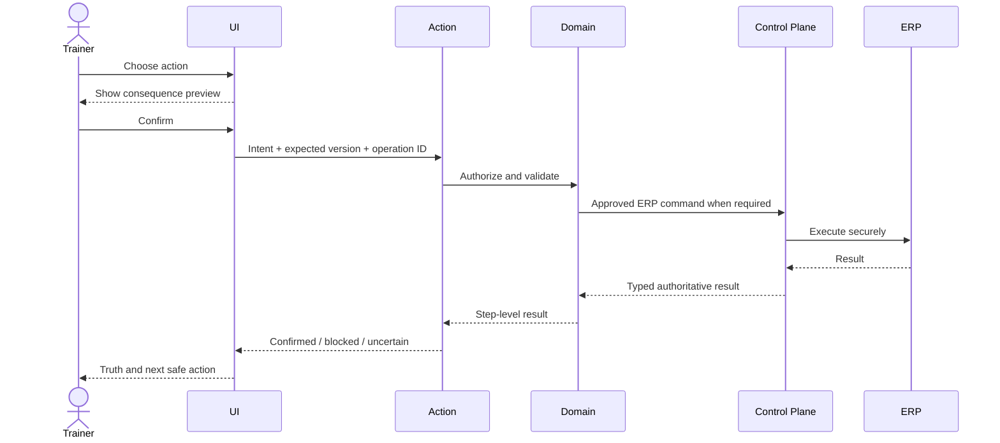

> **Status:** Target direction — adopted as canonical intent, NOT implemented state.
> **Adopted:** 2026-07-19 · **Source:** `FITDESK_SYSTEM_ARCHITECTURE_V1.md` (documentation pack) · **sha256 (source body):** `fb65be2b65550ecd200aa38aaa3d1c809b82d87b633a82ff8aabe35369b7b921`
> **Implementation reality:** see `docs/audits/FITDESK_IMPLEMENTATION_STATUS_RECONCILIATION_2026-07-19.md`
> **Rule:** This document describes intended product direction. Do not cite it as evidence
> that a capability exists. Verify against code before planning or estimating work.
>
---

# FitDesk System Architecture v1

```text
Product: FitDesk SaaS Platform
Document: System Architecture
Version: v1.0
Status: Architecture baseline — repository verification required
Stack: Next.js 14 App Router, TypeScript, Tailwind, Better Auth, Control Plane, Redis, Postgres, Prisma, ERPNext/Frappe, Evolution API
Generated: 2026-07-18
```

> **Adoption discipline:** This architecture is derived from approved project boundaries. Verify exact repository files, services, databases, APIs, and deployment configuration before adoption.

## 1. Objective

Provide fast trainer workflows while preserving tenant isolation, ERP authority, idempotent orchestration, recoverable distributed operations, and minimal infrastructure coupling.

## 2. Principles

1. Git is source of truth; Dokploy deploys from Git.
2. FitDesk never stores ERP credentials.
3. All ERP I/O uses the existing ERP client/proxy through the Control Plane.
4. The Control Plane performs no direct Docker execution.
5. The Provisioning Agent remains a thin bridge with no business logic.
6. Domain logic belongs in domain services/repositories, not UI components.
7. Consequential mutations are confirmed-first, version-aware, and idempotent.
8. Partial, stale, unavailable, and uncertain states are explicit.
9. AI is a proposal layer, never an execution path.
10. Existing working boundaries are audited before introducing abstractions.

## 3. System Context

```mermaid
flowchart LR
    T[Trainer Browser / Mobile Web] --> FD[FitDesk Next.js App]
    FD --> AUTH[Better Auth]
    FD --> DB[(FitDesk Postgres / Prisma)]
    FD --> REDIS[(Redis / BullMQ where used)]
    FD --> CP[Control Plane]
    CP --> EXEC[ERP Execution Service]
    EXEC --> ERP[ERPNext / Frappe HTTP API]
    FD --> WA[Evolution API / WhatsApp Adapter]
    FD --> AI[Model Provider Adapter]
    CP --> CPDB[(Control Plane Postgres)]
    CP --> CPREDIS[(Control Plane Redis / Queues)]
    PA[Provisioning Agent — thin bridge] --> CP
```



## 4. Component Responsibilities

### FitDesk product application

Owns:

- Next.js routes and URL-backed overlays;
- trainer-facing authentication integration;
- tenant-scoped server actions;
- domain services/repositories;
- scheduling validation/orchestration;
- goals, safety, programs, drafts, notes, events, and derived read models;
- approved ERP proxy invocation;
- messaging composition and normalized provider state;
- AI run orchestration and deterministic validation;
- selected offline intent and reconciliation UX.

Must not:

- store ERP credentials;
- call ERPNext from client components;
- embed domain rules in presentation;
- claim authoritative success optimistically;
- expose raw Control Plane/ERP execution details.

### Control Plane

Owns:

- tenant metadata and workspace mapping;
- provisioning and operational state machines;
- idempotency, locking, retries, and job orchestration;
- audit correlation and operational status;
- authorization of ERP execution requests;
- stable proxy boundary between product and ERP executor.

Must not own FitDesk UI or coaching business logic.

### Provisioning Agent

- Transitional transport/compatibility bridge only.
- No tenant state-machine decisions.
- No FitDesk business logic.
- No bypass around Control Plane.

### ERP Execution Service

- Server-only ERPNext/Frappe HTTP execution.
- Secure credential use.
- Request/response normalization.
- No product-specific business decisions.

### ERPNext

Authoritative for:

- ERP Customer identity;
- invoices;
- payments;
- credits, refunds, and corrections;
- accounting-facing records.

### Evolution API adapter

- Approved outbound sending.
- Provider delivery/event intake.
- Hardening-stage inbound webhooks.
- No authority over clients, schedules, packages, invoices, or payments.

### Model provider adapter

- Versioned provider abstraction.
- Strict runtime budgets.
- No direct product credentials or general-purpose tools.

## 5. Application Layering

```text
Route / Server Component / UI
→ Server Action
→ Domain service or orchestration service
→ Tenant-scoped repository and/or approved external client
→ Control Plane when ERP I/O is required
→ ERP Execution Service
→ ERPNext
```

Recommended boundaries, subject to audit:

```text
app/                     routes and server components
actions/                 authenticated entry points
lib/<domain>/             domain rules and orchestration
lib/<domain>/*Repository persistence abstractions
lib/erp/                  approved ERP client/proxy only
lib/ai/                   feature-scoped AI workflows
components/               presentation and interaction only
```

## 6. Declared Domain Paths

### Dashboard

```text
app/dashboard/page.tsx
→ dashboard reads
→ lib/dashboard/derive.ts
→ DashboardView / ActionCenter / BusinessHealth
```

`derive.ts` produces deterministic read models and must not mutate financial or scheduling state.

### Scheduling

```text
BookingSheet
→ actions/schedulingActions.ts
→ lib/scheduling/engine.ts
→ lib/scheduling/bookingService.ts
→ lib/scheduling/sessionRepository.ts
→ approved ERP proxy when required
```

The engine remains pure, structured, conflict-aware, DST-safe, package-aware, and recurrence-aware.

### Session completion

```text
SessionCompletionSheet
→ actions/schedulingActions.ts
→ lib/scheduling/sessionCompletionService.ts
→ progress persistence/event path [VERIFY]
→ session repository
→ package or invoice service
→ shared payment action for Paid Now
→ approved ERP proxy
```

One trainer review may produce multiple steps. The backend reports each step and prevents duplicate effects.

### Client creation

```text
AddClientSheet / AddClientForm
→ actions/clients.ts
→ approved ERP Customer path
→ tenant-scoped local client/goal/action/event writes
→ Client Hub
```

If ERP fails, do not create local authoritative client rows. If ERP succeeds and local projection fails, repair/reconcile rather than blindly delete the ERP Customer.

### Package assignment

```text
Client Hub
→ AssignPackageSheet
→ assignPackage action
→ package service/repository
→ ERP invoice path
→ optional shared payment path
→ authoritative refresh
```

### Payment

```text
Completion or Invoice/Statement
→ recordPayment action [exact path VERIFY]
→ approved ERP client/proxy
→ ERP Payment Entry
→ authoritative refresh
```

### Statement of Account

```text
Client Hub
→ approved ERP client/proxy
→ invoices/payments/credits/outstanding
→ normalized read model
→ summary + ledger
→ canonical payment/message actions
```

### Messaging

```text
Contextual entry point
→ MessageComposer
→ consent and identity check
→ editable draft
→ trainer confirmation
→ native handoff or Evolution API
→ normalized result
→ conversation/activity record
```

### AI

```text
Feature UI
→ feature Server Action
→ AI Run Orchestrator
→ tenant/entity authorization
→ context builder
→ prompt/schema/policy registry
→ provider adapter
→ schema validation
→ deterministic domain validation
→ trainer review
→ canonical application action
```

There is no AI-to-ERP or AI-to-write edge.

## 7. Data and State Classes

```text
Authoritative external
→ ERP Customer, invoices, payments, credits

Authoritative FitDesk
→ goals, safety, programs, workflow state, audit events

Derived
→ dashboard summaries, attention items, Client Pulse Lite, package runway

Draft/intent
→ forms, message drafts, offline completion intent, AI proposals

Provider evidence
→ WhatsApp send/delivery/inbound events
```

Operational states:

```text
loading · ready · confirmed empty · sparse · partial · stale · unavailable
failed · blocked · pending · reconciling · review required · uncertain · confirmed
```

## 8. Mutation Safety Pattern



Requirements:

- idempotency key per consequential operation;
- expected-version protection;
- tenant and actor authorization;
- immutable-state checks;
- no blind retry after uncertain external result;
- audit event linked to the operation identity.

## 9. Offline Architecture

```text
Selective read cache + trainer-authored intent ≠ local authoritative replica
```

Allowed local baseline:

- Today and limited upcoming-session context;
- goals/safety summary;
- as-of billing label;
- progress draft;
- intended outcome and next-session focus;
- expected versions and operation identity.

Online-confirmed only:

- client creation;
- booking/rescheduling;
- package assignment/consumption;
- invoice creation;
- payment;
- message sending;
- program publication;
- financial correction.

Reconciliation re-authenticates, reloads authority, compares versions, recalculates consequences, and executes once or requires trainer review.

## 10. Messaging Architecture

### MVP bridge

- canonical composer;
- native handoff or configured direct send;
- sent/failed records;
- client history.

### Hardening

- signed inbound webhooks;
- immutable provider events;
- deduplication/order handling;
- sender normalization and matching;
- conversation read model;
- unread/needs-reply/waiting;
- delivery normalization and recovery.

Inbound messages create information and Prepared Actions, not direct domain mutations.

## 11. AI Architecture

Recommended single product-server module:

```text
lib/ai/
├─ core/
├─ prompts/
├─ schemas/
├─ features/
└─ evals/
```

Controls:

- tenant-scoped minimal context;
- source references/context hash;
- prompt/schema/policy/model versions;
- strict output and domain validation;
- bounded calls/tools/tokens/time/cost;
- no generic memory;
- no raw SQL, shell, browser, ERP credentials, or write tools;
- review/approve/reject/expire states;
- kill switch and manual fallback.

## 12. Security Boundaries

- Authenticate before tenant resolution.
- Authorize each entity before context assembly.
- Verify webhook signature/timestamp.
- Prevent provider replay and duplication.
- Purpose-limit home locations, safety, finance, messages, and AI traces.
- Minimize sensitive raw logs.
- Clear or invalidate cache on logout, tenant switch, revocation, or expiry.
- Never expose internal reasoning or secrets.

## 13. Observability

Minimum correlation:

```text
requestId · traceId · tenantId · actorId · operationId · idempotencyKey
expectedVersion · domain action · entity IDs · Control Plane job ID
ERP result reference · provider event/message ID · AI versions
result/uncertainty · latency · error code
```

Capability health:

```text
Healthy · Degraded · Unavailable · Not configured · Unknown
```

## 14. Deployment

- Commit source changes to Git.
- Dokploy deploys from Git.
- No manual direct production edits except explicitly authorized incidents.
- Verify active repository to avoid cross-repo pollution.
- Run repository-confirmed tests, lint, typecheck, build, migration validation, and smoke checks.
- High-risk schema/production changes require verified backup and rollback.

## 15. Architecture Items to Verify

1. Actual product database and schema ownership.
2. Control Plane API/authentication contract.
3. ERP client/proxy implementation.
4. Queue/BullMQ ownership.
5. Session progress and completion orchestration.
6. Messaging records and Evolution API integration.
7. Offline/local persistence.
8. Existing AI module and eval code.
9. Program/catalog models and flags.
10. Deployment manifests and Dokploy configuration.
