> **Status:** Target direction — adopted as canonical intent, NOT implemented state.
> **Adopted:** 2026-07-19 · **Source:** `FITDESK_APPLICATION_SITEMAP_V1_1.md` · **sha256 (source body):** `ebf509e62761e0848cacea1284010ecdf18d794310d3b495dcb2b08cad9269fc`
> **Implementation reality:** see `docs/audits/FITDESK_IMPLEMENTATION_STATUS_RECONCILIATION_2026-07-19.md`
> **Rule:** This document describes intended product direction. Do not cite it as evidence
> that a capability exists. Verify against code before planning or estimating work.

---

# FitDesk Application Sitemap v1.1

```text
Product: FitDesk SaaS Platform
Document: Canonical Application Sitemap
Version: v1.1
Status: Product-owner revision — repository route audit required before adoption
Source: FITDESK_JOURNEY_MAP_V1 v1.12
Primary persona: Independent personal trainer
Navigation posture: Compact global navigation, one Client Hub, contextual workflows
Architecture posture: ERP-authoritative, trainer-sovereign, confirmed-first, tenant-scoped
Generated: 2026-07-18
Revision: Replaced Messages with Inbox; consolidated Invoices under Billing; removed Programs from primary navigation; moved program templates into Settings/Catalog; elevated persistent mobile Search; simplified More; promoted bounded offline read caching and completion-intent reconciliation into the MVP baseline.
```

> **Repository adoption rule**
>
> This document defines the intended product information architecture. Exact route names, existing aliases, implementation status, and feature flags must be audited against the active FitDesk repository and modernization branch before adoption. Land it as a documentation-only commit. Do not bundle it with application, schema, package, lockfile, or deployment changes.

---

## 1. Canonical Sitemap Decision

FitDesk remains a compact trainer operating system rather than a collection of disconnected feature modules.

### Desktop primary navigation

```text
Dashboard
Schedule
Clients
Inbox
Billing
Settings
```

### Mobile bottom navigation

```text
Home
Schedule
Clients
Inbox
More
```

### Persistent mobile controls

```text
Header Search
Profile / account control
Global action button
Connectivity / sync state when relevant
```

### Navigation doctrine

```text
Global navigation identifies where attention exists.
The Client Hub provides complete client context.
Canonical contextual workflows perform the work.
Settings manage reusable policy and catalogs.
```

Therefore:

- **Inbox** owns cross-client communication triage.
- **Billing** owns cross-client financial triage.
- **Program / Workout** stays inside the Client Hub.
- **Program templates and exercise catalogs** live under Settings/Catalog.
- **Search** is globally available and never hidden in More.
- **Offline capture** preserves context and intent; online reconciliation confirms authoritative consequences.

---

## 2. Information Architecture Principles

1. **One Client Hub:** Goals, safety, sessions, progress, program, packages, billing, attendance, communication, and lifecycle context stay together.
2. **One Inbox model:** Global Inbox and Client Hub Communication are two views of the same conversation records, not separate messaging systems.
3. **One program assignment flow:** Reusable templates may be managed globally, but client program assignment and revision happen inside the Client Hub.
4. **One canonical action per objective:** Multiple entry points may open the same Booking, Completion, Payment, Package, Message, or Resolver contract.
5. **Read-first surfaces:** Dashboard, Client Hub, Billing, Inbox, and system health explain state before asking the trainer to mutate it.
6. **Confirmed-first mutations:** No session, booking, package, invoice, payment, client, or message success is shown before authoritative confirmation.
7. **Offline intent, not offline authority:** Offline gym-floor work may be cached or queued, but financial and scheduling consequences remain pending until server reconciliation.
8. **Mobile-first contextual work:** Mobile uses full-height sheets or focused routes; desktop uses drawers, dialogs, and split workspaces.
9. **URL-backed meaningful state:** Refresh, Back, Forward, direct links, and recovery preserve significant workflow context.
10. **Existing working routes win:** Prefer aliases and incremental migration over route rewrites that risk current production behavior.

---

## 3. Whole-App Master Sitemap

```text
FitDesk
├─ Public and authentication
│  ├─ Product entry                                  /
│  ├─ Sign in                                       /sign-in
│  ├─ Sign up                                       /sign-up
│  ├─ Verify email                                  /verify-email
│  ├─ Forgot password                               /forgot-password
│  ├─ Reset password                                /reset-password
│  ├─ Privacy                                       /privacy
│  ├─ Terms                                         /terms
│  └─ Auth states
│     ├─ Session expired
│     ├─ Access denied
│     └─ Account unavailable
│
├─ Workspace activation
│  └─ Onboarding                                    /onboarding
│     ├─ Workspace introduction
│     ├─ Start Workspace
│     ├─ Provisioning progress
│     ├─ Waiting / blocked / failed / completed
│     ├─ Safe retry and recovery
│     └─ Continue to Dashboard
│
├─ Authenticated trainer app
│  ├─ Dashboard                                     /dashboard
│  │  ├─ Daily Brief
│  │  ├─ Today
│  │  ├─ Needs Attention
│  │  ├─ Business Health
│  │  ├─ First-client activation
│  │  ├─ Resume Work
│  │  ├─ Sync / reconciliation attention
│  │  ├─ Weekly Planning Brief                      [hardening]
│  │  ├─ Client Pulse Lite                          [pilot]
│  │  ├─ Trainer Focus Mode                         [pilot]
│  │  └─ Prepared Actions                           [pilot / gated]
│  │
│  ├─ Schedule                                      /schedule
│  │  ├─ Day view
│  │  ├─ Week view
│  │  ├─ Session cards
│  │  ├─ Empty / partial / unavailable states
│  │  ├─ Dated availability
│  │  ├─ Time-off and disruption review             [hardening]
│  │  └─ Open-slot recovery                         [future experiment]
│  │
│  ├─ Session context                               /sessions/{sessionId}
│  │  ├─ Session summary
│  │  ├─ Client goals and safety
│  │  ├─ Location and preparation
│  │  ├─ Package / rate context
│  │  ├─ Communication state
│  │  ├─ Client arrival                             [pilot]
│  │  ├─ Complete / no-show / cancel / reschedule
│  │  ├─ Offline completion state
│  │  └─ Session change summary
│  │
│  ├─ Clients                                       /clients
│  │  ├─ All clients
│  │  ├─ Search and filters
│  │  ├─ Smart deterministic views
│  │  │  ├─ Training today
│  │  │  ├─ No next session
│  │  │  ├─ Package low
│  │  │  ├─ Package exhausted
│  │  │  ├─ Payment overdue
│  │  │  ├─ Paused
│  │  │  ├─ Recently inactive
│  │  │  ├─ Safety review needed
│  │  │  └─ Setup needs attention
│  │  └─ Add Client entry
│  │
│  ├─ Client Hub                                    /clients/{clientId}
│  │  ├─ Today / Next Safe Action                   ?view=today
│  │  ├─ Overview                                   ?view=overview
│  │  ├─ Goals and Safety                           ?view=goals
│  │  ├─ Sessions and Recurring Schedule            ?view=sessions
│  │  ├─ Progress                                   ?view=progress
│  │  ├─ Program / Workout                          ?view=program [pilot]
│  │  ├─ Package and Billing                        ?view=billing
│  │  ├─ Statement of Account                       ?panel=statement
│  │  ├─ Attendance                                 ?view=attendance
│  │  ├─ Communication                              ?view=communication
│  │  ├─ Unified Activity                           ?view=activity
│  │  └─ Lifecycle
│  │     ├─ Pause
│  │     ├─ Resume
│  │     ├─ Reactivate
│  │     └─ Deactivate
│  │
│  ├─ Inbox                                         /inbox
│  │  ├─ Unread                                     ?filter=unread
│  │  ├─ Needs reply                                ?filter=needs-reply
│  │  ├─ Waiting for client                         ?filter=waiting
│  │  ├─ Failed delivery                            ?filter=failed
│  │  ├─ Unmatched sender                           ?filter=unmatched
│  │  ├─ Sent                                       ?filter=sent
│  │  ├─ Drafts / Resume Work                       ?filter=drafts
│  │  ├─ All conversations                          ?filter=all
│  │  └─ Conversation                               ?conversation={conversationId}
│  │
│  ├─ Billing                                       /billing
│  │  ├─ Overview                                   /billing
│  │  ├─ Balance due                                ?filter=outstanding
│  │  ├─ Overdue                                    ?filter=overdue
│  │  ├─ Recently paid                              ?filter=paid
│  │  ├─ Payment recovery                           ?filter=recovery
│  │  ├─ Invoices                                   /billing/invoices
│  │  ├─ Payments                                   /billing/payments [hardening]
│  │  ├─ Credits and corrections                    [hardening]
│  │  └─ Financial exceptions                       [hardening]
│  │
│  ├─ Invoice detail                                /billing/invoices/{invoiceId}
│  │  ├─ Authoritative invoice state
│  │  ├─ Payment history
│  │  ├─ Record payment
│  │  ├─ Receipt / proof                            [hardening]
│  │  ├─ Send reminder
│  │  └─ Financial correction                       [hardening]
│  │
│  ├─ Payment detail                                /billing/payments/{paymentId} [hardening]
│  │  ├─ ERP reference
│  │  ├─ Invoice allocation
│  │  ├─ Remaining balance
│  │  ├─ Receipt
│  │  └─ Correction resolver
│  │
│  ├─ Global Search                                 /search
│  │  ├─ Recent records
│  │  ├─ Clients
│  │  ├─ Sessions
│  │  ├─ Invoices
│  │  ├─ Payments
│  │  ├─ Locations
│  │  ├─ Conversations
│  │  ├─ Canonical commands
│  │  └─ Ask FitDesk                                [limited pilot]
│  │
│  └─ Settings                                      /settings
│     ├─ Trainer profile                            /settings/profile
│     ├─ Workspace / business                       /settings/workspace
│     ├─ Working hours                              /settings/working-hours
│     ├─ Dated availability                         /settings/availability
│     ├─ Scheduling rules                           /settings/scheduling
│     │  ├─ Time buffers
│     │  ├─ Default duration
│     │  ├─ Timezone
│     │  └─ Cancellation / no-show policy
│     ├─ Package catalog                            /settings/packages
│     │  ├─ Package templates
│     │  ├─ Default expiry rules
│     │  └─ Archived templates
│     ├─ Program library                            /settings/program-library [pilot]
│     │  ├─ Reusable program templates
│     │  ├─ Template categories
│     │  ├─ Template versions
│     │  └─ Archive template
│     ├─ Exercise catalog                           /settings/exercise-catalog [pilot]
│     ├─ Payment methods                            /settings/payment-methods
│     ├─ Locations                                  /settings/locations
│     ├─ Session types and defaults                 /settings/session-types [hardening]
│     ├─ Communications                             /settings/communications
│     │  ├─ Message templates
│     │  ├─ Reminder defaults
│     │  ├─ Communication Consent Center
│     │  ├─ WhatsApp handoff settings
│     │  └─ Inbound channel settings                [hardening]
│     ├─ Integrations                               /settings/integrations
│     │  ├─ ERP capability health
│     │  ├─ WhatsApp / Evolution API health
│     │  ├─ Calendar integration                    [when enabled]
│     │  └─ Integration recovery
│     ├─ Offline and sync                           /settings/offline [hardening]
│     │  ├─ Cached-data policy
│     │  ├─ Device storage status
│     │  ├─ Pending intents
│     │  └─ Clear local data
│     ├─ AI and automation                          /settings/ai [pilot / gated]
│     │  ├─ Feature availability
│     │  ├─ Trainer controls
│     │  ├─ Usage and limits
│     │  └─ Kill switches
│     ├─ Security and sessions                      /settings/security
│     ├─ Data and privacy                           /settings/data
│     └─ Help and support                           /settings/help
│
├─ Shared contextual workflows — not primary navigation
│  ├─ Add Client                                    AddClientSheet
│  ├─ Quick Add from Text                           inside Add Client [pilot]
│  ├─ Book / reschedule                             BookingSheet
│  ├─ Complete / resolve session                    SessionCompletionSheet
│  ├─ Offline completion reconciliation             SyncConflictResolver
│  ├─ Record payment                                RecordPaymentSheet
│  ├─ Assign / renew / replace package              Package workflow family
│  ├─ Compose / reply                               MessageComposer
│  ├─ Match unmatched sender                        SenderMatchingResolver
│  ├─ Resolve attention item                        AttentionResolver
│  ├─ Statement of Account                          Statement drawer/full-height sheet
│  ├─ Recurring Schedule Manager                    recurrence resolver
│  ├─ Client lifecycle resolver                     pause/resume/reactivate/deactivate
│  ├─ Duplicate Identity Resolver                   data-quality resolver
│  ├─ Missing Client Truth Resolver                 contextual data-quality resolver
│  ├─ Dated Availability Sheet                      scheduling exception
│  ├─ Day Disruption Resolver                       operational recovery
│  ├─ Financial Correction Resolver                 controlled ERP correction
│  ├─ Explanation panel                             Why This Happened
│  ├─ Session Change Summary                        before/after result
│  ├─ Program template picker                       inside Client Hub
│  ├─ Workout Builder                               client-contextual review [pilot]
│  ├─ Pre-Session Brief                             source-linked card [pilot]
│  ├─ Structured Progress Draft                     completion helper [pilot]
│  └─ Ask FitDesk panel                             read-only [limited pilot]
│
├─ Shared application and connectivity states
│  ├─ Loading
│  ├─ Ready
│  ├─ Confirmed empty
│  ├─ Sparse / activation
│  ├─ Partial data
│  ├─ Stale data
│  ├─ Unavailable
│  ├─ Failed
│  ├─ Blocked
│  ├─ Unauthorized
│  ├─ Not found
│  ├─ Saved on this device                          [MVP baseline]
│  ├─ Waiting to sync                               [MVP baseline]
│  ├─ Reconciling                                   [MVP baseline]
│  ├─ Review required                               [MVP baseline]
│  └─ Uncertain authoritative result
│
├─ Internal operational surfaces — outside trainer navigation
│  ├─ Provisioning operations and recovery
│  ├─ Tenant mapping audit
│  ├─ Job and idempotency inspection
│  ├─ Integration incident review
│  ├─ Webhook/event replay inspection
│  ├─ Message identity-matching audit
│  ├─ Offline intent and reconciliation audit
│  ├─ AI run audit and evaluation review            [pilot governance]
│  └─ Support-led controlled correction
│
└─ Future client-facing boundary — separate portal/app
   ├─ Secure portal entry                           /portal
   ├─ Identity verification                         /portal/verify
   ├─ Deferred onboarding                           /portal/onboarding
   ├─ Profile and communication preferences         /portal/profile
   ├─ Upcoming sessions                             /portal/sessions
   ├─ Approved client instructions                  /portal/preparation
   ├─ Statements and receipts                       /portal/statements
   ├─ Approved progress summary                     /portal/progress [future]
   └─ Dedicated PWA/native client app               decision-gated
```

---

## 4. Primary Navigation Model

### 4.1 Desktop

| Position | Destination | Purpose | Delivery posture |
|---|---|---|---|
| 1 | **Dashboard** | Today, attention, health, activation, recovery, and sync conflicts. | MVP / modernization |
| 2 | **Schedule** | Calendar, sessions, booking, availability, and disruption context. | MVP |
| 3 | **Clients** | Client discovery, smart views, Add Client, and Client Hub. | MVP |
| 4 | **Inbox** | Cross-client communication triage and conversation continuity. | Outbound bridge now; inbound hardening before broad rollout |
| 5 | **Billing** | Balance due, overdue work, invoices, payments, and recovery. | MVP + hardening |
| 6 | **Settings** | Reusable policy, catalogs, integrations, privacy, and controls. | MVP + hardening |

`Programs` is not a primary destination. `Ask FitDesk` belongs in Search/command or a contextual assistant panel.

### 4.2 Mobile

| Tab | Maps to | Primary job |
|---|---|---|
| **Home** | Dashboard | Understand today and resolve the next important item. |
| **Schedule** | Schedule | View, book, reschedule, and complete sessions. |
| **Clients** | Clients / Client Hub | Manage each client in context. |
| **Inbox** | Inbox | See unread conversations and reply without losing context. |
| **More** | Billing, Settings, Help, Account | Secondary administration only. |

### 4.3 Mobile More

```text
More
├─ Billing
├─ Settings
├─ Help and support
├─ Account
└─ Sign out
```

Search, Inbox, Programs, and frequent client actions must not be placed in More.

### 4.4 Global action button

```text
+
├─ Book session
├─ Add client
├─ Record payment
└─ Draft message
```

Each entry opens the same canonical workflow used elsewhere. The button is not a second navigation drawer.

---

## 5. Inbox and Communication Architecture

### 5.1 Product rule

```text
Global Inbox answers: Who needs a reply?
Client Hub Communication answers: What is the complete client context?
```

Both use the same tenant-scoped conversation, message, delivery, consent, and identity-matching records.

### 5.2 Global Inbox

```text
Inbox
├─ Unread
├─ Needs reply
├─ Waiting for client
├─ Failed delivery
├─ Unmatched sender
├─ Sent
├─ Drafts / Resume Work
└─ All conversations
```

Conversation context may show:

- client identity or unmatched sender;
- last inbound and outbound messages;
- unread and waiting state;
- consent and preferred channel;
- related next session;
- balance or package fact only when operationally relevant;
- suggested safe actions;
- editable reply draft.

### 5.3 Client Hub Communication

```text
Client Hub > Communication
├─ Current conversation
├─ Inbound and outbound timeline
├─ Unread / waiting state
├─ Delivery status
├─ Consent and channel
├─ Prepared replies
├─ Related session / invoice / package context
└─ Open full Inbox conversation
```

### 5.4 Inbound safety boundary

An inbound client message may prepare intent, but never performs the mutation.

```text
“Move tomorrow to 6 PM”
→ possible rescheduling intent
→ show current session and parsed requested time
→ trainer opens canonical reschedule flow
→ conflict and version checks run
→ trainer confirms
```

Inbound text never automatically:

- books, reschedules, cancels, or completes a session;
- changes a package or billing mode;
- marks an invoice paid;
- records payment;
- waives a consequence;
- changes safety state.

### 5.5 Unmatched sender resolver

```text
Unknown sender
→ show normalized phone
→ show evidence-backed possible client matches
→ link to existing client, create client draft, or leave unmatched
→ preserve audit
```

No automatic client creation or merge is allowed.

### 5.6 Delivery staging

**MVP / pilot-safe now**

- canonical MessageComposer;
- outbound logging;
- sent and failed delivery state;
- native WhatsApp deep-link handoff when direct sending is unavailable;
- client-level communication history;
- draft preserved when leaving and returning.

**Production-hardening before broad rollout**

- Evolution API inbound webhooks;
- global Inbox;
- unread, needs-reply, waiting, and unmatched states;
- duplicate/replayed-event protection;
- identity matching;
- Client Hub conversation timeline;
- delivery/read-state normalization;
- reconnect and webhook recovery.

**Future / approval-gated**

- AI WhatsApp Concierge;
- policy-bound automatic replies;
- trainer takeover;
- conversation summaries;
- inbound intent Prepared Actions.

---

## 6. Client Hub Sitemap

```text
Client Hub
├─ Header
│  ├─ Client identity
│  ├─ Lifecycle state
│  ├─ Billing mode
│  ├─ Safety indicator
│  ├─ Current package / rate
│  └─ Primary actions
│
├─ Today / Next Safe Action
│  ├─ Current or next session
│  ├─ Location and access
│  ├─ Preparation
│  ├─ Next-session focus
│  ├─ Goal and safety summary
│  ├─ Package / balance context
│  └─ One deterministic safe action
│
├─ Goals and Safety
│  ├─ Primary goal
│  ├─ Additional goals
│  ├─ Client-stated sub-goals
│  ├─ Trainer-assessed sub-goals
│  ├─ Urgency
│  ├─ Conflict resolution
│  └─ Safety state and review
│
├─ Sessions and Recurring Schedule
│  ├─ Upcoming
│  ├─ Past
│  ├─ Unresolved outcomes
│  ├─ Active recurring series
│  ├─ Change occurrence / future / series
│  └─ Book session
│
├─ Progress
│  ├─ Current measurements
│  ├─ Session progress entries
│  ├─ Current next focus
│  ├─ Measurement changes
│  └─ Formal report                            [future]
│
├─ Program / Workout                            [pilot]
│  ├─ Current assigned program
│  ├─ Upcoming workout
│  ├─ Program history
│  ├─ Trainer notes
│  ├─ Assign from template
│  ├─ Create client-specific program
│  ├─ Exercise swap
│  ├─ Propose revision
│  └─ Version comparison
│
├─ Package and Billing
│  ├─ Billing mode
│  ├─ Active package / session rate
│  ├─ Package balance and expiry
│  ├─ Package runway
│  ├─ Package usage history
│  ├─ Balance due
│  ├─ Assign / renew / replace
│  └─ Open Statement of Account
│
├─ Statement of Account
│  ├─ Balance due
│  ├─ Overdue
│  ├─ Invoiced
│  ├─ Paid
│  ├─ Credits
│  ├─ Chronological ledger
│  ├─ Record payment
│  ├─ Send reminder
│  ├─ Download / share                         [hardening]
│  └─ Financial correction                    [hardening]
│
├─ Attendance
│  ├─ Period and denominator
│  ├─ Completed
│  ├─ Cancelled
│  ├─ No-show
│  └─ Rescheduled
│
├─ Communication
│  ├─ Current conversation
│  ├─ Inbound / outbound timeline
│  ├─ Unread / waiting state
│  ├─ Consent and preferred channel
│  ├─ Delivery result
│  ├─ Prepared reply
│  └─ Related operational context
│
├─ Unified Activity
│  ├─ Sessions
│  ├─ Progress
│  ├─ Goals and safety
│  ├─ Program versions
│  ├─ Packages and billing
│  ├─ Payments and corrections
│  ├─ Messages
│  └─ Trainer notes
│
└─ Lifecycle
   ├─ Pause
   ├─ Resume
   ├─ Reactivate
   ├─ Deactivate
   └─ Resolve remaining sessions, package, billing, and communication
```

---

## 7. Program and Workout Architecture

### 7.1 Structural decision

```text
Program templates
→ reusable trainer-owned catalog under Settings

Client program
→ client-specific, versioned record inside Client Hub
```

Programs are removed from desktop and mobile primary navigation.

### 7.2 Client assignment journey

```text
Client Hub > Program / Workout
→ Assign from template
→ open contextual template picker
→ preview client-specific adaptation
→ edit
→ review goals, safety, equipment, duration, and assumptions
→ trainer confirms
→ create Client Program v1
```

The trainer does not leave the client workspace to perform normal assignment or revision.

### 7.3 Template management

```text
Settings > Program Library
├─ Create template
├─ Edit template
├─ Categorize
├─ Version
├─ Archive
└─ Review usage

Settings > Exercise Catalog
├─ Approved exercises
├─ Equipment requirements
├─ Contraindication metadata
├─ Variations
└─ Archive
```

### 7.4 Version rule

```text
Template v3 assigned to Sarah
→ Client Program v1 derived from Template v3

Template later changes to v4
→ Sarah's active program remains unchanged
→ trainer may compare and prepare a new client revision
```

AI may prepare a revision but cannot publish, overwrite, or bypass deterministic safety validation.

---

## 8. Search and Mobile Ergonomics

### 8.1 Persistent search

Mobile shows a Search icon in the header on every primary destination. Desktop supports a visible search affordance plus `Cmd/Ctrl+K`.

```text
Search FitDesk
├─ Recent
├─ Clients
├─ Sessions
├─ Conversations
├─ Invoices
├─ Payments
├─ Locations
└─ Commands
```

Search is tenant-scoped, permission-filtered, and deep-links into canonical records and workflows.

### 8.2 Search is not More

Search must not require:

```text
More → Search
```

It is a persistent global utility because it is used during time-sensitive, one-handed work.

### 8.3 Mobile surface rules

| Experience | Mobile | Desktop |
|---|---|---|
| Search | Full-screen | Command palette / overlay |
| Inbox thread | Full-height route/sheet | Split inbox/thread workspace |
| Add Client | Full-height stepped sheet | Drawer/dialog |
| Booking | Full-height bottom sheet | Drawer/dialog with schedule context |
| Session completion | Full-height sheet | Right drawer |
| Statement | Full-height route/sheet | Wide drawer or full page |
| Program template picker | Full-height sheet | Wide drawer/dialog |
| Message Composer | Bottom/full-height sheet | Drawer/dialog |
| Record Payment | Bottom/full-height sheet | Drawer/dialog |
| Attention resolver | Focused full-height flow | Contextual drawer |
| Day disruption | Full-screen resolver | Wide workspace |

Critical actions always have visible controls. Gestures may accelerate but never replace them.

---

## 9. Billing Sitemap

`Billing` replaces `Invoices` as the global destination because the trainer's actual job is broader than invoice browsing.

```text
Billing
├─ Overview
│  ├─ Balance due
│  ├─ Overdue
│  ├─ Recently paid
│  ├─ Uncertain results
│  └─ Financial recovery
├─ Invoices
│  ├─ All
│  ├─ Outstanding
│  ├─ Overdue
│  ├─ Paid
│  ├─ Partially paid                         [hardening]
│  └─ Credited / corrected                   [hardening]
├─ Payments                                  [hardening]
│  ├─ Recent
│  ├─ Allocation
│  ├─ Receipts
│  └─ Recovery
├─ Credits and corrections                   [hardening]
└─ Payment methods                           deep-link to Settings
```

Financial work may also begin from Dashboard, Client Hub, Session Completion, Statement, Search, or Inbox, but every action reuses the canonical Billing contracts.

Manual invoice creation remains hidden from the normal trainer workflow.

---

## 10. Canonical Workflow Sitemap

| Trainer objective | Main entry points | Canonical surface | Confirmed result |
|---|---|---|---|
| Add client | Dashboard, Clients, global action, Search | Add Client | ERP-linked client and Client Hub, or exact recovery state. |
| Quick Add from text | Add Client | Quick Add review | Evidence-linked draft returned to canonical Add Client. |
| Book or reschedule | Schedule, Client Hub, Dashboard, completion success, Search | BookingSheet | Conflict-aware booking or structured conflict. |
| Complete session | Today, Session Detail, Needs Attention | Completion Sheet | Outcome, progress, and conditional financial effects. |
| Capture completion offline | Session Detail / Today | Local completion intent | Saved locally; no authoritative package/invoice/payment claim. |
| Reconcile offline completion | Resume Work, session sync state | Sync Conflict Resolver | Confirmed completion or explicit trainer review. |
| Resolve unresolved session | Needs Attention, Session Detail | Same Completion Sheet | Restored context with duplicate-effect prevention. |
| Record payment | Completion, Billing, Invoice, Statement, Client Hub | Record Payment | Confirmed ERP Payment Entry and refreshed balance. |
| Assign or renew package | Client Hub, package warning, completion recovery | Package workflow family | Confirmed package and package invoice/payment state. |
| Send or reply | Inbox, Client Hub, Dashboard, Session, Billing | MessageComposer | Trainer-confirmed send/handoff and logged result. |
| Match inbound sender | Inbox | Sender Matching Resolver | Controlled link, client draft, or unmatched state. |
| Review client account | Client Hub, Billing, overdue item | Statement of Account | ERP-authoritative summary and ledger. |
| Manage recurring schedule | Client Hub, Schedule, Session Detail | Recurring Schedule Manager | Revalidated occurrence/future/series change. |
| Resolve attention item | Dashboard / deep link | Attention Resolver | One explained priority and safe action. |
| Resume incomplete work | Dashboard / deep link | Resume Work Resolver | Continued draft or recovered uncertain state. |
| Pause/reactivate/deactivate | Client Hub | Lifecycle Resolver | Consequence preview and canonical sub-actions. |
| Correct financial error | Statement, Invoice, Payment | Financial Correction Resolver | Approved ERP correction; no silent rewrite. |
| Resolve duplicate identity | Add Client warning, Client Hub | Duplicate Identity Resolver | Controlled survivor and preserved lineage. |
| Resolve missing truth | Booking, Completion, Client Hub | Data Quality Resolver | Fix and return to interrupted workflow. |
| Add dated availability | Schedule, Settings | Availability Sheet | Dated exception without global-hours rewrite. |
| Resolve day disruption | Schedule, Dashboard | Day Disruption Resolver | Per-item scheduling and communication recovery. |
| Assign or revise program | Client Hub | Program picker / Workout Builder | Client-specific version awaiting/after trainer approval. |
| Ask operational question | Search, Dashboard | Ask FitDesk | Read-only source-linked answer; no mutation. |

---

## 11. Offline and Reconciliation Sitemap

### 11.1 MVP boundary

```text
Offline FitDesk preserves context and intent.
Online FitDesk confirms authority and consequences.
```

### 11.2 Offline-capable baseline

```text
Cache
├─ Today
├─ Upcoming session context
├─ Limited Client Hub preparation context
├─ Current goal and safety summary
├─ Current billing label with as-of timestamp
└─ Trainer-authored drafts

Capture locally
├─ Session progress draft
├─ Intended session outcome
├─ Next-session focus
└─ Completion intent with observed versions
```

### 11.3 Remain online-confirmed

```text
Package deduction
Invoice creation
Payment recording
Package assignment or renewal
Booking or rescheduling
Financial correction
WhatsApp sending
Client identity creation
Program publication
```

### 11.4 Reconciliation flow

```text
Saved on device
→ Waiting to sync
→ Authenticate tenant and trainer
→ Reload session, billing, package, invoice, and payment state
→ Compare expected versions
→ Classify result

Unchanged
→ execute canonical completion once

Changed but still valid
→ show revised consequence
→ trainer reviews and confirms

Package exhausted / billing changed / session superseded
→ preserve progress
→ open explicit resolver

Uncertain result
→ query authoritative state before any retry
```

### 11.5 Trainer-facing states

```text
Saved on this device
Waiting to sync
Checking current session and billing state
Review required — authoritative state changed
Session completed and financial effects confirmed
Result could not be confirmed — do not retry yet
```

### 11.6 Security boundary

Offline storage is selective and encrypted during production hardening. It must not become a full local ERP replica. Tenant switch, logout, revocation, or expiry must make cached data unavailable or remove it safely.

---

## 12. Recommended URL-Backed States

Exact query names are illustrative and require repository reconciliation.

```text
/clients?sheet=add
/clients?sheet=add&mode=quick-text
/schedule?sheet=booking
/schedule?sheet=availability
/schedule?resolver=day-disruption
/sessions/{sessionId}?sheet=complete
/sessions/{sessionId}?sheet=reschedule
/sessions/{sessionId}?resolver=sync-conflict
/clients/{clientId}?view=program
/clients/{clientId}?view=program&sheet=select-template
/clients/{clientId}?view=program&sheet=build
/clients/{clientId}?view=program&sheet=revise
/clients/{clientId}?view=communication
/clients/{clientId}?view=communication&conversation={conversationId}
/clients/{clientId}?sheet=assign-package
/clients/{clientId}?sheet=message
/clients/{clientId}?panel=statement
/clients/{clientId}?sheet=recurring-schedule
/clients/{clientId}?sheet=lifecycle&action=pause
/clients/{clientId}?sheet=data-quality
/clients/{clientId}?sheet=duplicate
/inbox?filter=needs-reply
/inbox?filter=unmatched
/inbox?conversation={conversationId}
/billing?filter=overdue
/billing/invoices/{invoiceId}?sheet=record-payment
/billing/invoices/{invoiceId}?sheet=message
/billing/invoices/{invoiceId}?resolver=correction
/dashboard?resolver=attention&item={attentionId}
/dashboard?resolver=resume&item={resumeItemId}
/search
/search?panel=ask-fitdesk
/settings/program-library
/settings/exercise-catalog
```

Rules:

- URLs restore context but never encode sensitive authoritative payloads.
- Reloading an unconfirmed flow never executes it.
- Completed, pending, or uncertain operations re-query authoritative state before retry.
- Old working routes should redirect or alias safely during migration.

---

## 13. Settings Sitemap

### MVP / pilot-safe

```text
Settings
├─ Profile
├─ Workspace
├─ Working Hours
├─ Scheduling
├─ Package Catalog
├─ Program Library                         [pilot]
├─ Exercise Catalog                        [pilot]
├─ Payment Methods
├─ Locations
├─ Communications
├─ Integrations
└─ Security
```

### Production-hardening

```text
Settings
├─ Dated Availability
├─ Cancellation and No-show Policy
├─ Session Types and Defaults
├─ Reminder Defaults
├─ Communication Consent Center
├─ Inbound Channel Configuration
├─ Integration Health Center
├─ Offline and Sync
├─ Data and Privacy
├─ Policy Change Impact Preview
└─ AI Feature Controls and Usage
```

Guardrails:

- Client-specific program assignment does not belong in Settings.
- Client-specific package assignment does not belong in Settings.
- Payment recording does not belong in Settings.
- Manual invoice creation remains hidden.
- One-time scheduling exceptions do not rewrite global policy.
- Configure-in-context returns the trainer to the interrupted workflow.

---

## 14. Routes That Must Not Become Primary Navigation

```text
Programs
Program drafts
Exercise catalog
Goals
Safety
Progress
Attendance
Client packages
Payments
Receipts
Data Quality
Duplicate Clients
Needs Attention
Resume Work
Client Pulse
Prepared Actions
AI Runs
Availability Exceptions
Day Disruption
Financial Corrections
Integration Health
Consent Center
Offline Sync Queue
```

They remain contextual because they belong to a client, session, invoice, setting, or specific operational problem.

---

## 15. Shared State and Recovery Contract

```text
Operational state
├─ Loading
├─ Ready
├─ Confirmed empty
├─ Sparse / activation
├─ Partial
├─ Stale
├─ Unavailable
├─ Failed
├─ Blocked
├─ Saved on device
├─ Waiting to sync
├─ Reconciling
├─ Review required
├─ Uncertain authoritative result
└─ Recovered
```

Each consequential state explains:

```text
What happened
Why it happened
Which records are affected
What was safely preserved
What succeeded
What remains authoritative
What is uncertain
What the trainer can safely do next
```

Unknown or unavailable financial data is never displayed as zero.

---

## 16. Actor and Access Boundaries

### Trainer app

The trainer may view and explicitly confirm authorized client, scheduling, package, billing, payment, communication, and program operations.

### Client during MVP

The client does not sign into FitDesk. The client receives trainer-confirmed outputs through approved communication channels. Inbound messaging may enter the Inbox, but client text alone never executes consequential workflow changes.

### Future client portal

The portal is a separate application boundary and must not expose trainer-private notes, other clients, raw ERP complexity, unrestricted scheduling, unapproved financial actions, or internal AI reasoning.

### Internal support and Control Plane

Provisioning, tenant mapping, job orchestration, locks, retries, ERP execution details, webhook replay, offline reconciliation audit, AI governance, and support correction remain outside trainer and client navigation.

---

## 17. Scope Separation

### 17.1 MVP / pilot-safe now

- Authentication and `/onboarding` workspace activation.
- Dashboard, Today, Needs Attention, Business Health, activation, and Resume Work.
- Schedule and conflict-aware BookingSheet.
- Clients, Add Client, Client Hub, goals, safety, billing mode, and client package assignment.
- Session details and confirmed session outcomes.
- Unified completion direction with quick progress and financial consequence preview.
- Billing overview, invoices, invoice detail, payment recording, and Statement of Account.
- Canonical MessageComposer, outbound history, delivery state, and native WhatsApp handoff.
- Persistent global Search on mobile and desktop.
- Program / Workout inside Client Hub, with contextual template selection behind pilot controls.
- Program Library and Exercise Catalog under Settings, not primary navigation.
- Offline read cache for Today and limited Client Hub context.
- Offline progress and completion-intent capture with visible pending state.
- Reconciliation that auto-applies only when authoritative consequences are unchanged.
- Pilot Quick Add, structured completion, pre-session brief, Client Pulse Lite, booking parser, message copilot, constrained Workout Builder, and limited Ask FitDesk behind controls.

### 17.2 Production-hardening soon

- Inbound Evolution API events and the global Inbox.
- Unread, needs-reply, waiting, unmatched sender, and identity-matching flows.
- Client Hub inbound/outbound conversation timeline.
- Webhook deduplication, replay safety, reconnect handling, and delivery normalization.
- Encrypted local storage, cache expiry, background sync, device revocation, and multi-device conflict handling.
- Dedicated offline reconciliation and uncertain-result recovery.
- URL-backed overlays across all canonical workflows.
- Recurring Schedule Manager, Package Runway, lifecycle resolver, partial payments, receipts, corrections, credits, refunds, and statement download/share.
- Communication Consent Center, Integration Health Center, Day Disruption Manager, Duplicate Identity Resolver, and policy impact preview.
- Full accessibility, audit, idempotency, stale/partial truth, and recovery testing.

### 17.3 Future platform architecture later

- Secure client portal and later PWA/native client app.
- AI WhatsApp Concierge with policy-bound replies and trainer takeover.
- Formal progress reports, voice input, adaptive program suggestions, gap optimization, travel advice, delay orchestration, and advanced analytics.
- Predictive risk or next-best-action ranking only after deterministic rules and data quality are proven.
- Any autonomous scheduling, package, invoice, payment, safety, or program mutation requires separate approval.

---

## 18. Mermaid Master Sitemap

```mermaid
flowchart TD
    AUTH[Authentication] --> ONB[Onboarding / Workspace Activation]
    ONB --> DASH[Dashboard]

    DASH --> SCH[Schedule]
    DASH --> CLI[Clients]
    DASH --> INBOX[Inbox]
    DASH --> BILLING[Billing]
    DASH --> SET[Settings]

    SCH --> SES[Session Detail]
    SCH --> BOOK[BookingSheet]
    SCH --> AVAIL[Dated Availability]
    SCH --> DISRUPT[Day Disruption Resolver]

    SES --> COMPLETE[Session Completion]
    COMPLETE --> OFFLINE{Online?}
    OFFLINE -->|Yes| CONFIRM[Authoritative Completion]
    OFFLINE -->|No| INTENT[Save Completion Intent]
    INTENT --> RECON[Sync Reconciliation]
    RECON --> CONFIRM
    RECON --> CONFLICT[Review Conflict]

    CLI --> ADD[Add Client]
    CLI --> HUB[Client Hub]

    HUB --> TODAY[Today / Next Safe Action]
    HUB --> GOALS[Goals & Safety]
    HUB --> SESSIONS[Sessions & Recurrence]
    HUB --> PROGRESS[Progress]
    HUB --> PROGRAM[Program / Workout]
    HUB --> CLIENTBILL[Package & Billing]
    HUB --> STATEMENT[Statement]
    HUB --> ATTEND[Attendance]
    HUB --> COMM[Communication]
    HUB --> ACTIVITY[Unified Activity]
    HUB --> LIFE[Lifecycle Resolver]

    PROGRAM --> PICKER[Program Template Picker]
    PICKER --> LIB[Settings Program Library]

    INBOX --> THREAD[Conversation]
    THREAD --> COMPOSER[MessageComposer]
    THREAD --> MATCH[Unmatched Sender Resolver]
    COMM --> THREAD

    BILLING --> INV[Invoices]
    BILLING --> PAYMENTS[Payments]
    INV --> INVDET[Invoice Detail]
    INVDET --> PAY[Record Payment]
    INVDET --> COMPOSER
    INVDET --> CORRECT[Financial Correction]

    DASH --> ATTENTION[Needs Attention Resolver]
    DASH --> RESUME[Resume Work]
    DASH --> PULSE[Client Pulse Lite]

    SET --> HOURS[Working Hours]
    SET --> PACKAGES[Package Catalog]
    SET --> LIB
    SET --> EXERCISES[Exercise Catalog]
    SET --> METHODS[Payment Methods]
    SET --> LOCATIONS[Locations]
    SET --> CONSENT[Consent Center]
    SET --> HEALTH[Integration Health]

    SEARCH[Persistent Search] --> CLI
    SEARCH --> SES
    SEARCH --> THREAD
    SEARCH --> INVDET
    SEARCH --> ACTIONS[Canonical Commands]

    FUTURE[Future Client Portal] -. separate boundary .-> PORTAL[Sessions / Statements / Profile]
```



---

## 19. Repository Adoption Checklist

1. Confirm the active FitDesk repository and branch.
2. Inventory the current Next.js App Router paths and navigation components.
3. Reconcile `/messages` with the proposed `/inbox` route using safe aliases or redirects.
4. Reconcile `/invoices` with the proposed `/billing/invoices` route without breaking deep links.
5. Remove any planned Programs primary-nav entry; verify Client Hub program surfaces and feature flags.
6. Verify where template and exercise catalog management currently live before moving route ownership.
7. Verify current mobile header, bottom tabs, FAB, and More menu.
8. Verify the Search implementation and make it persistent before removing any existing access path.
9. Verify Evolution API capabilities, webhook contracts, identity mapping, deduplication, and delivery semantics before enabling inbound Inbox behavior.
10. Audit local persistence before implementing offline caching; classify every cached field by sensitivity and expiry.
11. Verify session, package, invoice, payment, and idempotency/version contracts before enabling offline completion intents.
12. Mark each route and capability as `existing`, `alias`, `planned`, `feature-flagged`, `hardening`, or `future`.
13. Adopt this sitemap in a documentation-only commit.
14. Implement changes atomically with redirects, tests, and rollback-safe commits.

Recommended documentation commit:

```text
docs(product): revise canonical FitDesk application sitemap
```

---

## 20. Final Sitemap Statement

```text
FitDesk has six stable desktop destinations:
Dashboard, Schedule, Clients, Inbox, Billing, and Settings.

FitDesk has five stable mobile tabs:
Home, Schedule, Clients, Inbox, and More.

Search remains persistent.
Programs remain client-contextual.
Program templates remain reusable catalog data under Settings.
Offline work preserves drafts and intent, not authoritative consequences.

Everything else is either:
- a contextual view inside a core destination;
- a canonical workflow opened from multiple entry points;
- an internal operational surface outside trainer navigation; or
- a future client-facing boundary requiring separate approval.
```
