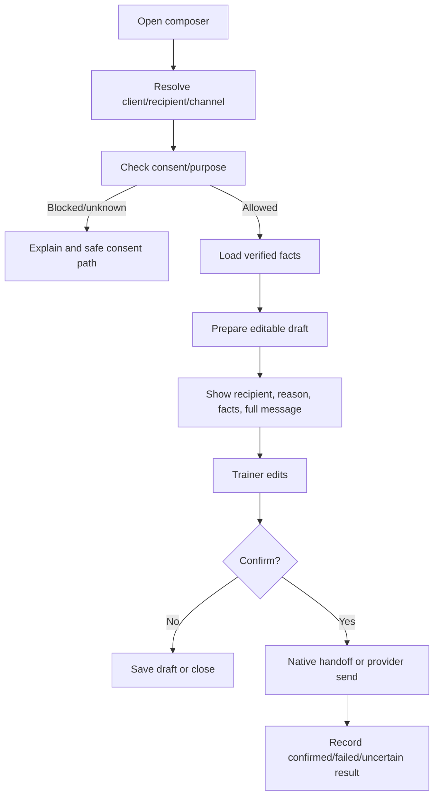
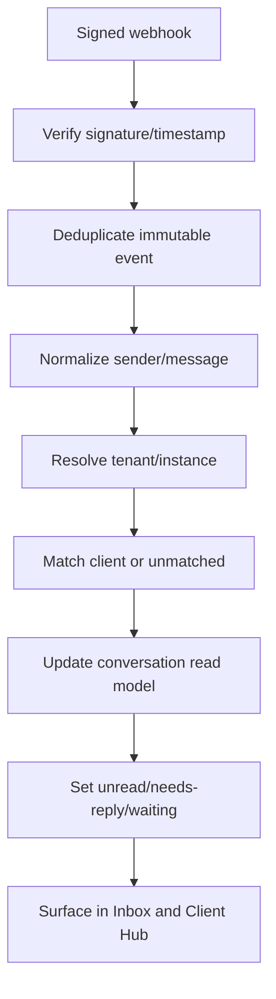

> **Status:** Target direction — adopted as canonical intent, NOT implemented state.
> **Adopted:** 2026-07-19 · **Source:** `FITDESK_INBOX_AND_COMMUNICATION_SPECIFICATION_V1.md` (documentation pack) · **sha256 (source body):** `5a8545861a147a692830519d8c46ee526a6ee7bdcb4a4fd5142459f03075b094`
> **Implementation reality:** see `docs/audits/FITDESK_IMPLEMENTATION_STATUS_RECONCILIATION_2026-07-19.md`
> **Rule:** This document describes intended product direction. Do not cite it as evidence
> that a capability exists. Verify against code before planning or estimating work.
>
---

# FitDesk Inbox and Communication Specification v1

```text
Product: FitDesk SaaS Platform
Document: Inbox and Communication Specification
Version: v1.0
Status: Staged specification — repository/provider verification required
Primary route direction: /inbox
Generated: 2026-07-18
```

> **Adoption discipline:** Verify the existing Messages route, MessageComposer, Evolution API capabilities, provider event semantics, consent fields, and data model before adoption.

## 1. Intent

FitDesk communication preserves the One Client Hub principle while giving the trainer one cross-client place to see who needs a reply.

```text
Global Inbox answers: Who needs a reply?
Client Hub Communication answers: What is the complete client context?
```

Both views use the same tenant-scoped conversation, message, delivery, consent, and sender-matching records.

## 2. Delivery Stages

### MVP / pilot-safe bridge

- canonical MessageComposer;
- trainer-reviewed recipient and full message;
- native WhatsApp deep-link handoff when direct sending is unavailable;
- approved outbound sending when configured;
- sent and failed states;
- client-level communication history;
- draft preservation where persistence exists.

### Production-hardening Inbox

- authenticated Evolution API inbound webhooks;
- immutable inbound/outbound events;
- deduplication, ordering, replay protection, reconnect handling;
- global Inbox;
- unread, needs reply, waiting, failed delivery, unmatched sender, sent, drafts, all conversations;
- sender identity matching;
- Client Hub conversation timeline;
- delivery/read-state normalization;
- Communication Consent Center;
- integration health and recovery.

### Future / approval-gated

- AI WhatsApp Concierge;
- safe automatic acknowledgment;
- grounded low-risk FAQ;
- bounded clarification;
- trainer takeover/handoff;
- Prepared Actions from inbound intent.

No future stage grants silent scheduling or financial authority.

## 3. Information Architecture

```text
Inbox
├─ Unread
├─ Needs reply
├─ Waiting for client
├─ Failed delivery
├─ Unmatched sender
├─ Sent
├─ Drafts / Resume Work
└─ All conversations
```

Route direction:

```text
/inbox?filter=needs-reply
/inbox?conversation={conversationId}
/clients/{clientId}?view=communication
```

Exact paths require audit and safe compatibility with any current `/messages` route.

## 4. Conversation Workspace

Desktop:

- split list/thread workspace;
- keyboard navigation;
- context panel only when useful.

Mobile:

- Inbox list route;
- full-height thread;
- visible back navigation;
- one-handed composer.

Thread context may include:

- matched client or unmatched sender;
- normalized address/channel;
- consent state;
- latest inbound/outbound messages;
- unread/waiting state;
- delivery failures;
- next session when useful;
- package/balance only when relevant and authorized;
- prepared action or safe next step.

## 5. Canonical MessageComposer

Entry points:

- Inbox;
- Client Hub;
- Session detail/confirmation;
- invoice/payment reminder;
- package renewal;
- Dashboard attention item.



Rules:

- full recipient and message are reviewable;
- AI may change wording only;
- dates, amounts, balances, references, units, locations, and policy facts come from verified sources;
- all entry points reuse one send contract;
- opening composer never sends.

## 6. Message Families and Fact Bundle

Families:

- booking confirmation;
- session reminder;
- location change;
- running late;
- package renewal;
- payment reminder;
- no-show follow-up;
- cancellation acknowledgment;
- welcome;
- progress encouragement.

Conceptual fact bundle:

```ts
type MessageFactBundle = {
  reason: string;
  verifiedFacts: Array<{
    key: string;
    value: string;
    sourceType: string;
    sourceId: string;
    observedAt: string;
  }>;
  prohibitedClaims: string[];
  consentState: string;
};
```

A fact-integrity check runs before send.

## 7. Conceptual Data Model

### Conversation

```text
id · tenantId · clientId nullable · normalized address · channel · state
lastInboundAt · lastOutboundAt · lastMessageAt · takeover state · timestamps
```

### Message

```text
id · conversationId · tenantId · direction · providerMessageId
clientId nullable · body/reference · status · consent snapshot
actor/AI preparation metadata · createdAt
```

### ProviderEvent

```text
providerEventId · messageId nullable · event type · provider timestamp
received timestamp · signature result · payload reference/hash
deduplication key · processing result
```

### DeliveryState

```text
prepared · handed_off · queued · sent · delivered · read · failed · unknown
```

Delivery does not equal client confirmation.

### SenderMatchDecision

```text
normalized sender · candidate IDs · evidence · selected action · actor · reason · time
```

### ConsentRecord

```text
clientId · channel · permitted purpose · state · source
confirmedAt · confirmedBy · revokedAt
```

## 8. Inbound Processing — Hardening



Requirements:

- reject/quarantine unverifiable events;
- preserve provider event reference;
- prevent replay/duplicate message creation;
- handle out-of-order events;
- keep sender matching tenant-scoped;
- support idempotent replay;
- never call core mutation services directly from message text.

## 9. Unmatched Sender Resolver

```text
Unknown sender
→ normalized address
→ evidence-backed tenant candidates
→ Link existing / Create client draft / Leave unmatched
→ explicit review and audit
```

No automatic merge or client creation. A client draft still uses normal Add Client duplicate and ERP creation checks.

## 10. Inbound Intent Boundary

```text
“Move tomorrow to 6 PM”
→ classify possible reschedule intent
→ show current session and interpreted requested time
→ open canonical reschedule
→ run normal conflict/version checks
→ trainer confirms
```

Inbound text never directly:

- books/reschedules;
- cancels/no-shows/completes;
- changes billing mode or price;
- assigns/renews/pauses/consumes package;
- creates/amends/cancels invoice;
- records/refunds/reallocates payment;
- waives consequences;
- changes safety or consent.

## 11. Inbox State Rules

- **Unread:** unacknowledged inbound message.
- **Needs reply:** latest relevant event needs trainer response and no approved reply exists.
- **Waiting for client:** trainer sent a question/request and is awaiting response; not a delivery state.
- **Failed delivery:** failed or unconfirmed outbound operation requiring review.
- **Unmatched sender:** conversation has no confirmed tenant-client link.
- **Sent:** operational log of outbound attempts/results, not proof of client action.
- **Drafts / Resume Work:** reversible drafts and interrupted communication workflows only.

## 12. Consent and Privacy

```text
Phone exists ≠ WhatsApp consent
Preferred channel ≠ verified permission
Delivered ≠ client confirmation
Occurrence override ≠ permanent preference
```

Requirements:

- purpose-based consent;
- source and confirmation time;
- revocation/opt-out;
- quiet-hours/provider policy where applicable;
- trainer-private context excluded unless selected;
- home address, safety, and finance shown only when operationally necessary;
- retention/deletion policy for bodies and provider payloads.

## 13. Failure and Recovery

### Outbound fails

Preserve recipient, reason, message, and fact bundle; show integration state; prevent duplicate send; allow safe retry or handoff.

### Delivery unknown

Do not claim delivery. Query provider where supported and expose duplicate-protection state.

### Webhook processing fails

Keep immutable event, mark processing state, allow idempotent replay, and expose capability impact.

### Identity uncertain

Keep unmatched; expose no other client context; require explicit decision.

### Consent unavailable

Block affected purpose, preserve draft, offer safe consent/alternative channel.

## 14. Future AI Concierge Boundary

```text
Level 0 — AI drafts; trainer sends
Level 1 — classify/summarize inbound signals
Level 2 — safe receipt acknowledgment
Level 3 — grounded low-risk FAQ
Level 4 — bounded clarification
Level 5 — transaction automation: not approved
```

Every message receives an answer, clarification, acknowledgment/escalation, unsupported-content acknowledgment, or policy/security block. Trainer takeover stops autonomous replies. No level silently mutates schedules, programs, packages, invoices, payments, consent, or safety.

## 15. Accessibility

- Clear conversation/thread landmarks.
- Keyboard navigation and focus behavior.
- Sender, direction, time, and delivery announced.
- Failed/unknown uses text/icons, not color alone.
- Composer fields retain labels.
- New-message/send-result live announcements.
- Mobile touch targets.

## 16. Acceptance Criteria

### MVP bridge

1. All outbound entry points reuse one composer.
2. Recipient/full text reviewed before send/handoff.
3. Consent failure preserves draft and blocks send.
4. Confirmed, failed, and unknown are distinct.
5. Client history is tenant-scoped.
6. No message/AI draft triggers core mutation.

### Hardening Inbox

1. Signed inbound events are deduplicated/replay-safe.
2. Unread/needs-reply/waiting is deterministic and explainable.
3. Unknown senders see no client context before matching.
4. Inbox and Client Hub show the same conversation truth.
5. Provider failures preserve context and recover safely.
6. Cross-tenant, spoofed, out-of-order, and duplicate tests pass.

## 17. Audit Items

- Current `/messages` route/components/model.
- MessageComposer/outbound integration.
- Evolution API version, auth, webhooks, events, delivery semantics.
- Provider IDs/dedup constraints/event tables.
- Consent fields and requirements.
- Native handoff behavior.
- Client communication history.
- Feature flags/integration health.
- Send/failure/replay/matching/tenant tests.
