> **Status:** Target direction — adopted as canonical intent, NOT implemented state.
> **Adopted:** 2026-07-19 · **Source:** `FITDESK_JOURNEY_MAP_V1_v1.12.md` · **sha256 (source body):** `bd4a6bba039e1331d2cb68a194d5cac8c912e5a6008a3cbd5fe474834910443e`
> **Implementation reality:** see `docs/audits/FITDESK_IMPLEMENTATION_STATUS_RECONCILIATION_2026-07-19.md`
> **Rule:** This document describes intended product direction. Do not cite it as evidence
> that a capability exists. Verify against code before planning or estimating work.

---

# FitDesk Journey Map v1

```text
Product: FitDesk SaaS Platform
Document: Canonical User Journey Map
Version: v1.12
Status: Product-owner direction incorporated — external docs-only draft pending adoption
Intended repository path: docs/product/FITDESK_JOURNEY_MAP_V1.md
Canonical repository: C:\Users\Lenovo\Dev\axis-erp\FitDesk
Primary persona: Independent personal trainer
Journey order: Daily operating journey → Client lifecycle → Signup/provisioning → Connected master map
Architecture posture: ERP-authoritative, trainer-sovereign, confirmed-first, incremental
Generated: 2026-07-18
Revision: Added the FitDesk Intelligence Layer and complete AI journey: pilot LLM workflows, constrained Workout Builder, Quick Add, progress parsing, pre-session briefs, booking and messaging copilots, bounded Ask FitDesk, Client Pulse Lite, shared AI governance/evaluations, and future voice, progression, risk, inbound-intent, predictive scheduling, and controlled autonomy
```

> **Adoption discipline**
>
> This draft is intentionally outside the repository. It should land only as its own documentation commit after the active repository, branch, execution log, and modernization-branch diff are reconciled. It must not be bundled with application, schema, package, lockfile, or deployment changes.

---

## 1. Purpose

This document maps how FitDesk is used as a trainer operating system.

It is not a screen inventory and not an aspirational feature list. It connects:

1. The trainer’s daily operating journey.
2. The client lifecycle.
3. First-time signup and workspace activation.
4. Focused sub-journeys for billing, sessions, goals, scheduling, communications, and future client onboarding.
5. A lightweight engineering layer based only on verified product boundaries and code paths.

The primary question is:

> **What does the trainer need to understand, decide, and complete next to run the coaching business safely?**

The map follows the FitDesk dashboard north star:

```text
Detect meaningful operational risk
→ explain why it matters
→ prepare the next safe action
→ let the trainer review and confirm
→ reflect the verified result
```

---

## 2. Evidence and Status Boundary

### 2.1 What “MVP” means here

For this document:

```text
MVP = capability verified on main
    + capability materially present on the active UI/UX modernization branch
```

A capability on the modernization branch may still be uncommitted, unmerged, or awaiting verification. This document therefore distinguishes product capability from repository adoption state.

### 2.2 Status legend

| Marker | Meaning |
|---|---|
| **MVP — MAIN** | Verified as materially built on the canonical product line. |
| **MVP — MODERNIZATION BRANCH** | Material implementation exists in the active modernization work, but reconciliation/commit/merge status must be verified. |
| **MVP — NEEDS UPGRADE** | Core flow exists but requires planned UX, trust, accessibility, or completion work. |
| **APPROVED JOURNEY REQUIREMENT** | Product-owner-approved workflow direction whose exact implementation status must be verified before repository adoption. |
| **APPROVAL-GATED** | Explicit product/architecture decision required before implementation or exposure. |
| **FUTURE** | Not part of the current MVP. |
| **PWA-DECISION-GATED** | Far-future client application direction; requires an explicit PWA/native decision. |
| **VERIFY AT ADOPTION** | Exact code or branch status must be rechecked before this file is committed as canonical. |

### 2.3 Primary evidence set

This journey map is grounded in the current FitDesk documentation and verified implementation reports, especially:

- `docs/plans/FITDESK_DASHBOARD_UI_UX_FULL_PLAN_V1_1.md`
- `docs/plans/FITDESK_UI_UX_MODERNIZATION_EXECUTION_LOG.md`
- `docs/product/FITDESK_CANONICAL_TRAINER_JOURNEY_V1_1.md`
- `docs/product/FITDESK_FLOW_EPICS_V1_1.md`
- `docs/product/FITDESK_PRODUCT_DECISIONS_V1_0.md`
- `docs/product/FITDESK_GOAL_SYSTEM.md`
- `docs/product/FITDESK_FUTURE_ARCHITECTURE_V1_0.md`
- `docs/product/FITDESK_DASHBOARD_COMMAND_CENTER_V1_1.md`
- `docs/adr/ADR-001-client-management-erp-authoritative-hybrid.md`
- Command Center Recovery sprint reports and code-path audits
- Current project-owner corrections captured during preparation of this document

### 2.4 Repository truth gate

Before adoption, verify the modernization execution log against the active Git diff. Treat the log as a high-value inventory, not unquestioned truth.

Do not infer current build state from an old roadmap alone.

---

## 3. Non-Negotiable Journey Rules

### 3.1 Trainer sovereignty

```text
AI prepares.
Trainer reviews.
Trainer decides.
System executes only after explicit confirmation.
Outcome is recorded.
```

In the MVP and current approved journeys, no journey diagram may show AI directly:

- sending a WhatsApp message;
- creating an invoice;
- recording a payment;
- booking a session;
- completing, cancelling, no-showing, or rescheduling a session;
- consuming a package;
- changing billing mode;
- overriding a safety flag;
- creating or publishing a program.

A future **AI WhatsApp Concierge** is a separately approval-gated autonomy tier. It may send policy-bound conversational replies only after inbound identity, consent, approved knowledge, escalation, audit, provider-policy, privacy, and evaluation controls are proven. It does not weaken the confirmed-first rules for scheduling, package, invoice, payment, safety, or other consequential mutations.

### 3.2 Confirmed-first actions

The UI must not claim success before authoritative confirmation for:

- client creation;
- ERP synchronization;
- booking;
- session outcomes;
- package assignment or consumption;
- invoice creation;
- payment recording;
- WhatsApp sending.

Immediate local behavior is acceptable only for reversible presentation state such as opening a sheet, editing a draft, changing a filter, or previewing a consequence.

### 3.3 ERP and ownership boundary

ERPNext remains authoritative for:

- ERP Customer identity;
- invoices;
- payments;
- accounting-facing records.

FitDesk local data owns:

- fast trainer UX;
- goals and safety state;
- action intents;
- notes/events;
- duplicate audit;
- onboarding/workflow summaries;
- dashboard derivations.

All ERP I/O follows the approved boundary:

```text
Route / UI surface
→ Server Action
→ Domain service or tenant-scoped repository
→ ERP client/proxy path
→ Control Plane
→ ERPNext
```

The journey map must not expose deeper infrastructure mechanics or suggest direct UI-to-ERP access.

### 3.4 Client interaction boundary

**MVP:** the client has no direct FitDesk interaction.

The client may receive:

- a booking confirmation;
- a reminder;
- an invoice or payment link;
- a trainer-approved WhatsApp message.

The client does not currently:

- complete FitDesk forms;
- sign into a client portal;
- update their profile;
- interact with FitDesk AI;
- reply into a FitDesk inbox as part of this journey.

**FUTURE:** a secure, no-install mobile portal may allow deferred onboarding.

**FUTURE / APPROVAL-GATED:** inbound WhatsApp signals and the AI WhatsApp Concierge may let clients ask questions or express intent without opening FitDesk. Every inbound message receives either a grounded answer or a clear acknowledgment and trainer escalation. Client text alone does not silently create, cancel, reschedule, bill, refund, waive, or complete anything.

**PWA-DECISION-GATED:** a dedicated client app/PWA is farther future.

### 3.5 Mobile interaction boundary

- Mobile uses bottom sheets and focused flows.
- Desktop may use drawers, split views, or contextual rails.
- Critical actions must never be gesture-only.
- Every swipe affordance has a visible control.
- One primary action should lead each state.

### 3.6 Session completion terminology

- **Progress update / Session progress** = a brief entry made during one session’s completion.
- **Progress report** = a formal multi-session or period-based report and is future/approval-gated.
- The completion UI uses progressive disclosure so package clients never see irrelevant payment controls and pay-per-session clients do not leave the flow to record Paid Now.

### 3.7 Operational recovery doctrine

> **FitDesk preserves the intended plan, detects when reality diverges, explains exactly what is affected, and coordinates safe recovery through canonical workflows—without silently cancelling sessions, messaging clients, changing accounting truth, or inventing a parallel operational system.**

Every consequential block, warning, recommendation, disruption, and policy change must identify:

```text
What happened
Why it happened
Which records are affected
What remains authoritative
What is uncertain
What the trainer may safely do next
```

Undo is permitted only for truly reversible local actions. Authoritative, financial, or externally visible effects use review, correction, or compensating-action flows.

### 3.8 FitDesk intelligence doctrine

> **Use deterministic code when the answer or sequence is knowable. Use an LLM workflow when natural language must be interpreted, structured, summarized, or drafted. Use a bounded agent only when the model must choose among approved tools or continue a controlled conversation.**

Decision rule:

```text
Can deterministic code solve it reliably?
→ Yes: do not use an LLM.

Are the steps and required tools known before execution?
→ Yes: use a fixed LLM workflow.

Must the model choose among approved tools or react to intermediate results?
→ Yes: consider one bounded agent.

Can the simpler design meet the evaluated quality target?
→ Yes: do not add agents or multi-agent orchestration.
```

FitDesk classification:

```text
Quick Add, progress parsing, booking parsing, message drafting
→ structured workflows

Workout generation and revision
→ constrained orchestration workflow

Ask FitDesk
→ one bounded read-only agent

Future WhatsApp Concierge
→ one bounded conversational agent

Booking, package, invoice, payment, safety, and program publication
→ canonical deterministic application workflows
```

Universal boundaries:

```text
AI proposal
≠ domain-valid result
≠ trainer approval
≠ authoritative mutation
≠ confirmed outcome
```

The pilot has no unrestricted AI memory, raw SQL, general database access, ERP credentials, shell/browser tools, general-purpose write tools, or multi-agent architecture.

---

# PART I — JOURNEY C FIRST: TRAINER DAILY OPERATING JOURNEY

## 4. Daily Operating Journey — Executive Layer

### 4.1 Daily objective

The trainer opens FitDesk to answer, within seconds:

1. What is happening today?
2. What needs attention?
3. Why does it matter?
4. What safe action should happen next?
5. Which client or revenue risk is developing?

### 4.2 Daily operating spine

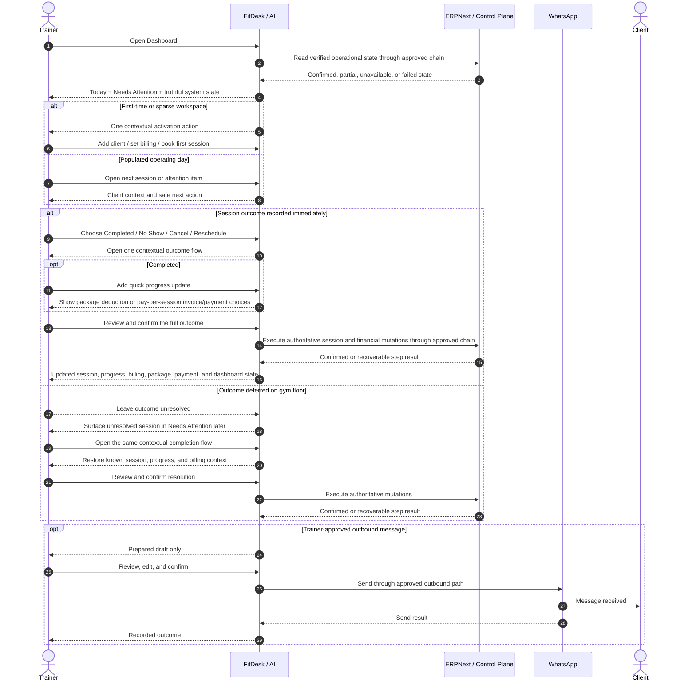

### 4.3 Daily journey stages

| Stage | Trainer need | FitDesk response | Primary status |
|---|---|---|---|
| Open the day | See today’s reality quickly | Stable dashboard shell with explicit loading/partial/unavailable/ready state | MVP — NEEDS UPGRADE / Modernization Stage 1 |
| Orient | Know the most important task | Today and Needs Attention lead the hierarchy | MVP — MODERNIZATION BRANCH / Stage 3 |
| Prepare | Review next client context | Client goal, safety, billing/package, notes, and next session context | MVP — MAIN |
| Deliver | Run the session | Timeline and Client Hub support preparation | MVP — MAIN |
| Resolve | Record session outcome and a quick progress update in one contextual flow | Consequence preview before confirmed mutation | MVP — MAIN / unified completion UX is an APPROVED JOURNEY REQUIREMENT |
| Recover | Resolve missed outcome later | Unresolved session returns as an attention item | MVP — MAIN/backend + dashboard; dedicated recovery UX VERIFY AT ADOPTION |
| Protect revenue | Apply the correct billing result inside the completion flow | Package decrement or pay-per-session invoice | MVP — MAIN |
| Collect | For pay-per-session, choose Paid Now or Pay Later without leaving completion; record later when needed | Confirmed ERP-backed payment state | MVP — MAIN / integrated completion placement VERIFY AT ADOPTION |
| Follow up | Send a relevant outbound message | Draft, preview, explicit send confirmation | MVP — NEEDS UPGRADE |
| Retain | Understand client risk | Deterministic, explainable Client Pulse | APPROVAL-GATED / Dashboard Stage 6 |
| Reduce admin | Prepare the next action | Prepared Action shown before execution | APPROVAL-GATED / Dashboard Stage 7 |

---

## 5. Daily Operating Journey — Product Layer

### 5.1 Stage D1 — Open Dashboard

| Dimension | Journey detail |
|---|---|
| Trainer action | Opens FitDesk at the start of the day or between sessions. |
| Primary surfaces | Dashboard heading, Daily Brief, Today, Needs Attention, Business Health, Quick Actions; desktop command palette after canonical actions are stable. |
| Trainer question | “What do I need to do now?” |
| Required product behavior | Render a stable shell; distinguish loading, unavailable, partial, error, empty, sparse, and populated states. |
| Forbidden behavior | Showing zero, “all clear,” or a Healthy client state when required data did not load. |
| Mobile pattern | Today first, then Needs Attention; no permanent right rail. |
| Desktop pattern | Main operational workspace; contextual rail only when useful. |
| Modernization link | Stage 1 operational truth; Stage 2 activation; Stage 3 hierarchy. |

### 5.2 Stage D2 — Review Today

Today should show:

- upcoming sessions;
- the current/live session when supported;
- recently ended sessions;
- past sessions whose outcome is unresolved;
- an honest empty-day state.

The trainer should not need to visit every client profile to understand the schedule.

### 5.3 Stage D3 — Review Needs Attention

Transactional items belong here, including verified:

- unresolved session outcomes;
- overdue or unpaid invoice risk;
- missing next session for an active client with prior activity;
- other confirmed operational blockers.

Future or approval-gated additions include:

- low package balance thresholds;
- cancellation-risk signals;
- trainer-approved communication follow-up prompts.

Needs Attention must remain finite and prioritized. It should not become an alert wall.

Each item opens a focused **resolver**, not a passive detail page:

```text
Why this item exists
→ one primary recommended action
→ relevant secondary action(s)
→ review
→ confirm
→ verified result
→ reveal the next unresolved priority
```

The recommendation is deterministic and state-derived first. AI may explain or prepare copy, but it never chooses or executes the mutation.

Pilot **Client Pulse Lite** may group verified attention conditions into `Clear`, `Needs review`, or `Unknown`, but Needs Attention remains the executable queue. Pulse is not a second alert system and never creates a separate client status.

### 5.4 Stage D4 — Prepare for the Next Client

The trainer opens a session or client context and sees only what is useful now:

- client identity;
- primary goal;
- safety state;
- recent note;
- billing mode;
- package or payment context;
- next session state.

A pilot **Pre-Session Client Brief** may condense this verified context for the gym floor:

```text
Deterministic source assembly
→ optional constrained summarization
→ source-linked mobile brief
```

The structured brief remains usable if summarization fails. Domain policy—not the model—determines safety priority, package truth, and readiness.

When the pilot Workout Builder is enabled and prerequisites are satisfied, the brief may link to the current trainer-approved program. It never invents a program, changes one, or marks the client ready.

### 5.5 Stage D5 — Complete the Session in One Contextual Flow

The session outcome choices remain:

```text
Completed
No Show
Cancelled
Rescheduled
```

When **Completed** is selected, FitDesk keeps the trainer in the same URL-backed sheet/drawer and progressively reveals only what is relevant:

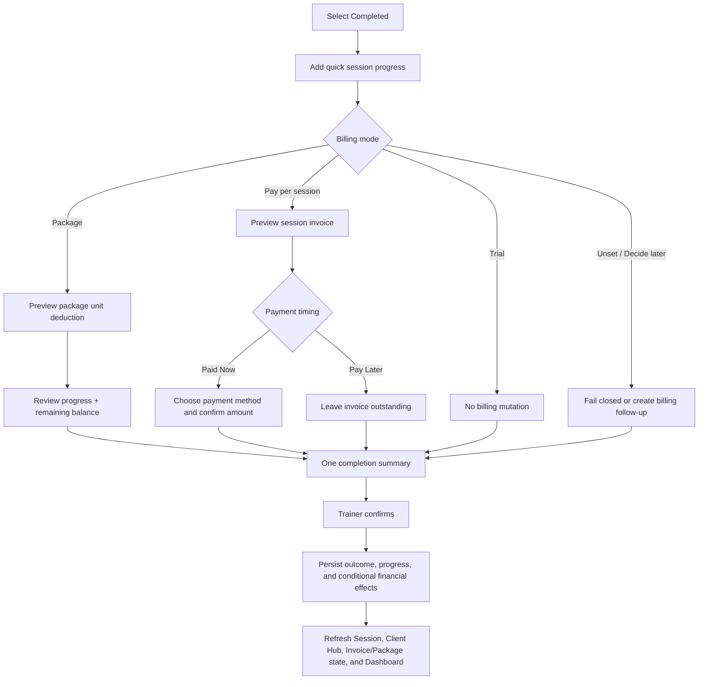

Each outcome flow must:

1. Explain what will change.
2. Keep the quick progress update and the applicable financial decision in the same window.
3. Show package, invoice, and payment consequences before mutation.
4. Require explicit trainer confirmation.
5. Wait for authoritative success or show the exact recoverable step that failed.
6. Update the dashboard and Client Hub after confirmation.

The per-session field is called **Session progress** or **Progress update**. A formal multi-session **Progress report** is a later reporting capability and must not turn every completion into a long mandatory form.

Progress should be fast:

- a brief trainer note;
- performance, measurement, or milestone;
- pain, safety, or recovery concern;
- recommended focus for the next session.

The pilot may offer **Text-to-Structured Session Completion**:

```text
Short trainer text
→ structured progress draft
→ source evidence and uncertainty
→ safety-signal highlighting
→ trainer edits
→ canonical completion review
```

The parser distinguishes:

```text
Client-reported observation
Trainer observation
Trainer interpretation
AI-prepared summary
```

A long narrative is not required. Safety-relevant entries may require acknowledgment before completion. Parsing never completes the session, clears safety, consumes a package, creates an invoice, records payment, or updates a program.

### 5.6 Stage D6 — Unresolved-Outcome Loop-Back

This loop is central to FitDesk’s gym-floor reality.

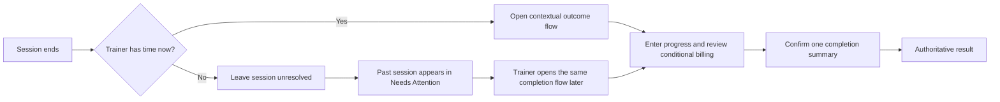

Rules:

- An unresolved session must not disappear.
- The trainer must be able to return later without guessing what happened.
- Batch recovery may exist, but every item remains independently guarded.
- Duplicate completion/package/invoice effects must be prevented.
- A failed item must not silently mark the rest successful.

### 5.7 Stage D7 — Protect Revenue

Inside the confirmed completion flow:

| Billing mode | Completion-window behavior | Confirmed result |
|---|---|---|
| Package | Show the package and before/after balance beside the progress update. No payment form appears by default. | Consume the correct package session according to package rules. |
| Pay per session | Preview the auto-generated session invoice, then ask **Paid Now** or **Pay Later**. | Create the invoice only after completion. |
| Trial | Show that no charge will be created. | No billing mutation. |
| Decide later / unset | Explain that billing is unresolved. | Fail closed or surface a billing-setup action; never invent a charge. |

### 5.8 Stage D8 — Record or Defer Payment

For a pay-per-session client, payment handling stays inside the same completion sheet:

```text
Paid Now
→ choose an available payment method
→ confirm amount and optional reference
→ record authoritative payment
```

```text
Pay Later
→ complete the session
→ create the invoice
→ leave it visibly outstanding
→ collect later from the invoice or dashboard attention flow
```

Unknown or unavailable financial data must be explained. It must not be replaced with a false Cash state.

For package clients, the completion sheet normally shows progress plus package consumption only. Package purchase/payment remains owned by package assignment or renewal, not by routine session completion.

### 5.9 Stage D9 — Follow Up

MVP communication is outbound only.

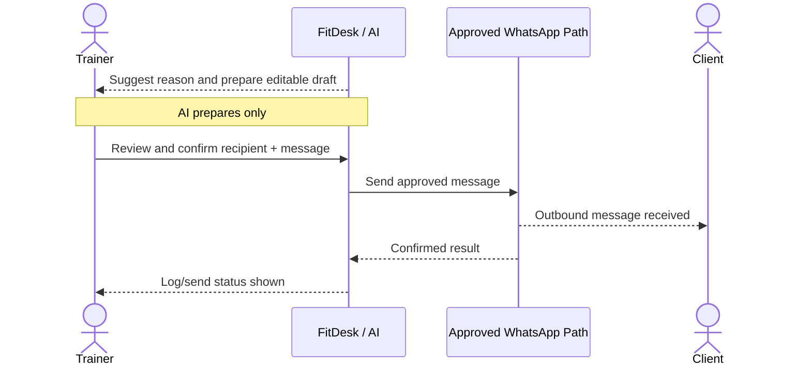

No diagram should show the client replying into FitDesk in the MVP.

All outbound entry points reuse one canonical message composer and send contract:

```text
Dashboard / Client Hub / Session / Invoice / Package
→ same contextual composer
→ same consent check
→ same editable draft
→ same trainer confirmation
→ same send result
→ global Sent Messages log + client activity timeline
```

The pilot **Contextual Message Copilot** may prepare wording from a verified fact bundle. Dates, balances, package units, invoice references, locations, and policy facts remain locked to authoritative sources and are checked again before send.

### 5.10 Stage D10 — Client Pulse Lite

**PILOT / DETERMINISTIC READ MODEL**

Client Pulse Lite answers:

> **Is there anything important the trainer should review for this client right now?**

Pilot states:

```text
Clear
Needs review
Unknown
```

Signal categories remain separate:

```text
Safety
Recovery / uncertain mutation
Session continuity
Package
Billing
Preparation / data quality
Communication
```

Priority:

```text
1. Safety prerequisite
2. Uncertain authoritative mutation
3. Unresolved session
4. Explicit financial hold
5. Package insufficient or exhausted
6. Overdue payment
7. Missing required session information
8. No next session
9. Communication failure
10. No urgent issue
```

Mandatory rules:

- `Unknown` is distinct from `Clear`.
- Pulse is derived from authoritative records and is never a new source of truth.
- The pilot uses no numerical risk score, prediction, character label, or AI-assigned state.
- Each signal exposes evidence, freshness, unavailable sources, and one canonical safe action.
- Safety and uncertain operations outrank commercial recommendations.
- Pulse never changes a client status, clears a concern, mutates a package, books, pays, or sends.
- Future AI may summarize deterministic evidence, but it may not invent or execute the underlying signal.

### 5.11 Stage D11 — Prepared Actions

**PILOT FOUNDATION / BROADER AUTONOMY APPROVAL-GATED**

Pilot Prepared Actions are proposals inside existing canonical flows:

```text
Contextual message draft
Follow-up extracted from progress
Workout or exercise revision draft
Quick Add client draft
Booking draft
```

The first financial example remains:

```text
Overdue invoice
→ existing reminder path
→ verified fact bundle
→ AI-prepared editable draft
→ full preview
→ explicit confirmation
→ approved outbound send path
```

The missing-next-session suggested-slot flow remains later because it changes scheduling behavior. Future inbound WhatsApp requests may create Prepared Actions, but they do not execute them.

---

## 6. Daily Operating Journey — Verified Engineering Layer

This layer records verified ownership boundaries without turning the journey map into an internal infrastructure diagram.

### 6.1 Dashboard read/derive path

```text
app/dashboard/page.tsx
→ dashboard data reads
→ lib/dashboard/derive.ts
→ DashboardView / ActionCenter / BusinessHealth / related presentation
```

Responsibilities:

- Route/server layer obtains authorized tenant-scoped data.
- `derive.ts` produces deterministic attention and health summaries.
- Presentation renders explicit operational states.
- No dashboard display action mutates financial or scheduling state.

### 6.2 Booking path

```text
BookingSheet
→ actions/schedulingActions.ts
→ lib/scheduling/engine.ts for pure validation/planning
→ lib/scheduling/bookingService.ts
→ lib/scheduling/sessionRepository.ts
→ approved ERP proxy path
```

The engine remains:

- conflict-aware;
- DST-safe;
- package-aware;
- recurrence-aware;
- structured in its conflict responses.

### 6.3 Session-outcome and progress path

```text
URL-backed SessionCompletionSheet or outcome surface
→ actions/schedulingActions.ts
→ lib/scheduling/sessionCompletionService.ts
→ session progress persistence/event path [VERIFY AT ADOPTION]
→ lib/scheduling/sessionRepository.ts
→ approved package or invoice service when required
→ approved payment-recording action when Paid Now is selected
→ approved ERP proxy path
```

The action/orchestration boundary must preserve:

- immutable-status guards;
- version and idempotency checks;
- billing-mode branch behavior;
- package/invoice hooks;
- progress ownership and auditability;
- Paid Now / Pay Later choice for pay-per-session clients;
- confirmed-first UI;
- explicit partial-failure recovery.

**One window does not mean one opaque cross-system transaction.** The trainer reviews one coherent completion summary, while the backend reports step-level authoritative results and prevents duplicate session, package, invoice, progress, or payment effects.

### 6.4 Add Client path

```text
AddClientSheet / AddClientForm
→ actions/clients.ts
→ approved ERP Customer creation path
→ ERP proxy / Control Plane / ERPNext
→ tenant-scoped local client repository writes
→ Client Hub success state
```

No invoice, payment, WhatsApp send, session, or program is created by identity creation itself.

### 6.5 Package assignment path

```text
Add Client success CTA
→ Client Hub
→ AssignPackageSheet
→ assignPackage server action
→ package assignment service/repository
→ approved ERP invoice path
→ confirmed package and invoice state
```

### 6.6 Payment path

```text
Pay-per-session completion flow when Paid Now is selected
or later Invoice payment surface
→ actions/invoices.ts recordPayment
→ approved ERP client/proxy
→ ERP Payment Entry
→ confirmed invoice/payment refresh
```

The same payment mutation contract is reused; the completion sheet is a contextual entry point, not a second payment implementation.

### 6.7 Client statement-of-account read path

```text
Client Hub → Statement of account
→ approved FitDesk ERP client/proxy
→ ERP-authoritative invoices, payments, credit notes, and outstanding balances
→ normalized read model / response
→ summary cards + chronological ledger
→ canonical Record Payment or Message Composer when action is needed
```

Rules:

- ERP remains authoritative for invoices, payments, credits, and outstanding balances.
- FitDesk may cache or normalize the response, but must expose freshness and unavailable/partial states honestly.
- A failed or unavailable read must never be rendered as `USD 0`.
- Statement actions reuse canonical payment and messaging contracts; the statement itself is not a second mutation implementation.

### 6.8 FitDesk Intelligence Layer path

```text
FitDesk UI
→ feature-specific Server Action
→ AI Run Orchestrator
→ tenant and entity authorization
→ feature-scoped context builder
→ versioned prompt + strict output schema
→ model provider adapter
→ schema validation
→ deterministic domain validation
→ trainer review
→ canonical FitDesk action
→ existing domain service/repository
→ approved ERP proxy path when required
```

There is no AI-to-execution edge.

The pilot model has no write tools. `createClient`, `bookSession`, `completeSession`, `cancelSession`, `publishProgram`, `consumePackage`, `createInvoice`, `recordPayment`, `sendWhatsApp`, and `changeSafetyState` remain normal application actions invoked only after the required review.

### 6.9 AI and outbound messaging path

```text
Attention item or message action
→ authoritative fact bundle
→ draft generation
→ fact-integrity check
→ trainer review
→ confirmation
→ approved outbound integration
→ send result logged
```

The AI may change wording. It may not change authoritative amounts, dates, references, balances, locations, consent state, or policy facts.

---

# PART II — JOURNEY B SECOND: CLIENT LIFECYCLE

## 7. Client Lifecycle — Executive Layer

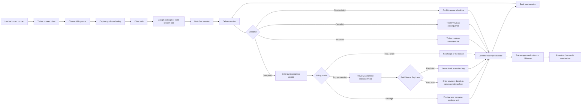

### Client role in MVP

The client lane is passive and receives confirmed outputs:

- appointment information;
- reminders;
- invoices/payment links;
- trainer-approved WhatsApp messages.

The client does not operate FitDesk directly.

---

## 8. Client Lifecycle — Stage Map

| Stage | Trainer job | Client experience | FitDesk job | Status |
|---|---|---|---|---|
| Capture | Create identity quickly | Shares name/phone verbally or through existing channel | Validate, deduplicate, create ERP identity and local view | MVP — MAIN |
| Commercial choice | Choose Package, Per-session, or Decide later | Commercial arrangement explained by trainer | Store mode without hidden side effects | MVP — MAIN |
| Goals/safety | Capture coaching direction | Discusses goals and limitations with trainer | Persist structured goals, conflicts, urgency, safety | MVP — MAIN |
| Activate | Assign package or store rate | Receives invoice/payment request only after trainer action | Generate package invoice or preserve PPS rule | MVP — MAIN |
| Book | Choose a valid session | Receives confirmed booking | Validate availability/conflicts and persist once | MVP — MAIN |
| Deliver | Attend session | Receives coaching | Present relevant client context | MVP — MAIN |
| Resolve | Record outcome plus a quick progress update in one flow | May receive follow-up/payment consequence | Apply confirmed outcome, progress, and conditional billing rule | MVP — MAIN / unified completion UX is an APPROVED JOURNEY REQUIREMENT |
| Collect | Choose Paid Now or Pay Later during pay-per-session completion, or collect later | Pays through supported method | Create confirmed ERP Payment Entry without leaving the completion context when Paid Now | MVP — MAIN / placement VERIFY AT ADOPTION |
| Review account | Understand invoiced, paid, outstanding, and overdue activity for one client | Receives accurate statement or payment reminder when trainer chooses | Show ERP-authoritative summary and ledger without exposing manual invoice creation | MVP / current visual exists; authoritative behavior VERIFY AT ADOPTION |
| Continue | Book next session | Receives next booking/reminder | Surface missing next session when relevant | MVP — MAIN / NEEDS UPGRADE |
| Retain | Renew, follow up, reactivate | Receives trainer-led communication | Explain risk and prepare action | APPROVAL-GATED / FUTURE |
| Close/archive | Stop active workflow safely | No further active scheduling | Preserve audit and historical financial records | MVP / verify exact UI |

---

## 9. First Client Activation Loop

The required first-time operating journey remains exactly:

```text
Add first client
→ configure billing mode
→ book first session
→ dashboard becomes operational
```

A trainer may optionally create reusable package templates after the workspace becomes ready. This setup is trainer-level configuration, is never required to continue, and must not be confused with assigning a package to a specific client from the Client Hub.

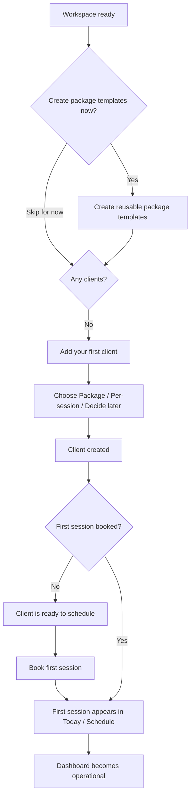

Contextual activation copy:

### No clients

```text
Add your first client
Set up their billing and book the first session.
```

### Client exists, no session

```text
Maya is ready to schedule
Book the first session to start the operating loop.
```

### Session booked

```text
Your first session is on the schedule
FitDesk will surface what needs attention next.
```

Recommended activation guidance:

```text
✓ Client created
✓ Billing mode selected
○ Package assigned or session rate confirmed
○ Goals and safety captured
○ First session booked
```

This is a compact, resumable checklist derived from existing state. It is not a mandatory wizard and does not require a separate onboarding-state store.

Rules:

- Package-template setup is optional and non-blocking.
- Package templates are reusable trainer-level configuration only.
- Client-specific package assignment still happens after creation from the Client Hub through `AssignPackageSheet`.
- Skipping package-template setup never blocks Package, Per-session, or Decide later billing choices.
- No separate persistent onboarding workflow in the MVP.
- A contextual activation checklist may be rendered from existing client, billing, goal, package, and session state.
- No new persistence solely for onboarding UI.
- One primary action per state.
- Guidance derives from verified state.

---

# PART III — JOURNEY A THIRD: SIGNUP AND PROVISIONING

## 10. Signup and Workspace Activation

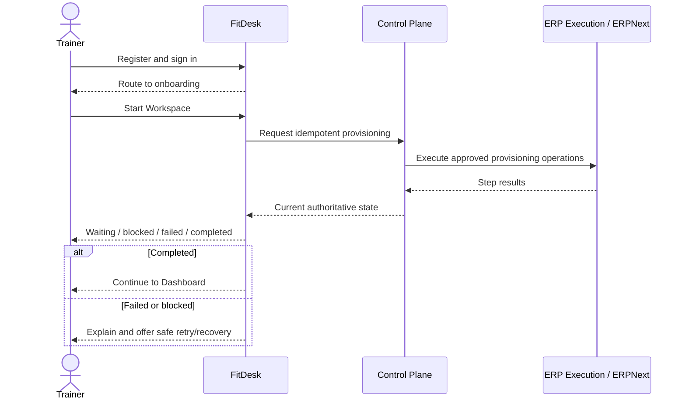

### 10.1 Trainer journey

| Dimension | Journey detail |
|---|---|
| Goal | Reach a usable workspace without understanding infrastructure. |
| Entry | Sign in and route to `/onboarding`. |
| Primary action | **Start Workspace**. |
| Required behavior | Idempotent request, authoritative progress, safe refresh/return, clear recovery. |
| Forbidden behavior | Timer-based fake progress, duplicate provisioning, cross-tenant mapping, exposed credentials or internal container details. |
| Completion | Workspace ready → trainer enters activation loop. |

### 10.2 Current handover state

The clean development reset is complete for the affected six test users:

- zero `WorkspaceProvisioning` rows;
- stale tenant references cleared;
- no cross-tenant mapping;
- working production users untouched.

The immediate product validation flow is:

```text
Log in
→ go to /onboarding
→ Start Workspace
→ validate provisioning
→ proceed to first-client activation
```

---

# PART IV — CONNECTED MASTER MAP

## 11. Connected Master Journey

This master map is derived after the daily journey, client lifecycle, and signup/provisioning journey.

```mermaid
flowchart LR
    subgraph FirstTime[First-time activation]
        A[Signup] --> B[Start Workspace]
        B --> C[Workspace ready]
        C --> P0{Create package templates now?}
        P0 -->|Yes| PT[Create reusable package templates]
        P0 -->|Skip for now| D[Add first client]
        PT --> D
        D --> E[Choose billing mode]
        E --> F[Book first session]
        F --> G[Dashboard becomes operational]
    end

    subgraph Daily[Daily operating loop]
        G --> H[Open Dashboard]
        H --> I[Today + Needs Attention]
        I --> J[Prepare for client]
        J --> K[Deliver session]
        K --> L{Record outcome now?}
        L -->|Yes| M[Open contextual outcome flow]
        L -->|No| N[Unresolved outcome attention item]
        N --> M

        M --> O{Completed?}
        O -->|Yes| PR[Add quick progress update]
        O -->|Other outcome| OC[Preview outcome consequence]
        PR --> BM{Billing mode}

        BM -->|Package| PK[Preview package deduction]
        BM -->|Pay per session| INV[Preview session invoice]
        INV --> PAY{Paid Now or Pay Later}
        PAY -->|Paid Now| RP[Enter payment details in same flow]
        PAY -->|Pay Later| OUT[Leave invoice outstanding]
        BM -->|Trial / unset| NC[No charge or fail closed]

        PK --> CS[Review and confirm completion summary]
        RP --> CS
        OUT --> CS
        NC --> CS
        OC --> CS

        CS --> AR[Authoritative result and exact recovery state]
        AR --> NX{Highest-priority next action}
        NX -->|Partial failure| RF[Recover the failed step]
        NX -->|Safety concern| SR[Review safety]
        NX -->|Package exhausted| RN[Renew or assign package]
        NX -->|Payment outstanding| CP[Collect or send payment reminder]
        NX -->|Otherwise| U[Book next session]
        RF --> H
        SR --> H
        RN --> H
        CP --> H
        U --> H
    end

    subgraph Retention[Retention and communication]
        AR --> V[Prepared outbound follow-up]
        V --> W[Trainer reviews and confirms]
        W --> X[Client receives WhatsApp]
        X --> Y[Renew / continue / reactivate]
        Y --> H
    end

    I -. APPROVAL-GATED .-> Z[Client Pulse]
    Z -. prepares only .-> V
    I -. APPROVAL-GATED .-> AA[Prepared Actions]
    AA -. trainer confirms .-> M
```

---

# PART V — FOCUSED SUB-JOURNEYS

## 12. Add Client and Billing Handoff

### 12.1 Add Client flow

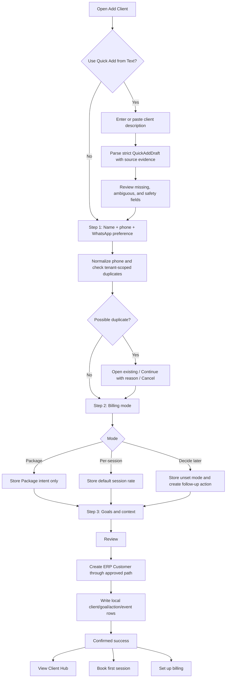

#### Quick Add from Text pilot rules

```text
Free text
→ strict structured draft
→ evidence beside material fields
→ deterministic normalization
→ duplicate and safety checks
→ trainer review
→ canonical Add Client flow
```

Quick Add never:

- creates the client automatically;
- infers verified consent from a phone number;
- assigns a package;
- creates an invoice;
- books a session;
- diagnoses a condition;
- invents missing identity, price, date, goal, or preference;
- merges client-stated and trainer-assessed goals.

Original input, prompt/schema/policy versions, field confidence, evidence, trainer edits, and final decision remain auditable.

### 12.2 Important correction

Billing mode is chosen during client creation, but package assignment does not occur inside identity creation.

```text
Add Client Step 2
→ choose Package / Per-session / Decide later

After success
→ Client Hub
→ AssignPackageSheet
→ select package template
→ choose Paid Now or Pay Later
→ create package invoice
→ show confirmed balance and payment state
```

### 12.3 Billing branch diagram

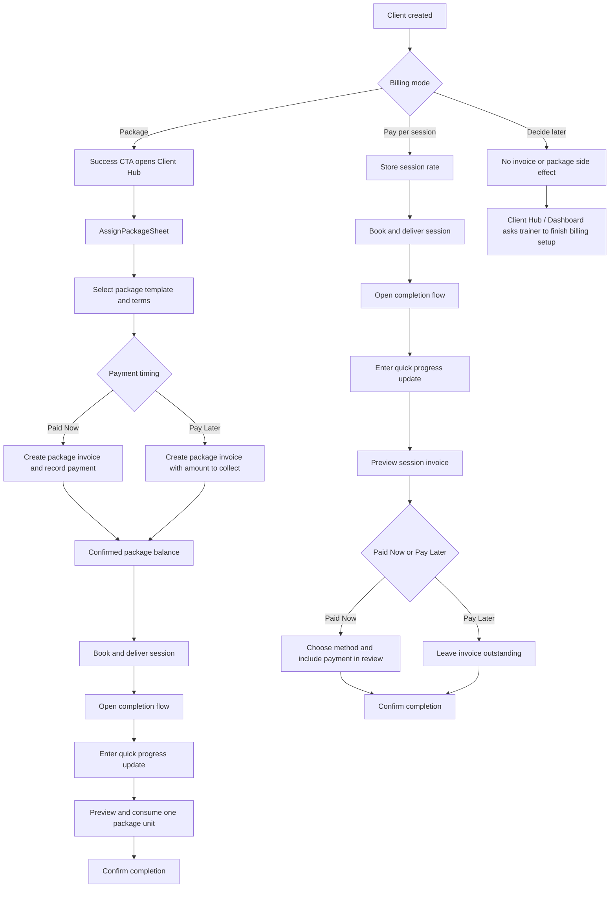

### 12.4 Guardrails

- Manual invoice creation stays hidden from the normal trainer flow.
- Package invoice creation occurs only in package assignment.
- Pay-per-session invoicing occurs only as part of confirmed session completion.
- A pay-per-session trainer can choose Paid Now or Pay Later inside that same completion window.
- Package completion shows progress plus package consumption; it does not reopen package-purchase payment by default.
- Decide later creates no financial mutation.
- Client creation never auto-sends WhatsApp.
- Success deep-links to the correct workflow rather than executing it.

### 12.5 Client Statement of Account — target experience

The Statement of Account is a **contextual, read-first financial workspace**. It answers three trainer questions immediately:

```text
How much does this client owe now?
How was that balance produced?
What is the safest next action?
```

The trainer opens it from the Client Hub’s Billing section. Other contextual entry points may include an overdue dashboard item, invoice detail, and the desktop command palette. Every entry point opens the same canonical statement surface.

### 12.6 Responsive surface and routing

Desktop:

- open as a right-side drawer;
- use a standard width for a confirmed empty state;
- expand to a wider drawer when transaction history is present;
- allow a print/export route when the full statement requires more space.

Mobile:

- use a full-height sheet or full-screen route;
- do not compress the ledger into a small half-height bottom sheet;
- render transactions as readable cards rather than a squeezed desktop table.

The state is URL-backed so refresh, Back, Forward, and direct navigation preserve context. The exact route must follow the audited repository; an illustrative state is:

```text
/dashboard/clients/{clientId}?panel=statement
```

### 12.7 End-to-end statement flow

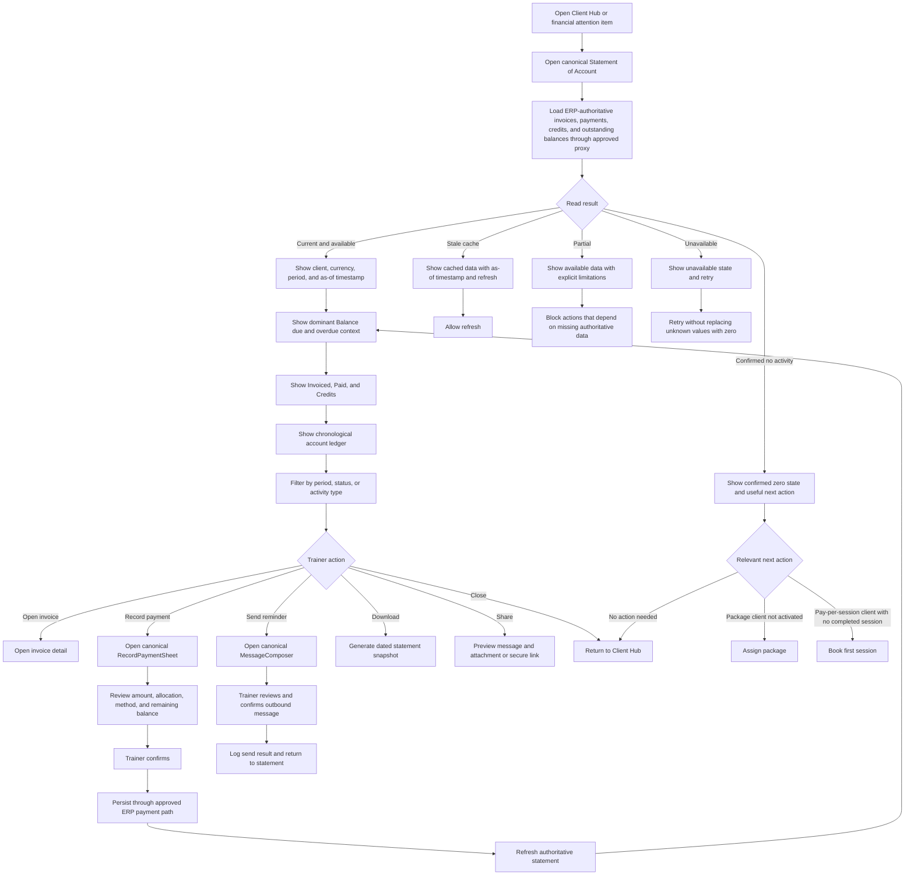

### 12.8 Header and account context

The header shows:

```text
Statement of account
Client name
Period
Currency
As of <date and time>
```

Header actions:

```text
Period
Download
Share
Close
```

Recommended period model:

```text
All time — MVP default
This month
Last 3 months
This year
Custom range
```

The MVP may support only **All time**, but the selected period must still be visible.

### 12.9 Summary hierarchy

The trainer’s first financial question is the current amount due. Therefore **Balance due** is visually dominant.

Recommended information hierarchy:

```text
BALANCE DUE
USD 80

USD 40 overdue since 10 July

Invoiced      Paid      Credits
USD 400       USD 320   USD 0
```

Recommended UI terminology:

| Accounting concept | Trainer-facing label |
|---|---|
| Outstanding | **Balance due** |
| Overdue outstanding | **Overdue** |
| Submitted invoice value | **Invoiced** |
| Allocated confirmed payments | **Paid** |
| Credit notes and approved adjustments | **Credits** |

The backend may retain accounting field names, but the trainer-facing interface should use the clearer labels above.

Definitions:

- **Invoiced:** submitted invoice value in the selected period.
- **Paid:** confirmed payments allocated to invoices in the selected period.
- **Balance due:** current unpaid amount, including partially paid invoices.
- **Overdue:** unpaid amount whose due date has passed.
- **Credits:** credit notes, returns, refunds, or approved adjustments represented according to ERP authority.

Totals are derived from authoritative accounting state. The browser does not invent independent financial truth.

### 12.10 Chronological transaction ledger

The ledger combines all client financial activity in one chronology:

- package invoices;
- pay-per-session invoices;
- payment entries;
- partial payments;
- credit notes;
- approved corrections or refunds;
- due and overdue state.

Desktop columns:

```text
Date
Type
Reference / description
Invoiced
Paid / credit
Balance
Status
```

Mobile transaction card:

```text
INVOICE · 18 JUL

Session — 18 July
INV-1042

Amount          USD 40
Balance due     USD 40
Due             25 July

[Open invoice]
```

Each transaction row or card must preserve enough information to understand the event without exposing raw ERP complexity.

A running balance is optional and appears only when the authoritative calculation is reliable.

### 12.11 Filters and search

MVP:

```text
Period: All time
Status: All
Type: All activity
```

Production-hardening options:

Status:

```text
All
Outstanding
Overdue
Paid
Partially paid
Credited
Cancelled
```

Activity type:

```text
All activity
Invoices
Payments
Credits and corrections
```

Search, pagination, and additional controls appear only when the statement volume justifies them. Avoid advanced accounting filters in the normal trainer workflow.

### 12.12 State-derived actions

The statement is read-first, but the primary action changes according to authoritative state:

```text
Data unavailable
→ Retry

Balance due, no financial hold
→ Record payment

Overdue
→ Record payment
→ Send payment reminder

Explicit financial hold
→ Open controlled hold-resolution flow

Fully paid
→ Open invoice or receipt
→ Download or share statement

No financial activity
→ Assign package or book a session when contextually relevant
```

Rules:

- `Record payment` opens the one canonical payment flow.
- `Send reminder` opens the one canonical outbound WhatsApp composer.
- The statement does not contain a second inline payment implementation.
- An overdue warning and an explicit financial hold remain separate concepts.
- Manual invoice creation remains hidden.
- The statement is not an accounting-administration screen.

### 12.13 Honest data-state model

#### Loading

```text
Loading account activity…
```

Use summary and ledger skeletons. Never flash `USD 0` while loading.

#### Confirmed empty

```text
No invoices or payments yet.

Financial activity will appear here after a package invoice
or a completed pay-per-session session.
```

Show one contextually useful action when appropriate.

#### Unavailable

```text
Account information is temporarily unavailable.

Your financial records have not been changed.

[Try again]
```

Unknown values display as unavailable, never zero.

#### Partial

```text
Some account activity could not be loaded.

Invoice totals are available.
Payment history may be incomplete.

[Try again]
```

Disable actions that depend on missing authoritative information.

#### Stale cache

```text
Showing information as of 7:45 PM.

[Refresh]
```

#### Uncertain result after mutation

```text
Payment status could not be confirmed.

No second payment has been created.
Check authoritative state before retrying.
```

### 12.14 Canonical Record Payment round-trip

```text
Statement
→ Record payment
→ canonical RecordPaymentSheet
→ select invoice allocation
→ enter amount and payment method
→ preview allocation and remaining balance
→ trainer confirms
→ approved ERP Payment Entry path
→ refresh statement
```

Review example:

```text
Amount received        USD 60
Applied to INV-1042    USD 40
Applied to INV-1047    USD 20
Remaining balance      USD 20
Method                 Whish

[Confirm payment]
```

The flow supports partial allocation only through the authoritative payment contract. Overpayment remains blocked unless customer-credit handling is explicitly approved.

### 12.15 Download and share

Download:

```text
Download statement
→ choose period
→ preview totals
→ generate PDF
```

The generated statement includes:

- workspace/trainer identity;
- client name;
- statement period;
- currency;
- generated date and time;
- summary totals;
- transaction ledger;
- page numbers;
- `as of` timestamp.

Share:

```text
Share statement
→ choose approved outbound channel
→ preview message and attachment or secure link
→ trainer confirms
→ send result is logged
```

MVP sharing remains trainer-confirmed and outbound-only. Opening a statement never triggers an automatic send.

### 12.16 Accessibility requirements

The statement must:

- avoid relying on red or green alone for status;
- include visible labels and status text;
- use real table headers on desktop;
- render readable transaction cards on mobile;
- trap focus correctly while the drawer/sheet is open;
- return focus to the Statement button when closed;
- give the close control an explicit accessible name;
- support keyboard row activation;
- announce loading, refresh, partial, and error states;
- use tabular numerals for aligned financial amounts;
- keep currency visible for every amount context;
- maintain readable contrast and touch-target sizes.

### 12.17 Scope status

MVP / pilot-safe:

1. URL-backed Client Hub drawer or full-height mobile sheet.
2. Client, period, currency, and `as of` timestamp.
3. Dominant Balance due plus Overdue, Invoiced, and Paid.
4. Unified invoice/payment ledger.
5. Open invoice.
6. Canonical Record Payment.
7. Canonical Send Reminder.
8. Loading, confirmed-empty, unavailable, partial, stale, and uncertain-result states.
9. No manual invoice creation.

Production-hardening soon:

1. Partial-payment display.
2. Credit-note, refund, and correction rows.
3. Period, status, and activity filters.
4. Search and pagination when needed.
5. PDF/print statement.
6. Trainer-confirmed WhatsApp or approved-channel sharing.
7. Optional running balance.
8. Full keyboard and screen-reader validation.

Future:

1. Secure client-facing statement portal.
2. Client payment from the future portal.
3. Approved scheduled statement delivery.
4. Multi-currency statements.
5. AI-prepared account summaries that remain trainer-reviewed.

---

## 13. Session Lifecycle and Outcome Consequences

### 13.1 Main outcome map

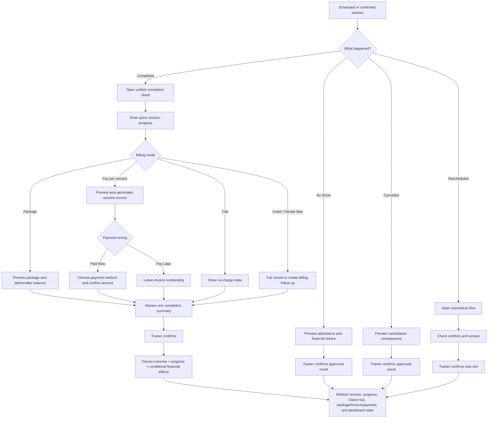

### 13.2 Unified Session Completion Sheet

The completion experience is one URL-backed overlay that renders as a mobile bottom sheet or desktop drawer.

Its progressive structure is:

```text
1. Outcome
2. Session progress
3. Conditional billing impact
4. Payment timing/method for pay-per-session only
5. One review and confirmation
6. Verified result or exact recovery state
```

#### Shared progress section

The trainer may capture:

- a brief session note;
- client performance, measurement, or milestone;
- pain, safety, or recovery concern;
- focus for the next session.

This is a quick **Progress update**, not a mandatory formal report.

#### Package client

Show:

```text
Package name
Balance before
Units consumed
Balance after
```

The trainer enters progress and confirms package consumption in the same flow. No routine payment form appears because package payment belongs to assignment or renewal.

#### Pay-per-session client

Show:

```text
Session rate
Invoice amount
Paid Now / Pay Later
```

If **Paid Now**, reveal payment method, amount, and optional reference. If **Pay Later**, create the invoice and leave it visibly outstanding.

#### One experience, explicit step truth

“One window” is a UX rule, not permission to hide distributed failure.

- Never claim the whole flow succeeded when only one step succeeded.
- Prevent duplicate outcome, package, invoice, progress, and payment writes.
- Preserve entered progress when a financial step needs recovery.
- Query authoritative state before allowing a retry after an uncertain result.
- Show the trainer exactly what was saved and what still requires action.

### 13.3 Implementation-status note

| Capability | Journey status |
|---|---|
| Completed outcome | MVP — MAIN |
| Quick progress within completion | APPROVED JOURNEY REQUIREMENT — exact persistence/UI status VERIFY AT ADOPTION |
| Package deduction in completion | MVP — MAIN; unified presentation VERIFY AT ADOPTION |
| Pay-per-session invoice on completion | MVP — MAIN |
| Paid Now / Pay Later inside completion | APPROVED JOURNEY REQUIREMENT — reuse existing payment contract; placement VERIFY AT ADOPTION |
| No Show | Core backend exists; UX and financial-choice depth may need upgrade |
| Cancelled | Material branch implementation exists; VERIFY AT ADOPTION |
| Rescheduled | Included in the product journey; exact current action/UI status must be verified separately |
| Unresolved recovery | Detection and dashboard attention are materially built; dedicated batch UI status VERIFY AT ADOPTION |

### 13.4 Completion preview content

The one review screen should state:

- client;
- session date/time;
- current and selected outcome;
- progress update and any safety concern;
- package name and units/balance affected;
- invoice amount or reason no invoice will be created;
- Paid Now / Pay Later choice;
- payment method and amount when Paid Now;
- any blocked or unconfigured state;
- whether a follow-up action will be suggested.

### 13.5 Formal progress-report boundary

A formal progress report covers a period, multiple sessions, goal trends, measurements, and trainer-approved interpretation. It is **FUTURE / APPROVAL-GATED** and must not be confused with the quick progress entry used during routine completion.

### 13.6 Cancellation and no-show consequence waiver

When a default cancellation or no-show rule would deduct a package unit or create a charge, FitDesk may offer a one-occurrence waiver:

```text
Normal consequence: Deduct 1 package unit
Applied consequence: Waived
Reason: Medical emergency
Scope: This occurrence
```

The trainer sees the normal and waived results before confirming. Submitted invoices or confirmed payments are not silently edited; they require an approved correction flow.

### 13.7 Package-exhausted completion resolver

If a completed session has no available package balance, preserve the trainer’s progress entry and offer explicit choices:

```text
Renew or assign package
Convert this session to pay-per-session
Mark as complimentary
Mark billing for review
Cancel completion
```

Never create a negative package balance, invent a billing mode, or silently mark a session complimentary.

### 13.8 Next-session focus loop

The unified completion flow may capture one concise coaching handoff for the next relevant session:

```text
Complete current session
→ enter Next-session focus
→ store source session and captured time
→ show in Client Today and the next Session Detail
→ trainer marks addressed, updates, carries forward once, or removes
```

Example:

```text
Next focus: Increase squat load gradually
Source: Session completed 18 July
```

Rules:

- This is coaching context, not a formal program or progress report.
- It remains trainer-private unless deliberately included in a client message.
- It does not copy forward indefinitely.
- Carry-forward is explicit and bounded.
- Updating or clearing it never rewrites the completed source session.
- A stale focus must show its source and age rather than appearing as timeless truth.

## 14. Scheduling, Recurrence, Pattern Slots, and Conflict Resolution

The main map shows the single-booking happy path and one conflict decision. Recurring bookings and pattern-slot logic belong here.

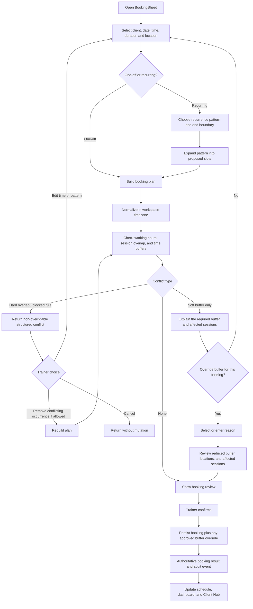

The same canonical `BookingSheet` is launched from Schedule, Client Hub, Dashboard, mobile FAB, desktop command palette, and the optional pilot **Natural-Language Booking Draft**. Entry context may prefill the client or time, but validation, preview, mutation, and recovery remain one implementation.

```text
“Book Sarah next Monday at 5 PM for 60 minutes,
at ABC Gym, every Monday for six weeks.”

→ parse BookingDraft
→ show absolute date, year, time, and timezone
→ expose ambiguity
→ open canonical BookingSheet
→ run normal conflict/recurrence validation
→ trainer confirms
```

The LLM interprets language only. It does not validate conflicts, working hours, buffers, DST, recurrence, package availability, or record version.

Meaningful booking states are URL-backed so refresh, Back, Forward, and direct linking preserve context. On mobile the route renders as a bottom sheet; on desktop it renders as a drawer/dialog.

### 14.1 Trainer override for soft time-buffer conflicts

A configured time buffer is a default operational safeguard, not always an absolute block. The trainer may override a **soft buffer-only conflict** when the actual session times do not overlap and the trainer has a valid reason.

Example:

```text
Client A: 4:00–5:00 PM
Client B: 5:00–6:00 PM
Default travel buffer: 30 minutes
Both sessions: same gym / same location
```

FitDesk should explain:

```text
Your schedule normally requires 30 minutes between these sessions.
Both clients are at the same location, so you can override the travel buffer for this booking.

[Keep buffer and choose another time]
[Override buffer]
```

When overriding, the trainer chooses or enters a reason:

```text
Same location — no travel needed
Online sessions
Trainer-approved shorter transition
Other — add note
```

The review state must show:

- the normal buffer;
- the reduced/effective buffer;
- both session times;
- both locations when known;
- whether the override applies to one occurrence or an explicitly selected recurring scope;
- the reason;
- any remaining warning.

The override is trainer-controlled and confirmed-first. It creates an auditable scheduling event and does **not** silently change the trainer’s global buffer setting.

Rules:

- The UI does not implement conflict logic.
- The engine produces structured conflict information and distinguishes hard conflicts from soft buffer-only conflicts.
- Hard session overlaps and blocked scheduling rules are never bypassed by the buffer override.
- A buffer override is explicit, reasoned, reviewed, and auditable.
- The default override scope is the current booking or occurrence; applying it to a recurring series requires a separate explicit scope choice and a regenerated preview.
- Unknown or different locations do not automatically qualify as “same location.”
- The override never changes workspace-wide scheduling settings.
- Recurrence is bounded and previewed.
- DST and timezone conversion are server/domain responsibilities.
- Repeated confirmation cannot create duplicate bookings.
- Suggested booking slots are approval-gated and are not implied by this journey.

### 14.2 Working-hours exception

Booking outside configured working hours is a **soft operational constraint** when there is no actual overlap or other hard block.

```text
Outside working hours

Normal hours: 08:00–19:00
Requested time: 19:30

[Choose another time]
[Approve this booking exception]
```

Rules:

- The default scope is this booking or occurrence only.
- A recurring-series exception requires a regenerated series preview.
- The trainer selects a structured reason; typed detail is required only for `Other`.
- The exception never changes workspace working hours.
- A real session overlap remains a hard conflict.

### 14.3 Location-confidence confirmation

FitDesk must not infer “same location” from loosely matching free text.

When location identity is missing or uncertain:

```text
Location could not be confirmed.

[Confirm same location for this booking]
[Update location]
[Keep normal travel buffer]
```

A location confirmation is scoped to the booking unless the trainer separately updates the source location record. Structured location identifiers are preferred over free-text matching.

### 14.4 Shared recurring-scope selector

Scheduling exceptions use one consistent scope model:

```text
This occurrence only — default
This and selected future occurrences — explicit preview
Entire series — highest review level
```

For future or entire-series scope, FitDesk regenerates all affected occurrences and reruns conflict, buffer, working-hours, DST, location, duration, and billing checks before confirmation.

### 14.5 Structured session-context doctrine

> **Capture a field only when FitDesk can reuse it at a meaningful trainer moment. Prefer structured defaults over repeated typing, preserve occurrence-level history, reveal optional details progressively, distinguish trainer-private from client-visible content, show where reused information came from, and never let a contextual field silently trigger scheduling, communication, package, or financial consequences.**

Session context is reused across:

```text
Booking
→ preparation
→ reminders
→ conflict and buffer review
→ session delivery
→ completion
→ next-session preparation
```

### 14.6 BookingSheet progressive disclosure

Always visible:

```text
Client
Date and time
Duration
Location
Session type
Repeat
```

Collapsed **Session details**:

```text
Trainer preparation
Access instructions
Equipment
Client preparation
Trainer reminder
Contact preference
Time flexibility
Environment
```

Derived after the trainer selects context:

```text
Payment context
Readiness checklist
Travel and buffer result
Communication state
Next safe action
```

FitDesk does not show every optional field on every booking. Session type, location type, client defaults, and current state determine which details are relevant.

### 14.7 Session location model

Location is a first-class booking field:

```text
Trainer location
Client location
Saved location
Online
Custom location
Intentionally unknown
```

Useful shortcuts:

```text
Use client’s usual location
Use trainer’s default location
Same as last session
Use series location
```

Conceptual ownership:

```text
Reusable location record
+ session occurrence snapshot
```

The reusable record may change later; the snapshot preserves where the booked or completed session actually occurred.

The location snapshot may include:

```text
Location type
Location ID when structured
Display name
Address or online details
Access instructions used
Captured source
Captured time
```

Rules:

- The short Schedule card shows the location label, not unnecessary sensitive detail.
- Client-home addresses remain tenant-isolated and appear only where operationally necessary.
- Full home addresses do not appear in broad timelines, analytics, or unrelated exports.
- Online is a proper location type, not merely the text “Zoom.”
- Unknown location is explicit and may create a Resume Work item for an in-person session.
- Structured location identity supports same-location confidence; free text alone does not silently prove a match.

### 14.8 Session type and contextual defaults

Recommended session types:

```text
Standard training
Assessment
Trial session
Progress review
Consultation
Online session
Group/shared session
```

Session type may control visible preparation context:

```text
Assessment
→ assessment preparation
→ suggested equipment
→ optional client instructions

Online
→ meeting details
→ physical travel not required

Progress review
→ recent goals and measurements
```

Hard boundary:

```text
Session type
≠ billing mode
≠ automatic price change
≠ automatic package consequence
```

Any financial consequence remains visible and explicitly confirmed through the existing billing flow.

### 14.9 Defaults, inheritance, provenance, and snapshots

Default hierarchy:

```text
Workspace default
→ client usual default
→ recurring-series default
→ occurrence override
```

The most specific value wins:

```text
Occurrence override
> recurring-series value
> client usual value
> workspace default
```

FitDesk shows provenance:

```text
Location: ABC Gym
From Sarah’s usual booking

Duration: 60 minutes
From recurring series

Next focus: Review hip mobility
From session completed 18 July
```

Changing a prefilled value requires an explicit scope:

```text
This booking only
This and future occurrences
Client’s future default
```

These are separate decisions.

Reusable defaults:

```text
Usual location
Usual duration
Usual session type
Availability preferences
Default contact preference
```

Historical occurrence snapshots:

```text
Actual location
Actual session type
Duration
Access instructions used
Client instructions sent
Contact override
Environment
```

Updating a default never rewrites completed sessions.

### 14.10 Field visibility and privacy classes

| Visibility class | Examples | Rule |
|---|---|---|
| **Trainer private** | Preparation note, coaching reminder, sensitive arrival detail | Never inserted into client communication automatically. |
| **Client visible when selected** | What to bring, approved public access instructions | Included only after trainer review. |
| **Operational system data** | Payment context, readiness result, communication state | Derived from authoritative sources; not free text. |
| **Shared booking information** | Date, time, location label, session type | Suitable for confirmed booking/reminder context. |

For a home session:

```text
Schedule card
→ Client home

Session Detail
→ approved full address and required access information
```

### 14.11 Optional session fields

#### Trainer preparation note

Private, optional, concise, and visible shortly before the session:

```text
Recheck knee discomfort
Bring resistance bands
Review last measurement
```

It is not a clinical record and is never sent automatically.

#### Access and arrival instructions

Separate location identity from instructions:

```text
Location: ABC Gym — Hamra
Access: Use rear entrance; Studio 2
```

Scope choices:

```text
Use this session only
Save to reusable location
```

#### Equipment needed

Use a small structured catalog:

```text
Common equipment
Recent equipment
Session-type defaults
Other
```

Do not create a full equipment-inventory system.

#### Client preparation

A separate client-visible field:

```text
Bring training shoes
Bring previous assessment results
Bring resistance band
```

The canonical Message Composer may insert it, but the trainer reviews the final message.

#### Trainer reminder

One optional internal reminder initially:

```text
30 minutes before
2 hours before
Morning of session
Custom
```

Trainer reminder and client reminder remain separate.

#### Availability preference

```text
Preferred
Possible
Avoid
Unavailable
```

Preferred and Avoid are advisory. Unavailable requires explicit domain meaning and never bypasses trainer availability, actual overlaps, buffers, or working hours.

#### Time flexibility

```text
Fixed
May move within 30 minutes
Flexible that day
```

This ranks suggestions only. FitDesk never moves or shortens the session automatically.

#### Environment

```text
Indoor
Outdoor
Either
```

Environment supports future weather advisories only after date, time, and structured location are reliable.

### 14.12 Operational states and derived readiness

Keep three state families separate:

```text
Session state
→ Scheduled / Arrived / Completed / Cancelled / No-show / Rescheduled

Communication state
→ Not prepared / Prepared / Sent / Delivered / Failed

Client confirmation
→ Not requested / Awaiting response / Confirmed / Declined / Manually confirmed
```

A delivered reminder never proves client confirmation.

Derived readiness may show:

```text
✓ Location confirmed
✓ Goal context available
✓ Safety reviewed
✓ Package or pricing available
! Client reminder not sent
✕ Required safety clearance missing
```

Readiness is calculated from current state; do not create a second checklist record.

Classify each item:

```text
Hard blocker
Soft warning
Optional preparation
```

The checklist appears only near the relevant session and does not become a mandatory wizard.

### 14.13 Read-only financial context

Before a session, FitDesk may show:

```text
Package session — 3 remaining
Pay per session — USD 40
Balance due — USD 80
Payment expected today
```

This context comes through the approved ERP-authoritative read path.

```text
Payment expected
≠ payment received
≠ invoice paid
```

The preparation view never creates a Payment Entry or changes the account balance.

### 14.14 Optional arrival and occurrence communication overrides

`Client arrived` is a pilot-only operational timestamp:

```text
Scheduled
→ Arrived
→ Completed
```

Arrival never:

- completes the session;
- deducts a package unit;
- creates an invoice;
- records payment.

Occurrence-specific communication preference:

```text
Use client default
WhatsApp for this session
Phone call for this session
No reminder for this session
```

The override applies only to the occurrence and never silently changes consent, the client default, or future recurring sessions.

### 14.15 Source freshness

Reused context must expose source and freshness where staleness matters:

```text
Usual location
Updated 3 months ago

Access instructions
Saved for ABC Gym

Next focus
From session completed 18 July
```

Suggested states:

```text
Current
Needs review
Unknown
Occurrence-specific
```

FitDesk must not silently reuse old access details, safety context, or client preparation forever.

### 14.16 Delivery priority

| Capability | Status |
|---|---|
| Session location with reusable record and occurrence snapshot | **MVP / PILOT-SAFE** |
| Session type | **MVP / PILOT-SAFE** |
| Next-session focus | **MVP / PILOT-SAFE** |
| Trainer preparation note | **MVP / PILOT-SAFE** |
| Client usual booking defaults | **MVP / PILOT-SAFE** |
| Access/arrival instructions | **MVP / PILOT-SAFE** |
| Booking vs communication vs confirmation state separation | **MVP / PILOT-SAFE** |
| Read-only payment context | **MVP / PILOT-SAFE** |
| Equipment, client preparation, readiness, trainer reminder | **PRODUCTION-HARDENING** |
| Availability preference and occurrence contact override | **PRODUCTION-HARDENING** |
| Source/freshness indicators | **PRODUCTION-HARDENING** |
| Series inheritance and occurrence overrides | **PRODUCTION-HARDENING** |
| Client-arrived state | **PILOT VALIDATION FIRST** |
| Time flexibility | **VALIDATE BEFORE BROAD ADOPTION** |
| Multiple trainer reminders | **VALIDATE BEFORE BROAD ADOPTION** |
| Weather advisory | **FUTURE / ADVISORY ONLY** |
| Gap optimization using flexibility | **FUTURE / RECOMMENDATION ONLY** |

---

## 15. Structured Flexibility and Exception Decisions

### 15.1 Product doctrine

> **FitDesk protects the trainer with safe defaults and non-negotiable safety, conflict, and accounting boundaries. When a legitimate exception exists, FitDesk allows the trainer to override only a soft operational rule—explicitly, with visible before-and-after consequences, the smallest practical scope, a structured reason, and an auditable, idempotent result—without silently changing the default policy.**

This is **structured flexibility**, not unrestricted override behavior.

### 15.2 Rule levels

| Rule level | Product behavior | Example |
|---|---|---|
| **Hard block** | Cannot be overridden in the current flow. Show the reason and safe recovery actions. | Actual session overlap, missing mandatory safety clearance, explicit financial hold, invalid accounting mutation. |
| **Soft constraint** | Safe default plus a deliberate, scoped trainer exception. | Time buffer, working hours, no-show consequence waiver, one-time grace use. |
| **Advisory** | Informational guidance that does not block submission. | Outstanding-balance warning when no financial hold exists. |
| **Allowed alternate path** | A valid domain route, not an override. | Book an assessment session while goals/setup are incomplete. |

The domain layer returns the rule level. The UI renders it; UI components do not reclassify domain rules.

### 15.3 Exception interaction contract

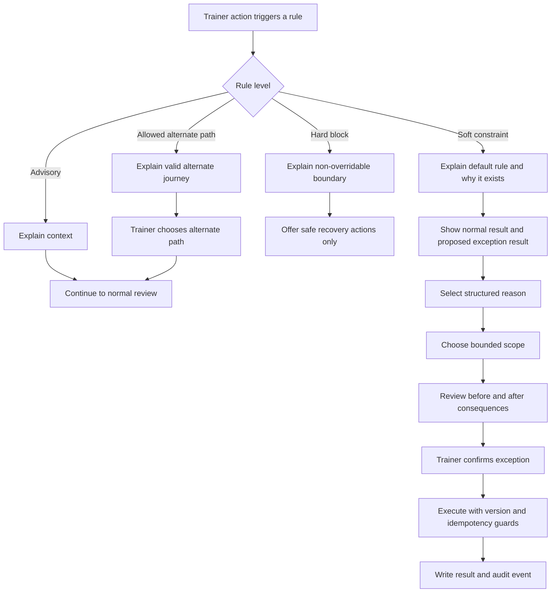

A soft exception remains inside the current contextual workflow. It does not send the trainer to an unrelated warning page.

### 15.4 Reason and scope rules

Use structured reason codes whenever possible:

```text
Same location — no travel
Online sessions
Medical emergency
Trainer caused cancellation
First approved exception
Approved relationship exception
Other
```

Rules:

- Only `Other` or a high-risk financial adjustment requires a typed note.
- Default scope is the smallest practical scope, normally one booking or occurrence.
- Series-level scope requires an explicit preview and separate confirmation.
- An exception never silently changes the default workspace policy.

### 15.5 Review contract

Before a consequential exception, show:

```text
Normal rule
Normal result
Applied exception
Result after exception
Reason
Scope
Related records
Confirm
```

Financial, package, scheduling, and safety-adjacent actions must be reviewable before mutation. Confirmed or submitted financial history is corrected through approved accounting flows, never by silently rewriting the original record.

### 15.6 Audit and idempotency contract

Recommended decision/audit vocabulary:

```text
eventType
ruleCode
ruleVersion
tenantId
affectedEntityType
affectedEntityId
originalState
approvedState
reasonCode
reasonNote
scope
performedBy
performedAt
relatedEntityIds
decisionId
idempotencyKey
expectedVersion
result
```

Rules:

- `ruleVersion` identifies the policy that was active when the exception was approved.
- Free-text notes must not collect unnecessary sensitive detail.
- Retrying after a timeout must not duplicate a booking, package deduction, invoice, payment, or audit event.
- The audit event references the same decision/operation identity as the mutation.
- One-window UX never hides step-level uncertainty.

### 15.7 Exception journey portfolio

| Journey | Classification | Required behavior | Delivery status |
|---|---|---|---|
| Time-buffer exception | Soft constraint | Reason, occurrence scope, location review, no global-setting change. | **APPROVED JOURNEY REQUIREMENT**; `VERIFY AT ADOPTION`. |
| Location-confidence confirmation | Soft confirmation | Confirm booking location or update source; never claim same location from weak free-text similarity. | **MVP / PILOT-SAFE NEXT**. |
| Outside-working-hours booking | Soft constraint | Booking-scoped exception; recurring preview; no global-hours change. | **MVP / PILOT-SAFE NEXT**. |
| Recurring exception scope | Shared control | Occurrence default; selected future/series preview. | **MVP / PILOT-SAFE NEXT**. |
| Goal soft conflict | Soft constraint | Resolution strategy required and recorded. | **MVP / GOAL-SYSTEM SCOPE**. |
| Missing goals/setup | Allowed alternate path | Permit assessment/consultation only; normal training remains safety-gated. | **MVP / PILOT-SAFE NEXT**. |
| Cancellation/no-show waiver | Soft financial/attendance consequence | Show normal vs waived result; structured reason; one occurrence by default. | **PRODUCTION-HARDENING SOON**. |
| Package exhausted at completion | Resolver, not silent override | Renew/assign, convert to pay-per-session, complimentary, billing review, or cancel completion. | **PRODUCTION-HARDENING SOON — HIGH PRIORITY**. |
| Package-expiry grace use | Soft package exception | Consume one expired unit without silently extending package expiry. | **PRODUCTION-HARDENING SOON**. |
| Overdue-payment booking | Advisory or hard block | Warning may be accepted; explicit financial hold requires separate removal. | **PRODUCTION-HARDENING SOON**. |
| Client deactivation with unresolved work | Resolver | Review future sessions, invoices, package balance, and prepared messages. | **PRODUCTION-HARDENING SOON**. |
| Session-price exception | Soft pre-invoice pricing decision | Show default/applied price and difference; do not rewrite submitted or paid invoices. | **PRODUCTION-HARDENING SOON**. |
| Partial payment | Supported financial path | Show amount received, remaining balance, and resulting partial status; block overpayment unless credit handling is approved. | **PRODUCTION-HARDENING SOON / PILOT-DEMAND GATE**. |
| Duration-based pricing | Domain extension | Recalculate time, buffer, conflicts, recurrence, and invoice price. | **FUTURE / DEMAND-GATED**. |
| AI-prepared exception explanation | AI assist only | Prepare explanation; trainer reviews and confirms. | **FUTURE / APPROVAL-GATED**. |
| Predictive exception suggestion | Recommendation only | Never auto-approve or execute. | **FUTURE / APPROVAL-GATED**. |
| Multi-trainer financial approval threshold | Governance extension | Higher-risk exceptions require an authorized approver. | **FUTURE / MULTI-SEAT-GATED**. |
| Generic configurable rules engine | Platform abstraction | Deferred until multiple explicit production rules prove the common model. | **FUTURE — DO NOT BUILD NOW**. |

### 15.8 Accounting and safety boundaries

Never treat these as ordinary soft overrides:

- actual session overlap;
- missing mandatory safety clearance;
- hard goal contradiction;
- explicit financial hold;
- negative package balance;
- overpayment without approved customer-credit handling;
- silent conversion of billing mode;
- mutation of submitted or paid invoice history;
- AI execution of an override.

Financial corrections follow the ERP-authoritative path:

```text
Draft invoice
→ normal review/correction

Submitted unpaid invoice
→ approved cancel/amend process

Paid invoice
→ credit note / correction / refund process
```

### 15.9 Implementation strategy

Do not build a generic rules platform now.

```text
Implement explicit domain rules first:
1. Time buffer
2. Working hours
3. Goal conflict
4. No-show waiver

Then extract only proven common pieces:
- shared RuleDecision response types
- shared reason and scope controls
- shared review UI
- shared audit vocabulary
- shared idempotency/expected-version contract
```

The existing scheduling engine, booking service, repository, and structured conflict responses remain authoritative for booking logic. Business logic does not move into a generic UI component.

---

## 16. Goals and Safety Sub-Journey

### 16.1 Goal journey

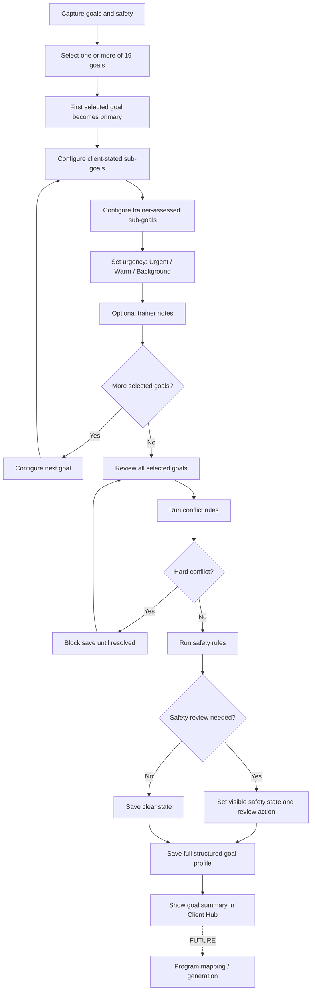

### 16.2 As-built data split

The goal system separates:

- **Client-stated sub-goals:** what the client says they want.
- **Trainer-assessed sub-goals:** what the trainer identifies through screening and professional judgment.

The journey must preserve both layers. They must not be flattened into one generic list.

### 16.3 Single-primary rule

- Exactly one goal is primary when goals exist.
- Selecting a new primary automatically unsets the prior one.
- The primary goal is visible in review and Client Hub.

### 16.4 Conflict handling

Examples:

- Fat Loss + Muscle Gain: soft warning and prioritization/recomposition choice.
- Underweight/Safe Weight Gain + Fat Loss: hard conflict requiring resolution.

### 16.5 Safety timing

Safety checks happen when goals are saved, not only when a future program is requested.

Safety-sensitive goals include rehabilitation and pre/postnatal contexts.

### 16.6 Assessment-session alternate path

Incomplete goals or setup do not automatically require a generic override.

```text
Client setup is incomplete.

[Book assessment session]
[Complete goals and safety]
```

An assessment or consultation is an allowed alternate journey. If mandatory safety clearance is missing, ordinary training remains blocked.

### 16.7 Pilot Workout Builder boundary

AI-assisted program generation is approved for the pilot only as a **Constrained Workout Builder** after the required domain prerequisites are verified.

Eligibility requires:

```text
Confirmed client
Trainer-reviewed goals
Current safety state
Trainer-approved exercise catalog
Available equipment
Sessions per week
Session duration
Program duration or review boundary
Machine-readable program and progression policies
```

Flow:

```text
Eligibility gate
→ retrieve allowed exercise candidates
→ build minimal tenant-scoped context
→ generate strict ProgramDraft using catalog IDs
→ validate schema, exercise IDs, equipment, duration, and policy
→ one bounded repair attempt when validation fails
→ run deterministic safety checks
→ show basis, assumptions, warnings, and structured diff
→ trainer edits and approves
→ canonical program service stores a new version
```

The pilot expands in this order:

```text
Exercise swap
→ section revision
→ single workout
→ program revision
→ multi-week program draft
```

The Workout Builder may prepare, arrange, explain, suggest catalog alternatives, and regenerate a selected section. It may not:

- publish without trainer confirmation;
- use an exercise outside the approved catalog;
- ignore unresolved safety state;
- diagnose a condition;
- define its own safety rules;
- invent equipment, measurements, or performance;
- silently change an approved program;
- change billing, packages, sessions, or messages;
- overwrite an approved version.

Every approved program remains versioned. A revision creates a new draft and shows exercises, volume, progression, equipment, and safety-impact differences.

### 16.8 Future adaptive program boundary

Adaptive progression begins as advisory review, not autonomous mutation:

```text
Authoritative progress
→ deterministic signals
→ eligibility and data-quality gate
→ LLM prepares bounded options
→ trainer reviews structured diff
→ approved program-revision service
```

Autonomous program adaptation remains a separate far-future decision.

---

## 17. Client Hub Operating Workspace and Lifecycle

### 17.1 Governing experience rule

> **Do not create a new module for every useful client view. Centralize client truth in one Client Hub, reveal the right context for the current moment, and launch one canonical, URL-backed workflow for each action.**

The Client Hub is a read-first operating surface, not a collection of embedded mutation forms.

```text
Understand current state
→ explain why it matters
→ show one next-safe action
→ preserve relevant alternatives
→ launch the canonical workflow
→ return to refreshed client context
```

### 17.2 Client Hub information architecture

```text
Client Hub
├─ Today / Next Safe Action
├─ Goals & Safety
├─ Sessions & Recurring Schedule
├─ Progress
├─ Package & Billing
├─ Statement of Account
├─ Attendance
├─ Communication
└─ Unified Activity
```

These are contextual sections in one client workspace. They are not separate primary application destinations.

Actions render as URL-backed mobile bottom sheets/full-height sheets or desktop drawers/dialogs. Direct navigation may render a full page when appropriate.

### 17.3 Client Today context

When the trainer opens a client from today’s schedule or shortly before a session, the Client Hub emphasizes preparation context:

```text
Today with Sarah

Session: 5:00–6:00 PM
Type: Standard training
Location: ABC Gym
Access: Studio 2
Next focus: Review hip mobility
Preparation: Bring resistance bands
Primary goal: Fat loss
Recent concern: Mild knee discomfort
Package balance: 3 sessions
Payment state: Clear
Readiness: 1 optional item remaining
```

Primary actions:

```text
Open session
Review last progress
Send message
```

Rules:

- This is a contextual Client Hub state, not a separate “Today” page.
- Safety and recovery concerns outrank commercial recommendations.
- The view reuses existing client, session, goal, package, billing, program, and progress data.
- Missing or unavailable information is shown honestly rather than guessed.
- Structured source data renders first; optional AI condensation never replaces the confirmed fields.
- Every generated sentence can be traced to a current source record or is labelled as an AI-prepared summary.

### 17.4 Deterministic Next Safe Action

Each Client Hub may show one explainable primary recommendation:

```text
Safety prerequisite
→ Review safety

Uncertain mutation
→ Verify or recover

Unresolved session
→ Complete session

Explicit financial hold
→ Resolve hold

Package exhausted
→ Renew or change billing

Payment overdue
→ Record payment or send reminder

No next session
→ Book session

Otherwise
→ No urgent action
```

The recommendation:

- states why it appears;
- never executes automatically;
- does not hide valid alternatives;
- uses deterministic rules first;
- remains separate from future predictive ranking.

### 17.5 Package and Billing Status

The Package & Billing section answers:

```text
What package or rate is active?
How many sessions remain?
When does the package expire?
What has been consumed?
What is the payment state?
What should happen next?
```

Example:

```text
8-Session Package
Used: 6
Remaining: 2
Expires: 31 July
Payment: Paid
```

Contextual actions:

```text
Renew
Assign replacement
View usage history
Send renewal reminder
Open statement
```

Rules:

- Package template administration remains under Settings/Catalog.
- Client-specific package truth remains in Client Hub.
- Actions reuse canonical assignment, renewal, payment, message, and statement flows.
- Package exhaustion uses the explicit completion resolver; no negative balance is created silently.

### 17.6 Recurring Schedule Manager

The Client Hub exposes the client’s active recurring schedule:

```text
Every Monday and Wednesday
5:00 PM
ABC Gym
60 minutes
Valid until 30 September
```

Actions:

```text
Change future sessions
Pause series
Skip occurrence
End series
```

Scope:

```text
This occurrence only — default
This and future occurrences
Entire series
```

Before confirming future or series changes, FitDesk regenerates and previews affected sessions and reruns:

- actual overlaps;
- time buffers;
- working hours;
- location checks;
- timezone and DST;
- package availability;
- billing consequences;
- version checks.

A one-occurrence location, price, duration, or buffer exception never spreads silently to the series.

### 17.7 Resume Work queue

FitDesk uses **Resume Work**, not “Inbox,” for unfinished trainer workflows.

Include only:

```text
Saved booking draft
Incomplete session completion
Uncertain payment result
Unfinished package assignment
Message draft
Required recovery action
```

Do not include:

- general reminders;
- every overdue invoice;
- marketing announcements;
- completed notifications;
- low-value informational alerts.

Each item shows:

```text
Why it is unfinished
What was safely saved
What is authoritative
What remains uncertain
Continue
Discard draft — only when reversible
```

Resume Work may be surfaced from Dashboard/Needs Attention and linked back to the relevant client or object. It must not become a second notification center.

### 17.8 Unified Progress and Activity history

The Client Hub separates structured current state from chronological history.

```text
Structured current state
├─ Active goals
├─ Measurements
├─ Safety status
└─ Current next focus

Chronological history
├─ Session progress
├─ Measurement changes
├─ Goal updates
├─ Safety events
├─ Package and billing events
├─ Messages and delivery results
└─ Trainer notes
```

Rules:

- The timeline explains how current state changed.
- Structured goals, measurements, and safety data remain authoritative outside free-text timeline entries.
- Quick progress entries come from the unified completion flow.
- Formal multi-session progress reports remain future/approval-gated.
- Timeline events deep-link to their canonical source or action.

### 17.9 Factual Attendance Summary

The Attendance section uses neutral, factual language:

```text
Last 90 days
12 of 15 scheduled sessions completed

Completed: 12
Cancelled: 2
No-show: 1
Rescheduled: 3
```

Actions:

```text
Review missed sessions
Send follow-up
Adjust recurring schedule
```

Do not use:

```text
Reliable client
Unreliable client
Bad attendance
```

The period and denominator are always visible. Predictive retention or character judgments remain future-gated.

### 17.10 Client Pause, Resume, Reactivate, and Deactivate lifecycle

#### Pause

```text
Pause client activity
→ choose start and expected resume dates
→ inspect future sessions
→ inspect recurring series
→ inspect package expiry
→ inspect outstanding balance
→ choose each consequence
→ preview
→ confirm
```

Separate decisions:

```text
Pause future sessions
Extend package expiry
Keep package expiry unchanged
Prepare client message
```

Pause is not archive, package cancellation, invoice cancellation, safety clearance, or automatic financial waiver.

#### Resume or Reactivate

Use a state-derived, resumable checklist:

```text
Goals or safety review needed?
Package active or expired?
Outstanding balance?
Billing mode valid?
Next session booked?
Client confirmation prepared?
```

The trainer may complete safe actions in any order unless a hard prerequisite applies. The checklist is derived from current data and does not require a separate workflow record unless production evidence later proves that persistence is necessary.

#### Deactivate

Before deactivation, show unresolved state:

```text
Future sessions
Recurring series
Outstanding invoices
Package balance
Saved drafts or prepared messages
```

The trainer resolves each item explicitly. Financial and scheduling history is preserved. Nothing is deleted silently.

### 17.11 Payment Promise and Installment boundaries

A Payment Promise is an operational expectation, not an accounting mutation:

```text
Outstanding balance: USD 80
Expected payment: 25 July
Promise status: Active
```

States:

```text
Active
Due today
Missed
Resolved by confirmed payment
Cancelled by trainer
```

Rules:

- The invoice remains outstanding until an authoritative Payment Entry exists.
- Store amount, expected date, status, and optional note; do not rely on free text alone.
- Payment Promise is pilot-validation-gated.

Distinguish:

```text
Contractual installment schedule
→ ERP-authoritative payment terms

Informal payment promise
→ operational expectation

Money received
→ ERP Payment Entry
```

Changing an expected installment never rewrites historical payments or marks money received.

### 17.12 Receipt and Proof of Payment

After a confirmed payment:

```text
Confirmed ERP payment
→ authoritative refresh
→ receipt preview
→ download or trainer-confirmed send
→ return to Statement of Account
```

Receipt content:

- client;
- amount and date;
- payment method;
- ERP/payment reference;
- invoice allocation, including multiple invoices when applicable;
- remaining balance;
- workspace/trainer identity.

The receipt is generated from confirmed ERP state, never optimistic form values.

### 17.13 Financial Correction Resolver

FitDesk asks what requires correction:

```text
Duplicate payment
Wrong invoice allocation
Wrong method or reference
Invoice amount incorrect
Refund needed
Credit required
```

Then it routes to the approved ERP-authoritative path:

```text
Draft correction
Cancel or amend
Reallocation
Credit note
Refund
```

Rules:

- Raw accounting administration remains hidden from the normal trainer workflow.
- Submitted or paid records are never silently edited.
- The trainer reviews the correction impact before confirmation.
- Every correction is versioned, idempotent where applicable, and auditable.
- This is required production hardening, not a frequent daily surface.

### 17.14 Communication history and contextual message packs

Client Hub activity shows client-specific sent messages and delivery results. A global Sent Messages log supports operational delivery review and failed sends.

There is no inbound inbox while FitDesk remains outbound-only.

Message packs:

```text
Booking confirmation
Session reminder
Payment reminder
Package renewal
No-show follow-up
Welcome message
Progress encouragement
```

Canonical flow:

```text
Reason
→ retrieve live authoritative context
→ prepare editable message
→ trainer reviews
→ trainer confirms
→ send
→ log result
```

Messages reuse current session time, location, balance due, invoice reference, package balance, and expiry rather than asking the trainer to retype known data.

### 17.15 Future scheduling assistance

#### Gap Optimizer

After scheduling data is authoritative, FitDesk may suggest:

```text
This 90-minute gap could fit Sarah’s usual 60-minute session.
```

It never reserves or books automatically.

#### Travel-aware scheduling

Adopt in stages:

```text
1. Structured location records
2. Same-location confidence
3. Manual travel-duration setting
4. External travel estimates
5. Travel-aware suggestions
```

Travel estimates remain advisory and never remove the trainer’s scoped buffer override.

#### Session delay handling

```text
Trainer marks delay
→ calculate affected end time
→ rerun downstream conflicts and buffers
→ show affected sessions and clients
→ offer safe choices
→ prepare messages
→ trainer confirms each mutation and send
```

Never use one opaque button to shorten, move, and message multiple sessions. This requires canonical rescheduling, canonical messaging, version checks, explicit scope, and partial-failure recovery.

### 17.16 Delivery status

| Capability | Status |
|---|---|
| Client Today context inside Client Hub | **MVP / PILOT-SAFE** |
| Deterministic Next Safe Action | **MVP design direction / hardening implementation** |
| Package & Billing Status | **MVP read context / high-priority hardening** |
| Basic factual attendance summary | **MVP / PILOT-SAFE** |
| Contextual message packs | **MVP upgrade after canonical composer** |
| Receipt after confirmed payment | **NEAR-TERM / PRODUCTION-HARDENING** |
| Recurring Schedule Manager | **HIGH-PRIORITY PRODUCTION-HARDENING** |
| Resume Work queue | **HIGH-VALUE PRODUCTION-HARDENING** |
| Unified Progress and Activity | **PRODUCTION-HARDENING** |
| Pause / Resume / Reactivate | **PRODUCTION-HARDENING** |
| Deactivation resolver | **MANDATORY PRODUCTION-HARDENING** |
| Communication history and delivery status | **PRODUCTION-HARDENING** |
| Financial Correction Resolver | **MANDATORY BEFORE BROAD PRODUCTION** |
| Payment Promise | **PILOT VALIDATION FIRST** |
| Installment view | **DEMAND-GATED HARDENING** |
| Gap Optimizer | **FUTURE / RECOMMENDATION-ONLY** |
| Travel-time estimation | **FUTURE; STRUCTURED LOCATIONS FIRST** |
| Session-delay orchestration | **FUTURE AFTER SCHEDULING AND MESSAGING HARDENING** |
| Structured session location, type, focus, preparation, defaults, and access context | **MVP / PILOT-SAFE** |
| Derived readiness and clear session/communication/confirmation states | **MVP DIRECTION / HARDENING VALIDATION** |
| Equipment, client preparation, reminder, and availability preferences | **PRODUCTION-HARDENING** |
| Arrival timestamp and time flexibility | **PILOT VALIDATION FIRST** |
| Weather/environment advisory | **FUTURE / ADVISORY ONLY** |

---

## 18. Operational Disruption, Explainability, and Recovery

### 18.1 Governing operating model

FitDesk must handle the difference between the intended plan and the trainer’s real day:

```text
Preserve intended state
→ detect divergence
→ calculate impact
→ explain affected truth
→ choose explicit scope
→ coordinate canonical workflows
→ verify each result
→ surface unresolved exceptions
```

These capabilities remain embedded in Schedule, Client Hub, Dashboard/Needs Attention, Settings, and canonical resolvers. They are not separate top-level applications.

### 18.2 Dated trainer-availability exceptions

Normal working hours remain the recurring baseline. A dated exception changes availability for a specific date or period only.

```text
Normal workspace working hours
→ dated availability exception
→ existing confirmed session
```

Examples:

```text
Available this Saturday
10:00 AM–2:00 PM

Unavailable next Monday
All day

Temporary venue availability
Tuesday, 4:00–8:00 PM
```

Rules:

- A dated exception never rewrites recurring weekly hours.
- Existing confirmed sessions are not silently cancelled.
- Overlapping confirmed sessions become affected items requiring review.
- Timezone and DST behavior reuse the canonical scheduling engine.
- One-off behavior ships before recurring exception patterns.
- The exception itself is versioned and auditable.

### 18.3 Trainer Time-Off and Day Disruption Manager

The resolver has three phases:

```text
Declare disruption
→ calculate impact
→ resolve affected work
```

Example:

```text
Trainer unavailable
22 July, 2:00–8:00 PM
Reason: Illness

Affected
5 confirmed sessions
2 recurring series
3 prepared reminders
1 payment expected today
```

Per-session choices:

```text
Reschedule
Cancel with reviewed consequence
Keep as an explicit exception
Prepare client message
Leave unresolved for later review
```

Execution contract:

- create an immutable impact snapshot;
- require explicit selected scope;
- recheck versions before each mutation;
- execute scheduling, package, billing, and messaging effects through their canonical contracts;
- preserve per-item success, failure, skipped, and uncertain results;
- use idempotency keys;
- never bulk-message without trainer review;
- finish with a before/after summary and unresolved-item list.

There is no opaque `Cancel everything and notify everyone` action.

### 18.4 Open Slot Recovery

A slot may become available after cancellation, rescheduling, or a dated availability change.

```text
Slot becomes available
→ derive eligible candidates
→ explain why each candidate appears
→ trainer selects one client
→ open canonical BookingSheet
→ revalidate
→ trainer confirms
→ optionally prepare message
```

Candidate reasons may include:

```text
Requested an earlier session
No next session booked
Preferred day or time matches
Existing session is marked flexible
Usual duration fits
Location and buffer are compatible
```

Guardrails:

- Opening suggestions does not reserve the slot.
- No first-come message blast.
- One client never sees another client’s identity or schedule.
- Availability is rechecked immediately before confirmation.
- Suggestions stop when the slot is filled.
- Preferences remain advisory.
- No existing booking moves automatically.

Status: **controlled experiment after scheduling hardening**.

### 18.5 Explainable decisions contract

Every domain block, warning, recommendation, and derived status returns structured explanation data:

```ts
{
  ruleCode,
  ruleVersion,
  level,
  title,
  explanation,
  relatedEntityIds,
  consequences,
  allowedActions
}
```

The UI renders:

```text
What happened?
Why?
Which records or rules matter?
What remains unchanged?
What can the trainer safely do next?
```

Example:

```text
Booking blocked

Why
The proposed time overlaps an existing confirmed session.

Relevant time
Existing: 4:30–5:30 PM
Proposed: 5:00–6:00 PM

Safe actions
Choose another time
Open existing session
Cancel
```

Privacy rule: shared or client-visible surfaces do not expose another client’s identity unless operationally necessary and authorized.

The UI never invents explanations from raw exception strings.

### 18.6 Safe Undo, correction, and compensating action

```text
Undo
→ immediate local effect
→ reliably reversible
→ no external or accounting consequence

Correction
→ authoritative effect exists
→ approved mutation path repairs it

Compensating action
→ original external or financial effect cannot be erased
→ a new authoritative action offsets or supersedes it
```

Good Undo candidates:

```text
Draft discarded
Attention item dismissed
Filter changed
Reminder draft removed
Local note archived
Optional view change
```

Not eligible for casual Undo:

```text
Submitted invoice
Confirmed Payment Entry
Package unit consumed
WhatsApp message sent
Credit note issued
Cancellation already communicated
```

Undo eligibility is owned by the domain contract, not guessed by the UI.

### 18.7 Package Runway

Package Runway translates current balance into operational meaning:

```text
Available units: 4
Confirmed future sessions: 3
Unallocated units after bookings: 1
Based on confirmed sessions, exhaustion: 5 August
Package expiry: 31 August
```

States:

```text
Enough for confirmed sessions
Exactly covers confirmed sessions
Insufficient for confirmed sessions
Expires before scheduled use
Unused units remain at expiry
No future sessions booked
```

Calculation distinguishes:

```text
Purchased
Consumed
Available
Allocated to confirmed future sessions
Cancelled or restored
```

It is deterministic, not predictive AI.

Actions:

```text
Renew package
Review bookings
Send renewal reminder
Open package history
```

### 18.8 Just-in-Time Client Data Quality Resolver

FitDesk does not display a generic profile-completion percentage.

It surfaces missing or uncertain truth only when it affects a meaningful task:

```text
Next in-person session has no location
Billing mode is unset before completion
Safety review required before assessment
Communication consent unknown before reminder
Possible duplicate identity
Package insufficient for next confirmed session
```

Each item shows:

```text
Why it matters
What is missing or uncertain
Primary resolver
Safe alternative
```

Known information is reused. The resolver opens in context and returns the trainer to the original flow.

### 18.9 Duplicate Client Identity Resolver

Possible duplicates are compared before any consolidation:

```text
Possible duplicate
→ compare identities and relationships
→ choose survivor
→ preview transferred/relinked records
→ identify hard conflicts
→ confirm controlled consolidation
→ preserve alias and lineage
```

Comparison includes:

```text
ERP Customer identity
Normalized phone and email
Goals and safety
Sessions and recurring series
Packages
Invoices and payments
Messages
Notes
Consent
```

Hard boundaries:

- Cross-tenant merge is always blocked.
- ERP and local client mappings are audited before implementation.
- Financial records remain attached to authoritative ERP identities.
- Invoices and payments are never copied or duplicated.
- Submitted or paid records are not rewritten casually.
- Local relationships may be relinked only through approved services.
- The losing identity remains as a merged alias/lineage record.
- Audit captures survivor, sources, transferred links, skipped links, conflicts, actor, and timestamp.
- Reversal is controlled support work, never casual Undo.

Status: **mandatory hardening before imports or high-volume adoption**.

### 18.10 Smart Client Views

The Clients screen may expose fixed deterministic views:

```text
Training today
No next session
Package low
Package exhausted
Payment overdue
Paused
Recently inactive
Safety review needed
Setup needs attention
```

Rules:

- A view is a filter, not a client status.
- Each view explains its inclusion rule.
- Counts distinguish current, stale, partial, unavailable, and unknown states.
- URL state preserves filters.
- Being added to or removed from a view never mutates the client.
- Custom views come later.
- Predictive labels such as “likely to churn” remain future-gated.

### 18.11 Weekly Planning Brief

A read-only dashboard section summarizes deterministic next-week facts:

```text
18 confirmed sessions
3 scheduling gaps
2 packages insufficient for booked sessions
4 overdue balances
1 in-person session without a location
2 clients without a next booking
```

Sections:

```text
Schedule
Preparation
Packages
Billing
Client follow-up
Integration issues
```

Each item opens a canonical view or resolver.

State must be explicit:

```text
Current as of <timestamp>
Partial data
Unavailable section
No issues found
```

AI narrative is future-only and remains trainer-reviewed.

### 18.12 Policy Change Impact Preview

Settings with downstream effects use:

```text
Propose change
→ calculate affected future records
→ show before/after
→ choose application scope
→ confirm
→ version policy
→ apply idempotently
→ show results and exceptions
```

Covered policies may include:

```text
Default buffer
Working hours
Cancellation policy
Package expiry defaults
Payment terms
Reminder timing
```

Safe default:

```text
Apply to new records only
```

Stronger scopes:

```text
New records and unmodified future drafts
Selected active series/packages
All eligible future records
```

Completed sessions, paid invoices, and historical package usage remain unchanged.

### 18.13 Global Search

Desktop:

```text
Cmd/Ctrl + K
```

Mobile:

```text
Full-screen search
```

Result groups:

```text
Clients
Sessions
Invoices
Payments
Locations
Commands
```

Requirements:

- tenant-scoped indexing;
- permission-filtered results;
- canonical deep links;
- keyboard and screen-reader navigation;
- safe recent-search handling;
- explicit no-result state;
- no sensitive trainer-note indexing initially;
- merged and archived identities are labelled clearly;
- commands and record search remain visually distinct.

Status: **hardening after canonical routes are stable**.

### 18.14 Integration Health Center

Each integration reports user-facing capability health:

```text
Healthy
Degraded
Unavailable
Not configured
Unknown
```

For each integration show:

```text
Status
Last successful operation
Last failed operation
Affected capability
Whether drafts/data are preserved
Duplicate-protection state
Primary recovery action
```

Example:

```text
WhatsApp delivery — Degraded

Last success: 8:12 PM
Last failure: 8:19 PM
Affected: outbound messages
Preserved: client, draft, decision ID
Duplicate-send protection: active

Review failed messages
```

A responding endpoint alone does not qualify as Healthy.

### 18.15 Communication Consent Center

Consent state includes:

```text
Preferred channel
Verified consent state
Permitted purpose
Source
Confirmed date
Confirmed by
Withdrawal/revocation state
Occurrence override
```

Distinctions:

```text
Phone number exists
≠ WhatsApp consent

Preferred method
≠ verified permission

Message delivered
≠ client confirmation

Occurrence override
≠ permanent preference
```

The canonical Message Composer consumes this state and fails closed where required consent is absent or unknown.

### 18.16 Session Change Summary

Every consequential session edit uses a shared before/after success pattern:

```text
Session updated

Before
Monday, 5:00 PM
ABC Gym
60 minutes

After
Tuesday, 6:00 PM
Client home
60 minutes

Also changed
Travel buffer recalculated
Reminder draft needs review
Package allocation unchanged
Recurring series unchanged
```

For a series:

```text
8 future sessions selected
6 updated
2 require separate review
```

Actions:

```text
Send updated confirmation
Review exceptions
Open session
Done
```

A generic `Saved` toast is insufficient for consequential schedule changes.

### 18.17 Trainer Focus Mode

Focus Mode is a presentation layer over Today:

```text
NOW
Sarah — 5:00 PM
ABC Gym
Next focus: Hip mobility
Bring: Resistance bands

NEXT
Ali — 6:30 PM
Client home
20-minute transition
```

Rules:

- no new authoritative state;
- no separate data model;
- no hidden safety or recovery item;
- accessible text and touch targets;
- easy return to full Dashboard;
- quick actions open canonical flows;
- no time-based automatic status progression.

Status: **pilot validation**.

### 18.18 Delivery priority

| Capability | Status |
|---|---|
| Dated availability exceptions | **MVP / PILOT-SAFE** |
| Explainable decisions contract | **MVP / DESIGN-SYSTEM DOCTRINE** |
| Session Change Summary | **MVP / DESIGN-SYSTEM REQUIREMENT** |
| Smart Client Views | **MVP / PILOT-SAFE** |
| Safe Undo eligibility | **MVP DOMAIN/DESIGN-SYSTEM RULE** |
| Time-Off and Day Disruption Manager | **HIGH-PRIORITY HARDENING** |
| Duplicate Client Identity Resolver | **MANDATORY HARDENING BEFORE IMPORTS** |
| Package Runway | **HIGH-PRIORITY HARDENING** |
| Just-in-Time Data Quality Resolver | **HIGH-VALUE HARDENING** |
| Weekly Planning Brief | **PRODUCTION-HARDENING** |
| Policy Change Impact Preview | **PRODUCTION-HARDENING REQUIREMENT** |
| Integration Health Center | **PRODUCTION-HARDENING** |
| Communication Consent Center | **REQUIRED BEFORE BROADER AUTOMATION** |
| Global Search | **HARDENING AFTER ROUTE STABILITY** |
| Open Slot Recovery | **CONTROLLED EXPERIMENT** |
| Trainer Focus Mode | **PILOT VALIDATION** |
| Custom client views | **FUTURE / DEMAND-GATED** |
| Capacity and revenue forecasting | **FUTURE** |
| AI-prepared weekly explanation | **FUTURE / TRAINER-REVIEWED** |
| Predictive recovery recommendations | **FUTURE / NO AUTO-EXECUTION** |

---

## 19. WhatsApp Messaging Journey — Current Outbound and Future AI Concierge

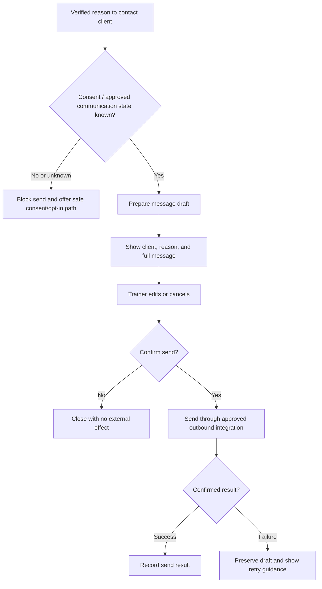

Canonical surface:

```text
Contextual entry point
→ one MessageComposer
→ consent state
→ prepared editable draft
→ trainer confirmation
→ approved send path
→ Sent Messages log
→ per-client activity timeline
```

### 19.1 MVP boundaries

- outbound only;
- trainer confirmed;
- no client forms;
- no inbound inbox journey;
- no autonomous reminders.

### 19.2 Future AI WhatsApp Concierge objective

When the trainer is busy, in a session, in Do Not Disturb mode, or outside configured response hours, FitDesk may operate a future AI WhatsApp Concierge.

The product goal is:

> **Every inbound WhatsApp message receives a timely, useful, and honest response—even when the trainer cannot reply—without allowing an uncertain message to silently change scheduling, packages, billing, payments, safety state, consent, or client history.**

Trainer availability context may be:

```text
Available
In session
Busy / Do Not Disturb
After hours
Temporarily unavailable
```

The trainer may set the state manually. FitDesk may also derive `In session` from a confirmed active session, but it never changes the trainer’s status based on an unverified assumption.

### 19.3 Future inbound-response flow

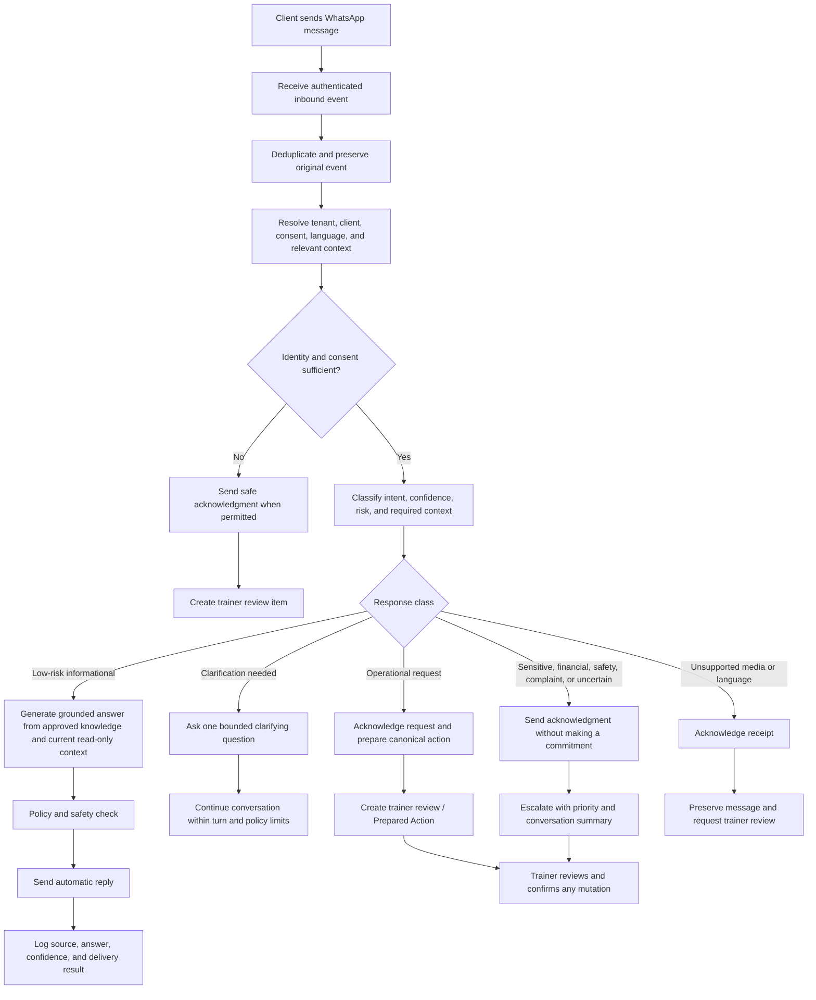

### 19.4 “Answer every message” classification

Every inbound message receives one of these outcomes:

```text
Answered automatically
→ safe, grounded, low-risk information

Clarifying question sent
→ bounded ambiguity that can be resolved conversationally

Acknowledged and escalated
→ trainer decision or sensitive judgment required

Unsupported content acknowledged
→ media/language/context cannot be processed safely

Blocked
→ consent, identity, policy, abuse, or security boundary prevents a normal reply
```

“Every message is answered” does **not** mean every request is autonomously fulfilled.

### 19.5 Safe automatic-answer scope

Examples of future low-risk automatic answers:

```text
Trainer availability window
Confirmed session date/time/location
What to bring when explicitly approved for that session
Public studio directions
Supported payment methods
How to access an already approved payment link
Package balance or invoice status only after identity and privacy checks
General cancellation-policy explanation without applying a consequence
Acknowledgment that the trainer is currently busy
```

The AI answer must be grounded in:

```text
Approved workspace FAQ / knowledge
Confirmed session and client read model
Approved policy version
Consent and privacy scope
Current integration health
Message and conversation context
```

It must never invent a price, slot, package balance, payment result, policy exception, medical recommendation, or trainer promise.

### 19.6 Requests that require trainer approval

The AI Concierge may discuss, clarify, and prepare—but not silently execute—the following:

```text
Book or reschedule a session
Cancel or no-show a session
Apply or waive a cancellation consequence
Change recurring series
Change billing mode or session price
Assign, renew, pause, extend, or consume a package
Create, amend, cancel, or credit an invoice
Record, refund, reallocate, or promise a payment
Change consent or permanent contact preference
Resolve a safety or health concern
Commit the trainer to a custom promise, discount, or exception
Handle a complaint requiring judgment
```

For these, the AI sends a truthful acknowledgment such as:

```text
I’ve received your request and prepared it for the trainer to review.
You’ll receive confirmation after the trainer approves any change.
```

Then it creates a Prepared Action linked to the canonical resolver.

### 19.7 Trainer takeover and handoff

The trainer can take over any conversation.

Handoff summary:

```text
Client
Conversation reason
What the AI answered
What remains unresolved
Detected intent and confidence
Relevant session/package/invoice
Prepared action
Recommended next safe response
```

Rules:

- Trainer takeover stops autonomous replies for the selected conversation until released.
- The trainer may correct the AI answer and optionally mark the approved knowledge source for review.
- Conversation status never replaces the authoritative session, invoice, package, payment, or consent state.
- The client is told when the conversation is being handed to the trainer when appropriate.

### 19.8 Autonomy ladder

```text
Level 0 — Current
AI drafts; trainer reviews and sends.

Level 1 — Inbound Signals
Capture, deduplicate, classify, summarize, and prepare action.

Level 2 — Safe Acknowledgment
Automatically confirm receipt and state that trainer review is required.

Level 3 — Grounded FAQ Concierge
Automatically answer approved low-risk questions.

Level 4 — Policy-Bound Conversational Support
Ask clarifying questions and complete low-risk informational conversations.

Level 5 — Limited Transaction Automation
FAR FUTURE / SEPARATE APPROVAL ONLY.
Any transaction class requires explicit policy, risk, audit, rollback, and product-owner authorization.
```

The roadmap may stop at Level 4. Level 5 is not implied by approving the Concierge.

### 19.9 Controls required before automatic replies

- authenticated inbound webhook and provider verification;
- tenant/client identity matching and safe unknown-sender handling;
- message and event deduplication;
- ordering and replay protection;
- consent, permitted-purpose, opt-out, and quiet-hours rules;
- approved knowledge sources with version and freshness;
- read-only access through approved FitDesk/ERP proxy paths;
- prompt-injection and malicious-content defenses;
- response-policy engine and prohibited-topic rules;
- confidence thresholds and fail-closed escalation;
- trainer Busy/Available controls;
- rate limits, spam, abuse, and loop prevention;
- multilingual and mixed-language evaluation where supported;
- voice-note/media handling only after separate validation;
- immutable conversation and decision audit;
- privacy, retention, deletion, and redaction policy;
- delivery/failure states and duplicate-send protection;
- human takeover;
- quality evaluation, sampled review, and kill switch.

### 19.10 Future operational states

```text
AI reply active
Trainer takeover
Awaiting client clarification
Prepared action awaiting trainer
Escalated — normal
Escalated — urgent
Blocked by consent/policy
Delivery failed
Integration unavailable
```

Urgent does not mean the AI provides medical or safety advice. It means the trainer receives a higher-priority review item and the client receives an appropriate acknowledgment.

### 19.11 Future status

| Capability | Status |
|---|---|
| Inbound event capture and deduplication | **FUTURE / APPROVAL-GATED FOUNDATION** |
| Inbound intent classification and summary | **FUTURE / PREPARED-ACTION STAGE** |
| Automatic safe acknowledgment while trainer is busy | **FUTURE / CONTROLLED PILOT** |
| Grounded low-risk FAQ answers | **FUTURE / CONTROLLED PILOT** |
| Clarifying questions within bounded policy | **FUTURE / AFTER FAQ PILOT** |
| Trainer takeover and conversation handoff | **REQUIRED BEFORE AUTOMATIC REPLIES** |
| Automatic scheduling or financial mutation | **NOT APPROVED; SEPARATE FAR-FUTURE DECISION** |
| Unrestricted autonomous WhatsApp agent | **REJECTED** |

---

## 20. FitDesk Intelligence Layer — Pilot and Future AI Journey

### 20.1 Product objective

FitDesk AI exists to remove searching, copying, retyping, and structuring from the trainer’s day without moving business truth or professional judgment into a model.

```text
Unstructured trainer/client input
→ tenant-scoped context
→ strict AI proposal
→ schema validation
→ deterministic domain validation
→ trainer review
→ canonical FitDesk workflow
→ confirmed result
```

The pilot uses one shared Intelligence Layer for several feature-specific workflows. It does not create an onboarding agent, scheduling agent, workout agent, safety agent, and messaging agent.

### 20.2 Workflow-versus-agent routing

| Capability | 2026 system pattern | Delivery decision |
|---|---|---|
| Quick Add from Text | Structured extraction workflow | **PILOT CORE** |
| Text-to-Structured Completion | Structured extraction workflow | **PILOT CORE** |
| Pre-Session Brief | Deterministic retrieval + optional constrained summary | **PILOT CORE** |
| Contextual Message Copilot | Grounded generation workflow | **PILOT CORE** |
| Natural-Language Booking | Intent extraction into BookingSheet | **PILOT AFTER EXTRACTION KERNEL** |
| Exercise Swap / Program Revision | Constrained catalog workflow | **PILOT WORKOUT-BUILDER ENTRY** |
| Workout / Program Builder | Constrained orchestration workflow | **PILOT AFTER CATALOG + SAFETY GATES** |
| Follow-Up Extractor | Structured extraction inside completion | **PILOT EMBEDDED FEATURE** |
| Client Pulse Lite | Deterministic read model | **PILOT; NOT AN LLM FEATURE** |
| Ask FitDesk | One bounded read-only tool-using agent | **LIMITED PILOT LAST** |
| Voice Progress | Speech adapter into existing parser | **NEAR-TERM FUTURE** |
| Adaptive Progression | Deterministic signals + LLM proposal | **FUTURE IN STAGES** |
| Risk Explanations | Rules/signals + source-linked explanation | **FUTURE ADVISORY** |
| Zero-UI Intent Parser | Bounded event-processing workflow | **FUTURE FOUNDATION** |
| WhatsApp Concierge | One bounded conversational agent | **FUTURE AUTONOMY LADDER** |
| Autonomous program/schedule/financial action | Write-capable autonomy | **FAR FUTURE / SEPARATE APPROVAL** |
| Multi-agent operations | Coordinated autonomous agents | **DO NOT BUILD WITHOUT EVAL EVIDENCE** |

### 20.3 Pilot system boundary

Conceptual placement, subject to repository audit:

```text
FitDesk product server
└─ lib/ai/
   ├─ core/
   │  ├─ aiRunService
   │  ├─ provider adapter
   │  ├─ context builder
   │  ├─ policy engine
   │  └─ output/domain validators
   ├─ prompts/
   ├─ schemas/
   ├─ features/
   │  ├─ quickAdd
   │  ├─ progressParser
   │  ├─ preSessionBrief
   │  ├─ messageCopilot
   │  ├─ bookingParser
   │  ├─ programBuilder
   │  └─ askFitDesk
   └─ evals/
```

Boundaries:

- no AI business logic in the Provisioning Agent;
- no AI business logic in ERP Execution Service;
- no direct UI-to-provider or UI-to-ERP calls;
- no ERP credentials stored in prompts, model tools, or FitDesk;
- ERP reads/writes continue through the approved client/proxy and Control Plane;
- start with one provider interface and one model per task class;
- no new AI microservice until production evidence proves the product-server module insufficient.

### 20.4 Shared AI run state machine

```text
RECEIVED
→ AUTHORIZED
→ CONTEXT_BUILDING
→ MODEL_RUNNING
→ OUTPUT_RECEIVED
→ SCHEMA_VALIDATED
→ DOMAIN_VALIDATED
→ REVIEW_REQUIRED
→ APPROVED / APPROVED_EDITED / REJECTED / EXPIRED
→ CANONICAL_ACTION
→ CONFIRMED
```

Failure states:

```text
INPUT_INVALID
CONTEXT_UNAVAILABLE
MODEL_FAILED
OUTPUT_INVALID
DOMAIN_BLOCKED
BUDGET_EXCEEDED
EXECUTION_UNCERTAIN
```

The review surface always distinguishes:

```text
Original input
AI-prepared fields
Source evidence
Assumptions
Missing or ambiguous values
Safety/risk flags
Domain validation
What happens after confirmation
```

### 20.5 Feature registry and source contract

Every feature is versioned:

```ts
type AIFeatureDefinition = {
  key:
    | "client.quick_add"
    | "progress.parse"
    | "brief.pre_session"
    | "message.draft"
    | "booking.parse"
    | "program.generate"
    | "program.revise"
    | "fitdesk.ask"
    | "message.intent"
    | "progression.recommend";

  featureVersion: string;
  promptVersion: string;
  schemaVersion: string;
  policyVersion: string;
  riskClass: "low" | "moderate" | "high";
  requiresTrainerReview: boolean;
  allowedContext: string[];
  prohibitedActions: string[];
};
```

Standard source reference:

```ts
type AISourceReference = {
  sourceType:
    | "user_input"
    | "client_record"
    | "session"
    | "goal"
    | "safety_state"
    | "exercise_catalog"
    | "program"
    | "invoice"
    | "package"
    | "workspace_policy"
    | "inbound_message";

  sourceId: string | null;
  fieldPath?: string;
  excerpt?: string;
  observedVersion?: string;
  observedAt: string;
};
```

The UI can answer:

```text
Where did this come from?
Is the source current?
Was it retrieved, extracted, or inferred?
```

### 20.6 Tenant isolation and context construction

```text
Authenticated user
→ resolve tenant
→ authorize feature
→ authorize each requested entity
→ build minimal tenant-scoped context
→ hash and record context snapshot
→ call provider
```

Never:

```text
Model requests a client
→ global search
→ tenant filter afterward
```

Every run records tenant, actor, feature, authorized entities, source versions, context hash, provider request/trace ID, and tool calls.

Untrusted data remains data—not instructions:

```text
Client messages
Trainer notes
Imported programs
Exercise descriptions
WhatsApp text
Uploaded documents
```

Prompt separation:

```text
System policy
→ feature contract
→ approved tool definitions
→ authorized context
→ untrusted content
→ strict output schema
```

### 20.7 Runtime budgets, memory, and exit conditions

```ts
type AIRunBudget = {
  maxModelCalls: number;
  maxToolCalls: number;
  maxRepairAttempts: number;
  maxInputTokens: number;
  maxOutputTokens: number;
  timeoutMs: number;
  maxEstimatedCostUsd: number;
};
```

Pilot defaults:

```text
Quick Add / Progress Parser
→ 1 generation + 1 optional schema repair

Pre-Session Brief / Message Copilot / Booking Parser
→ 1 generation

Workout Builder
→ 1 generation + 1 validator-guided repair

Ask FitDesk
→ maximum 3–5 read-tool calls + 1 final response
```

There is no unbounded self-reflection or repair loop.

Pilot memory:

```text
Authoritative FitDesk records
Feature-specific drafts
Short-lived context snapshots
Conversation state only where required
```

There is no generic AI memory such as “the model remembers Sarah prefers Mondays” unless that preference is trainer-approved and stored as a proper FitDesk field.

### 20.8 Pilot Quick Add from Text

Example input:

```text
Add Sarah Ahmed, 70 123 456.
She wants fat loss and better mobility.
Usually free Monday and Wednesday after 5.
She mentioned knee discomfort.
Pay per session, USD 40.
Prefers WhatsApp.
```

Output groups:

```text
Identity
Billing
Client-stated goals
Trainer-assessed goals — never inferred from client wording
Safety signals requiring review
Availability preferences
Communication preference
Missing / ambiguous fields
```

Every extracted field includes:

```text
Value
Status: extracted / ambiguous / missing / unsupported
Confidence: high / medium / low
Source phrase
```

Deterministic code performs phone normalization, currency handling, taxonomy mapping, tenant duplicate detection, and safety rules.

Success criteria include near-zero invented fields, high required-field precision, high safety-signal recall, zero cross-tenant leakage, and zero automatic creation.

### 20.9 Pilot Text-to-Structured Completion

```text
Typed progress
→ strict ProgressDraft
→ evidence and uncertainty
→ safety-signal check
→ trainer edit
→ canonical completion
```

The same schema is reused later by voice.

Output:

```text
Session summary
Client-reported observation
Trainer observation
Trainer interpretation
Performance / milestone
Measurement
Recovery / safety concern
Next-session focus
Maximum three potential follow-ups
```

Follow-up proposals include type, source phrase, reason, timing, and required canonical action. Nothing is saved merely because it was extracted.

### 20.10 Pilot Pre-Session Brief

```text
Confirmed session + client context
→ deterministic brief data
→ optional LLM condensation
→ source-linked mobile card
```

Structured fields include:

```text
Session time/type/location
Access instructions
Current goals
Safety items in domain-defined priority
Latest progress
Next-session focus
Trainer preparation
Equipment
Program context
Package/payment context
Source links and freshness
```

The brief is read-only. If AI fails, deterministic fields still render.

### 20.11 Pilot Contextual Message Copilot

```ts
type MessageFactBundle = {
  reason: string;
  verifiedFacts: Array<{
    key: string;
    value: string;
    source: AISourceReference;
  }>;
  prohibitedClaims: string[];
  consentState: string;
};
```

Flow:

```text
Choose message reason
→ retrieve authoritative facts
→ prepare editable wording
→ compare dates/amounts/balances/references with fact bundle
→ consent check
→ trainer confirms
→ canonical MessageComposer sends
```

Pilot message families:

```text
Booking confirmation
Session reminder
Location change
Running late
Package renewal
Payment reminder
No-show follow-up
Cancellation acknowledgment
Progress encouragement
Welcome
```

The model never invents money, package units, dates, slots, discounts, policies, or trainer commitments.

### 20.12 Pilot Natural-Language Booking Draft

```text
Trainer request
→ BookingDraft
→ absolute date/year/time/timezone
→ visible ambiguity
→ canonical BookingSheet
→ scheduling engine
→ trainer confirmation
```

The parser records raw date phrase, interpreted date, timezone, and ambiguity class:

```text
none
multiple dates
missing year
relative date
locale uncertain
```

No model booking write tool exists.

### 20.13 Pilot Workout Builder and revision assistant

Program generation remains catalog-constrained and trainer-reviewed.

Machine-readable validation covers:

```text
Exercise ID exists
Exercise not deprecated
Equipment available
Goal/program context allowed
Safety tags allowed
Session duration fits
Units explicit
Block limits satisfied
Warm-up/cool-down policy satisfied
Progression boundaries satisfied
Goal/safety versions still current
```

Revision commands may include:

```text
Replace this exercise
Regenerate only the warm-up
Shorten to 45 minutes
Create a hotel-gym version
Create a no-equipment version
Reduce complexity this week
```

Smallest-change rule:

```text
Exercise swap
before section rewrite
before session rewrite
before full program regeneration
```

Approved versions are immutable; every new proposal is a versioned draft with a structured diff.

### 20.14 Limited read-only Ask FitDesk agent

This is the pilot’s only true tool-using agent.

Supported example questions:

```text
Which clients have no next session?
Whose packages do not cover booked sessions?
Which sessions tomorrow have no location?
Which payments are overdue?
Who needs safety review before the next session?
```

Approved tools may include:

```text
getClientOperationalSummary
findClientsWithoutNextSession
findLowPackageClients
findOverdueInvoices
findSessionsMissingLocation
findUnresolvedSessions
getGoalAndSafetyContext
```

Tool result contract:

```ts
type ReadToolResult<T> = {
  status: "current" | "partial" | "stale" | "unavailable";
  asOf: string;
  records: T[];
  nextPageToken?: string;
};
```

Boundaries:

- five to ten approved question families initially;
- six to eight narrow read tools;
- no raw SQL or generic query tool;
- no write tools;
- no ERP credentials;
- no answer without source links and freshness;
- explicit unavailable response instead of memory-based guessing.

### 20.15 Pilot Client Pulse Lite

```text
Authoritative records
→ deterministic signal derivation
→ Pulse read model
→ evidence and freshness
→ one safe canonical action
```

```ts
type ClientPulse = {
  state: "clear" | "needs_review" | "unknown";
  calculatedAt: string;
  primarySignal: PulseSignal | null;
  secondarySignals: PulseSignal[];
  unavailableSources: string[];
};
```

```ts
type PulseSignal = {
  code: string;
  category:
    | "safety"
    | "recovery"
    | "scheduling"
    | "package"
    | "billing"
    | "communication"
    | "data_quality";
  level: "blocker" | "warning" | "advisory";
  title: string;
  explanation: string;
  sourceEntityIds: string[];
  sourceVersion?: string;
  observedAt: string;
  recommendedAction: string;
};
```

Where it appears:

```text
Dashboard
→ only Needs review / Unknown clients

Client Hub
→ complete evidence and secondary signals

Mobile
→ one compact card + full-height explanation sheet
```

Pilot Pulse has no `Healthy / Watch / At Risk`, numerical risk score, prediction, automatic message, or direct mutation.

### 20.16 Future Voice-to-Structured Progress

```text
Audio upload
→ transcription provider
→ editable transcript
→ existing Progress Parser
→ uncertainty and safety highlighting
→ trainer review
```

Controls:

- transcript beside parsed fields;
- typed/structured alternative remains complete;
- no outcome or financial inference;
- explicit audio-retention policy;
- noisy-gym evaluation;
- Arabic, English, and mixed-language evaluation where supported;
- no realtime voice agent initially.

### 20.17 Future Adaptive Progression

Separate deterministic evidence from model explanation:

```text
Completed plans
Trainer-recorded performance
Measurements
Difficulty/recovery notes
Pain/safety signals
Adherence
Substitutions
Program-review timing

→ deterministic progression signals
→ data-quality and safety gate
→ LLM prepares bounded options
→ structured before/after diff
→ trainer approval
```

Progression ladder:

```text
Level 1 — review suggested
Level 2 — one parameter/exercise change
Level 3 — session revision
Level 4 — week/program-phase revision
Level 5 — autonomous adaptation; separate far-future approval
```

The model never treats attendance alone as readiness, pain as resolved, or missing measurements as positive evidence.

### 20.18 Future operational, coaching, and safety signals

Keep signal families separate:

```text
Coaching progression
Operational continuity/revenue
Safety review
```

Never:

```text
Sarah risk score: 73%
```

Use:

```text
Review suggested
Reason
Evidence and source dates
Current unresolved state
Safe canonical actions
Dismiss/correct with reason
```

Deterministic rules detect. AI may group and explain evidence. The AI never clears safety or labels the client’s character.

### 20.19 Future Zero-UI Inbound Intent Parser

```text
Authenticated inbound webhook
→ immutable event
→ deduplicate/order safely
→ resolve tenant/client/session/invoice/package
→ classify intent, confidence, and risk
→ answer / clarify / acknowledge-escalate / block
```

Intent families include availability, location, running late, confirmation, cancellation, rescheduling, payment, package, complaint, safety/health concern, general question, and unknown.

Consequential requests become Prepared Actions. Client text alone never books, reschedules, cancels, charges, refunds, waives, changes consent, changes a package, or clears safety.

This parser is implemented before autonomous WhatsApp answers and feeds the autonomy ladder in section 19.

### 20.20 Future predictive scheduling and open-slot recommendations

```text
Open slot
→ deterministic eligible-client query
→ approved ranking inputs
→ AI explanation
→ trainer chooses client
→ canonical BookingSheet
→ full revalidation
→ trainer confirmation
```

Approved ranking inputs may include explicit earlier-session request, no next session, preferred day/time, duration fit, location/buffer compatibility, valid package/rate, and stored flexibility.

Do not rank by opaque “client value,” predicted acceptance, or inferred churn.

### 20.21 Future autonomy ladder

```text
Structured interpretation
→ advisory recommendation
→ bounded read-only agent
→ bounded conversational assistance
→ separately approved transaction class
```

Scheduling, coaching, communication, package, safety, and financial authority advance independently.

Far-future actions such as transactional WhatsApp, autonomous program adaptation, autonomous schedule optimization, and multi-agent business operations require separate product, safety, legal, evaluation, and architecture approval.

### 20.22 Evaluation system

Every feature has four evaluation layers:

```text
Component
→ schema validity, extraction accuracy, catalog validity, source correctness

Domain
→ safety policy, scheduling boundary, billing/package separation, tenant authorization, consent

End-to-end
→ input, proposal, trainer edit, approval, canonical action, confirmed result

Adversarial
→ prompt injection, cross-tenant collision, stale context, fake financial facts,
  malformed dates, similar client names, unsupported exercise, timeout, replay
```

Release gates:

```text
Golden dataset
Minimum quality threshold
Maximum harmful-error threshold
Multiple trials where non-determinism matters
Latency budget
Cost budget
Fallback behavior
Human-review test
Cross-tenant isolation test
Regression suite
Trace review
Rollback switch
```

Model, prompt, schema, policy, catalog, context-builder, and tool changes rerun the relevant regression suite.

### 20.23 AI observability and governance

A shared run record includes:

```text
requestId / traceId
tenantId / actorId
feature key + feature/prompt/schema/policy versions
provider + model snapshot
authorized entity IDs
context hash and source versions
tool-call trace
input/output risk flags
schema/domain validation
human decision and edit state
canonical operation ID
stop reason
latency, tokens, and estimated cost
error and expiry
```

Privacy rules:

- minimize raw sensitive text in operational logs;
- store redacted traces or secure references where possible;
- define feature-specific retention and deletion;
- isolate tenant usage and cost;
- provide incident review, kill switch, and rollback;
- do not use model self-evaluation as the only safety gate.

### 20.24 Delivery sequence

```text
Wave 0 — repository/data audit
→ existing AI code
→ goal/safety model
→ exercise/program catalog
→ canonical workflow contracts
→ queue and observability capability

Wave 1 — shared AI kernel
→ feature registry
→ prompt/schema/policy registry
→ context/source contract
→ run audit
→ strict validation
→ eval harness

Wave 2 — lowest-risk pilot
→ Quick Add
→ Text-to-Structured Completion
→ Pre-Session Brief
→ Client Pulse Lite

Wave 3 — grounded generation
→ Message Copilot
→ Natural-Language Booking
→ Follow-Up Extraction

Wave 4 — constrained coaching
→ Exercise Swap
→ Program Section Revision
→ Workout Builder
→ Program Revision / multi-week draft

Wave 5 — bounded read-only agent
→ Ask FitDesk with approved questions and tools

Future
→ Voice
→ Adaptive Progression
→ signal explanations
→ inbound intent
→ WhatsApp autonomy ladder
→ predictive scheduling
```

### 20.25 Delivery priority

| Capability | Status |
|---|---|
| Shared AI kernel, schemas, context, audit, and eval harness | **PILOT FOUNDATION** |
| Quick Add from Text | **PILOT CORE** |
| Text-to-Structured Completion | **PILOT CORE** |
| Pre-Session Brief | **PILOT CORE** |
| Client Pulse Lite | **PILOT CORE — DETERMINISTIC** |
| Contextual Message Copilot | **PILOT GROUNDED GENERATION** |
| Natural-Language Booking Draft | **PILOT AFTER EXTRACTION KERNEL** |
| Follow-Up Extraction | **PILOT EMBEDDED IN COMPLETION** |
| Exercise Swap / Section Revision | **PILOT WORKOUT-BUILDER ENTRY** |
| Workout / Program Builder | **PILOT AFTER CATALOG + SAFETY GATES** |
| Ask FitDesk | **LIMITED READ-ONLY PILOT LAST** |
| Voice-to-Structured Progress | **NEAR-TERM FUTURE** |
| Adaptive Progression proposals | **FUTURE IN STAGES** |
| Operational/safety risk explanations | **FUTURE ADVISORY** |
| Zero-UI Intent Parser | **FUTURE FOUNDATION** |
| WhatsApp Concierge | **FUTURE CONTROLLED AUTONOMY** |
| Predictive scheduling | **FUTURE RECOMMENDATION ONLY** |
| Autonomous program/schedule/financial action | **FAR FUTURE / SEPARATE APPROVAL** |
| Multi-agent business operations | **FAR FUTURE / EVAL-EVIDENCE REQUIRED** |

---

## 21. Future Client Onboarding Portal

### 21.1 MVP

```text
Trainer creates and manages the client.
Client has no direct FitDesk account or portal.
```

### 21.2 Future secure no-install portal

**FUTURE / APPROVAL-GATED**

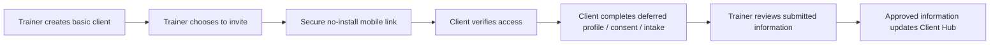

Required decisions before implementation:

- identity verification;
- link expiry and revocation;
- tenant isolation;
- consent and privacy model;
- health-data scope;
- audit trail;
- field ownership;
- conflict resolution when trainer and client values differ.

### 21.3 Dedicated client app

**PWA-DECISION-GATED**

A dedicated PWA or native app is not part of the current roadmap commitment. It requires a separate decision after the secure portal is proven valuable.

---

# PART VI — SERVICE BLUEPRINT AND OWNERSHIP

## 22. Cross-Actor Swimlane

| Journey moment | Trainer | Client | FitDesk / AI | WhatsApp | ERPNext / Control Plane |
|---|---|---|---|---|---|
| Start day | Opens dashboard | — | Derives Today/Attention; AI may explain only | — | Supplies authoritative operational data |
| Add client | Enters and confirms identity | Shares details outside FitDesk | Validates, deduplicates, creates local workflow state | No send | ERP Customer remains authoritative |
| Billing mode | Chooses mode | Agrees with trainer | Stores local/ERP-compatible billing context | — | Financial records remain authoritative |
| Package assignment | Selects package and Paid Now/Later | Receives invoice/payment request | Opens workflow and shows confirmed result | May deliver approved link/message | Creates invoice/payment records through approved path |
| Client Hub review | Reviews Today, safety, package, attendance, progress, and next-safe action | — | Derives contextual read model without duplicating mutations | — | Supplies authoritative operational and financial truth |
| Recurring schedule | Selects occurrence/future/series scope and confirms | Receives changed booking information | Regenerates affected occurrences and revalidates conflicts, buffers, DST, location, package, and billing | May deliver approved confirmation | Persists only through approved scheduling path |
| Pause/reactivate | Reviews affected sessions, package, billing, safety, and communication | Receives trainer-approved update | Preserves history and coordinates canonical flows | May deliver approved message | Financial records remain authoritative and are not silently changed |
| Availability disruption | Declares dated exception and resolves affected sessions | Receives only trainer-approved updates | Calculates impact, explains consequences, and coordinates canonical resolvers | Sends only confirmed messages | Existing sessions and accounting records remain authoritative |
| Identity resolution | Reviews duplicate evidence and survivor plan | — | Prevents cross-tenant merge and preserves lineage | — | ERP identities and financial relationships are audited and preserved |
| Book | Chooses slot and confirms | Receives booking | Validates conflict/timezone through scheduling stack | May deliver confirmed reminder | Persists authoritative session |
| Deliver | Coaches client | Attends | Presents context | — | — |
| Outcome | Selects outcome, enters quick progress, chooses conditional billing/payment handling, and confirms once | Experiences coaching outcome | Keeps progress and consequences in one contextual flow; never auto-decides | — | Applies authoritative session/package/invoice/payment mutations; FitDesk owns progress workflow state |
| Payment | Chooses Paid Now during pay-per-session completion or records later from the invoice | Pays | Reuses one payment contract from contextual completion or invoice detail | May deliver approved payment link | ERP Payment Entry authoritative |
| Follow-up | Reviews and confirms message | Receives outbound message | AI drafts only | Executes confirmed outbound send | — |
| Retention / Pulse Lite | Reviews deterministic evidence and safe action | Receives no system judgment | Derives Clear / Needs review / Unknown from authoritative signals | Optional confirmed outbound action | Financial/session truth remains authoritative |
| Quick Add | Reviews extracted identity, goals, safety, preferences, and billing | Shares details through existing channel | Produces evidence-linked draft only | No send | ERP Customer created only through approved path after confirmation |
| Workout Builder | Reviews catalog-constrained program or revision diff | Receives trainer-approved coaching | Produces structured draft from goals, safety, catalog, equipment, and policy | No automatic send | No accounting effect |
| Ask FitDesk | Asks supported read-only question | — | Chooses among approved tenant-scoped read tools and cites current records | — | ERP truth accessed only through approved reads |
| Portal | — | FUTURE direct interaction | Approval-gated secure portal | Optional invitation channel | Ownership rules remain explicit |

---

## 23. Mutation Sovereignty Pattern

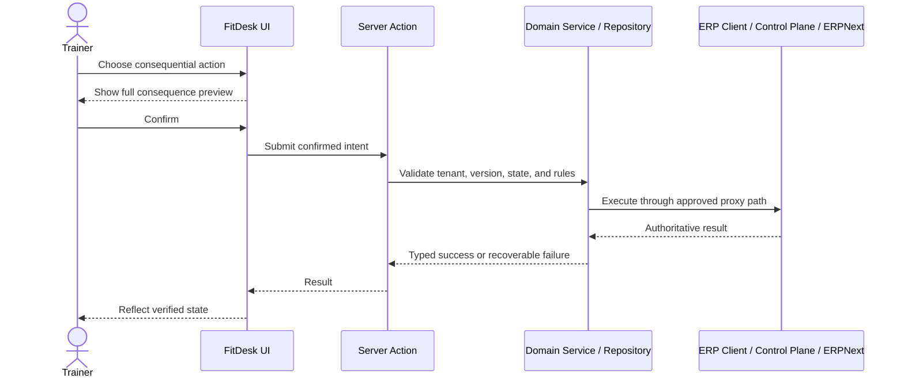

No AI participant is included in the authoritative execution chain. AI may prepare content, structured drafts, summaries, program proposals, booking drafts, or read-only answers before the trainer’s decision, but the confirmed action chain remains trainer-owned.

The future WhatsApp Concierge may autonomously send only the separately approved low-risk conversational response classes described in section 19. It still has no scheduling, coaching-program publication, package, invoice, payment, safety-clearance, or unrestricted write authority.

---

# PART VII — CROSS-JOURNEY STATE AND RECOVERY

## 24. Honest State Model

| System reality | Trainer-facing response | Required behavior |
|---|---|---|
| Loading | “Checking today’s activity…” | Stable shell, shaped skeletons, no reassurance. |
| Unavailable | “We couldn’t refresh this information yet.” | Preserve known context, offer retry, never show zero/all clear. |
| Partial | “Schedule is current; payment activity could not be refreshed.” | Identify current vs incomplete sources; restrict unsupported actions. |
| Rejected before mutation | “Nothing changed. Correct the issue and try again.” | Preserve draft and correction path. |
| Confirmed success | Specific verified result | Refresh affected dashboard/client/invoice/package state. |
| Confirmed but stale projection | “Saved. Some summaries are still refreshing.” | Do not repeat mutation; repair/reconcile read model. |
| Outcome uncertain | “Status unconfirmed. Do not retry yet.” | Disable duplicate action and query authoritative state. |
| Blocked | Explain why action cannot continue | Give one safe resolution path. |
| Empty | Verified checks completed and no records exist | Show one activation action. |
| Sparse | Some records exist but low activity | Use contextual activation/reactivation guidance. |
| AI draft pending review | “Prepared from your input. Review highlighted fields.” | Distinguish extracted, inferred, missing, and ambiguous values. |
| AI context stale | “Source information changed. Regenerate before approval.” | Block approval against outdated safety, goal, schedule, package, or policy versions. |
| AI output invalid | “The draft could not be validated.” | Preserve original input; offer manual flow or one bounded repair. |
| AI budget exceeded | “The assistant stopped safely.” | No mutation; show manual fallback and logged stop reason. |
| AI source unavailable | “Some source information could not be checked.” | Do not invent values or present the result as complete. |

---

## 25. Key Failure Loops

### 25.1 Client creation

- ERP Customer fails → no local rows; preserve form; retry.
- ERP succeeds and local projection fails → do not delete ERP Customer automatically; repair through backfill/reconcile.
- Duplicate warning → trainer may open existing, cancel, or continue with an audited reason.

### 25.2 Booking

- Conflict → return structured conflict; do not save.
- Stale version → refresh and ask trainer to review again.
- Unknown persistence result → do not encourage immediate retry until authoritative state is checked.

### 25.3 Session completion

- Progress validation/persistence fails → preserve the draft and do not claim the progress was saved.
- Billing mode unset → fail closed or show the approved no-charge/follow-up state.
- Package unavailable/exhausted → preserve progress and route to package review without claiming package consumption.
- Invoice creation fails → state whether the session/progress was saved and keep financial recovery explicit.
- Paid Now payment fails or is uncertain → do not claim payment success; preserve the invoice and query authoritative state before retry.
- Duplicate submit → immutable/version/idempotency guards prevent repeated session, package, invoice, progress, or payment effects.

### 25.4 Payment

- Method unavailable in the completion sheet or invoice detail → do not silently substitute Cash.
- ERP configuration incomplete → show a configuration-unavailable state and allow Pay Later where valid.
- Payment creation uncertain → query authoritative invoice/payment state before retry.
- Leaving the completion sheet must not lose a valid outstanding invoice or entered progress.

### 25.5 WhatsApp

- Consent unknown/opted out → block send.
- Send fails → preserve draft and recipient context.
- Delivery state unknown → do not claim delivery.

### 25.6 Operational disruption

- Impact calculation fails → preserve the proposed exception; mutate no sessions.
- Affected session changes after preview → mark stale and require regenerated review.
- Partial batch failure → show per-item result and keep unresolved items visible.
- Message preparation succeeds but scheduling mutation fails → do not send misleading confirmation.
- Retry → reuse decision and idempotency keys.

### 25.7 Duplicate identity resolution

- Cross-tenant candidate → hard block.
- ERP identity conflict → stop and route to controlled review.
- Relationship relink partially fails → preserve merge lineage and expose unresolved relationships.
- Financial relationship is uncertain → block consolidation.
- Retry → never duplicate invoices, payments, sessions, packages, or messages.

### 25.8 Integration and consent

- Integration health unknown → show Unknown, not Healthy.
- Consent missing or stale → fail closed for the affected purpose.
- External operation fails → preserve draft/context and expose duplicate-protection state.
- Recovery action unavailable → explain affected capability and safe fallback.

### 25.9 AI proposal and agent runs

- Tenant/entity authorization fails → build no context and call no model.
- Required source unavailable → show partial/unavailable state; do not infer authoritative truth.
- Schema invalid → allow at most the feature’s bounded repair count, then fall back safely.
- Domain validation blocks → preserve draft and show the exact deterministic reason.
- Safety/goal/program source changes before approval → expire the proposal and regenerate.
- Model/provider timeout → preserve input; create no mutation.
- Run/tool/cost budget reached → stop with explicit reason.
- Prompt injection in notes/messages/catalog → treat as untrusted data; never expand tools or authority.
- Trainer rejects → retain only the approved audit/retention record; execute nothing.
- Repeated approval submission → canonical operation idempotency prevents duplicate effects.

---

# PART VIII — MODERNIZATION PROGRAM CROSSWALK

## 26. Journey-to-Dashboard Plan v1.1

| Dashboard plan stage | Journey map impact | Journey requirement |
|---|---|---|
| Stage 1 — Operational truth | D1 Open Dashboard; all recovery states | No unavailable-as-zero; no unsupported “all clear.” |
| Stage 2 — Empty/sparse/activation | First-client activation loop | Use `Add client → billing mode → book first session → dashboard operational`. |
| Stage 3 — Hierarchy/compact rows | Daily operating journey | Today and Needs Attention lead; unresolved outcomes visible. |
| Stage 6 — Client Pulse Lite | Pilot operational awareness | Deterministic Clear/Needs review/Unknown, evidence/freshness, one safe action, no score or prediction. |
| Stage 7 — Prepared Actions v1 | Follow-up/action preparation | AI drafts only; trainer reviews and confirms; existing mutation contract unchanged. |
| Operational recovery | Dated availability, disruption, data quality, integration health | Explain impact, deep-link to canonical resolvers, and preserve unresolved work. |
| Weekly planning | Deterministic next-week facts | Show freshness and partial/unavailable states; no AI narrative required. |
| Smart client views | URL-backed deterministic filters | Views never mutate client state and expose their inclusion rules. |

### 26.1 Approval-gated dashboard flags

Do not treat these as MVP merely because they appear in a plan:

- Predictive Pulse, adaptive thresholds, Healthy/Watch/At Risk labels, and retention scoring beyond pilot Pulse Lite.
- Prepared outbound reminder surfaced earlier.
- Suggested booking slots.
- Insight layer and chart.
- Persistent onboarding checklist.
- Persistent AI chat.
- Product analytics instrumentation.
- Inbound WhatsApp Signals.
- Automatic AI WhatsApp acknowledgments or answers.
- Any WhatsApp transaction automation.
- Autonomous program adaptation or publication.
- Predictive scheduling that reserves, moves, books, or messages.
- Multi-agent orchestration.

### 26.2 Programs, portal, and insight layer

Use explicit flags:

```text
Client portal = APPROVAL-GATED FUTURE
Insight layer = APPROVAL-GATED
Programs = FUTURE / APPROVAL-GATED
Dedicated client app/PWA = PWA-DECISION-GATED
```

---

# PART IX — 2026 FLOW CONSOLIDATION BLUEPRINT

## 27. Recommended Canonical Flows

### 27.1 Governing rule

```text
One real-world objective
→ one coherent contextual flow
→ one review point
→ explicit truth for every authoritative effect
```

A surface may have many entry points, but there should be one canonical action contract for validation, preview, mutation, audit, recovery, and success.

Consolidation must reduce navigation and repeated entry without creating a mega-sheet or hiding distributed failure.

### 27.2 Consolidated operating map

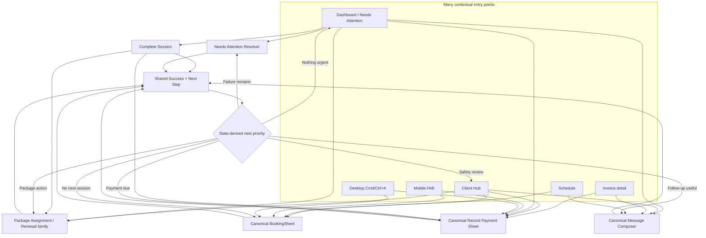

### 27.3 Recommended ideas and status

| Recommendation | Why it helps the trainer | Product status |
|---|---|---|
| **Unified Complete Session** | Resolves outcome, quick progress, package/invoice consequence, and Paid Now/Pay Later without changing modules. | **APPROVED JOURNEY REQUIREMENT**; exact code status `VERIFY AT ADOPTION`. |
| **One canonical Record Payment flow** | The same payment experience opens from completion, invoice, Client Hub, dashboard, FAB, and command palette. | **MVP / production-hardening boundary**; reuse existing authoritative payment contract. |
| **One canonical BookingSheet** | Single booking, recurrence, conflict review, reschedule, alternative slots, and explicit soft-buffer override stay in one flow. | **MVP — NEEDS UPGRADE**; buffer override is an **APPROVED JOURNEY REQUIREMENT**, exact implementation `VERIFY AT ADOPTION`. |
| **Client activation checklist** | Prevents created-but-not-operational clients while avoiding a forced wizard. | **PRODUCTION-HARDENING SOON**; derive from existing state, no new onboarding persistence. |
| **State-derived next action** | Shows the highest-priority safe action rather than always pushing “Book next session.” | **PRODUCTION-HARDENING SOON**; deterministic rules first. |
| **Shared success-and-next-step grammar** | Makes every workflow predictable: what changed, what remains, and what to do next. | **MVP / design-system consolidation**. |
| **One contextual WhatsApp composer** | Removes duplicated send UIs while preserving consent, confirmation, and audit. | **MVP — NEEDS UPGRADE**; outbound only. |
| **Needs Attention resolver** | Turns alerts into finite, executable work with one primary action. | **MVP / dashboard modernization**. |
| **URL-backed overlays** | Preserves context, Back/Forward behavior, refresh, bookmarking, and deep links. | **PRODUCTION-HARDENING SOON**. |
| **Draft preservation and resume** | Protects gym-floor work from interruption without confusing draft and authoritative state. | **PRODUCTION-HARDENING SOON**. |
| **Unified Client Hub timeline** | Gives one chronological history for sessions, progress, billing, packages, messages, goals, safety, and notes. | **PRODUCTION-HARDENING SOON**. |
| **Consolidated package lifecycle** | Keeps Assign, Renew, Replace, and Review Balance coherent without mixing template administration into routine work. | **PRODUCTION-HARDENING SOON**. |
| **Configure when needed, then return** | Fixes missing setup in context and returns to the original draft instead of abandoning the trainer in Settings. | **PRODUCTION-HARDENING SOON**. |
| **Desktop command palette** | Reduces navigation pressure and accelerates frequent actions for power users. | **PRODUCTION-HARDENING SOON**, after canonical actions are stable. |
| **Optional end-of-day closeout** | May help trainers clear unresolved outcomes, payments, bookings, and messages in one queue. | **EXPERIMENT / VALIDATE FIRST**. |
| **AI-drafted progress summaries** | Can reduce writing effort while preserving trainer review and control. | **FUTURE / APPROVAL-GATED**. |
| **Predictive next-best-action ranking** | May improve prioritization after deterministic rules and sufficient data exist. | **FUTURE / APPROVAL-GATED**. |
| **Sequential batch resolution** | Could speed up closeout while preserving per-item confirmation. | **EXPERIMENT / VALIDATE FIRST**. |
| **During-session live notes** | May help some trainers, but risks creating a complex workout-tracking surface without validated demand. | **EXPERIMENT / VALIDATE FIRST**. |
| **Structured exception decisions** | Keeps safe defaults while allowing legitimate trainer judgment through hard/soft/advisory classification, bounded scope, review, and audit. | **CROSS-CUTTING PRODUCT DOCTRINE**; explicit rules first. |
| **Working-hours and location exceptions** | Avoids editing global settings for one legitimate booking while preserving hard conflict boundaries. | **MVP / PILOT-SAFE NEXT**. |
| **No-show waiver and package-exhausted resolver** | Prevents rigid financial outcomes and completion dead ends without silent accounting changes. | **PRODUCTION-HARDENING SOON**. |
| **Partial-payment path** | Matches authoritative invoice allocation while keeping the remaining balance explicit. | **PRODUCTION-HARDENING SOON / PILOT-DEMAND GATE**. |
| **Client Statement of Account** | Gives the trainer a read-first financial workspace with dominant Balance due, explainable ledger history, honest data states, and direct payment/reminder resolution. | **MVP / CURRENT VISUAL EXISTS**; 2026 target UX and authoritative behavior `VERIFY AT ADOPTION`. |
| **Client Today + Next Safe Action** | Shows the trainer the right preparation context and one explainable priority without creating another page. | **MVP / PILOT-SAFE DIRECTION**. |
| **Package & Billing Status** | Centralizes package usage, expiry, payment state, and renewal actions inside Client Hub. | **HIGH-PRIORITY HARDENING**. |
| **Recurring Schedule Manager** | Makes occurrence/future/series changes understandable and revalidated before mutation. | **HIGH-PRIORITY HARDENING**. |
| **Resume Work queue** | Lets trainers continue drafts, uncertain results, and incomplete workflows without becoming a notification inbox. | **HIGH-VALUE HARDENING**. |
| **Lifecycle Pause / Resume / Reactivate** | Preserves client history while resolving schedules, package, billing, safety, and messaging consequences. | **PRODUCTION-HARDENING**. |
| **Unified Progress and Activity** | Separates structured current truth from chronological coaching and operational history. | **PRODUCTION-HARDENING**. |
| **Receipt and Financial Correction** | Generates proof only from confirmed ERP state and routes mistakes through controlled accounting corrections. | **MANDATORY PRODUCTION-HARDENING**. |
| **Structured Session Context** | Captures location, type, focus, preparation, defaults, and instructions once and reuses them at booking, preparation, reminder, and completion moments. | **MVP / PILOT-SAFE CORE**. |
| **Progressive Booking Details** | Keeps BookingSheet fast while revealing optional fields only when session type, location, or trainer intent makes them relevant. | **MVP UX REQUIREMENT**. |
| **Session State Separation** | Prevents reminder delivery or arrival from being mistaken for client confirmation, completion, package use, invoice creation, or payment. | **MVP DOMAIN REQUIREMENT**. |
| **Dated Availability + Day Disruption** | Lets the trainer handle illness, travel, and venue changes without rewriting normal hours or manually rebuilding every session. | **MVP FOUNDATION / HIGH-PRIORITY HARDENING**. |
| **Explainable Decisions + Change Summaries** | Shows why a rule fired, what changed, and the safest next actions instead of generic errors or “Saved.” | **MVP CROSS-CUTTING REQUIREMENT**. |
| **Duplicate Identity Resolver** | Prevents fragmented client truth while preserving ERP, financial, scheduling, and audit lineage. | **MANDATORY BEFORE IMPORTS**. |
| **Package Runway** | Converts remaining units into deterministic coverage of confirmed future sessions and expiry impact. | **HIGH-PRIORITY HARDENING**. |
| **Just-in-Time Data Quality Resolver** | Surfaces missing truth only when it blocks or weakens a real trainer action. | **HIGH-VALUE HARDENING**. |
| **Integration and Consent Health** | Makes outbound and ERP capability failures understandable and prevents unsafe sends. | **PRODUCTION-HARDENING**. |
| **Smart Client Views + Weekly Planning** | Gives the trainer deterministic operational slices without creating new client statuses or AI segments. | **MVP VIEWS / HARDENING BRIEF**. |
| **Safe Undo Boundary** | Makes reversible local actions forgiving while routing authoritative effects to correction or compensation. | **MVP DESIGN-SYSTEM RULE**. |
| **AI WhatsApp Concierge** | Ensures every inbound client message receives a grounded answer or acknowledgment while the trainer is busy, with sensitive requests escalated to Prepared Actions. | **FUTURE / APPROVAL-GATED AUTONOMY LADDER**. |
| **Quick Add from Text** | Turns an unstructured client description into an evidence-linked draft without bypassing duplicate, consent, safety, billing, or ERP creation rules. | **PILOT CORE**. |
| **Text-to-Structured Completion** | Converts a short trainer note into editable progress, safety signals, next focus, and bounded follow-ups inside completion. | **PILOT CORE**. |
| **Pre-Session Brief** | Condenses verified client/session context for the gym floor while retaining source links and deterministic fallback. | **PILOT CORE**. |
| **Contextual Message Copilot** | Prepares wording from a locked fact bundle and canonical consent/send flow. | **PILOT GROUNDED GENERATION**. |
| **Natural-Language Booking Draft** | Converts trainer language into a reviewable BookingSheet draft; scheduling engine remains authoritative. | **PILOT AFTER EXTRACTION KERNEL**. |
| **Constrained Workout Builder** | Creates exercise-catalog-based, safety-validated, versioned drafts and revisions for trainer approval. | **PILOT AFTER CATALOG + SAFETY GATES**. |
| **Ask FitDesk** | Answers a small set of operational questions using narrow, tenant-scoped, read-only tools and source-linked freshness. | **LIMITED PILOT LAST**. |
| **Client Pulse Lite** | Groups verified client conditions into Clear, Needs review, or Unknown with one safe action and no prediction. | **PILOT DETERMINISTIC READ MODEL**. |
| **Voice / Adaptive Progression / Intent Parser** | Reuse the AI kernel for future multimodal input, advisory coaching revisions, and inbound Prepared Actions. | **FUTURE IN STAGES**. |

### 27.4 Canonical entry-point matrix

| Trainer objective | Allowed entry points | Canonical surface | Single contract rule |
|---|---|---|---|
| Add client | Clients, Dashboard, FAB, command palette | `AddClientSheet` / desktop drawer | One create, duplicate-check, review, and recovery contract. |
| Book or reschedule | Schedule, Client Hub, completion success, Dashboard, FAB, command palette | `BookingSheet` | One conflict-aware, recurrence-aware contract that distinguishes hard conflicts from auditable soft-buffer overrides. |
| Complete or resolve session | Session detail, Today, Needs Attention | URL-backed completion/resolution sheet | One outcome framework with conditional progress and financial branches. |
| Record payment | Completion, Invoice detail, Client Hub, Needs Attention, FAB, command palette | `RecordPaymentSheet` | One payment validation, preview, mutation, and authoritative-result contract. |
| Assign or renew package | Client Hub, package warning, completion recovery | Package assignment/renewal family | Shared package services; distinct modes, no giant template-management sheet. |
| Send message | Client Hub, session, invoice, package, Needs Attention | `MessageComposer` | One consent, draft, confirmation, send, and logging contract. |
| Resolve attention item | Dashboard, deep link | Attention resolver | One primary action, explainable reason, safe secondary actions. |
| Review client account | Client Hub, invoice detail, overdue attention item, command palette | URL-backed Statement of Account drawer/full-height mobile sheet | One ERP-authoritative read model; Balance due is primary; payment/reminder actions reuse canonical contracts. |
| Prepare for client | Today schedule, Client Hub | Client Hub contextual Today state | One client read model with safety-first deterministic next action. |
| Manage recurring schedule | Client Hub, session detail, Schedule | URL-backed Recurring Schedule Manager | One recurrence-aware preview and mutation contract with explicit scope. |
| Resume incomplete work | Dashboard, Needs Attention, deep link | Resume Work resolver | One draft/recovery source that distinguishes saved, authoritative, and uncertain state. |
| Pause, resume, reactivate, or deactivate | Client Hub lifecycle actions | URL-backed lifecycle resolver | One consequence preview coordinating canonical scheduling, package, billing, safety, and message flows. |
| Review progress and activity | Client Hub | Structured current state + unified timeline | Timeline explains change history; structured goals/safety/measurements remain authoritative. |
| Correct financial error | Statement, payment detail, invoice detail | Controlled Financial Correction Resolver | Route only through approved ERP-authoritative correction services. |
| Add or edit session context | BookingSheet, Session Detail, Client Today, recurring manager | Canonical BookingSheet / session-context sheet | One field hierarchy, visibility model, provenance contract, and occurrence snapshot. |
| Prepare for next session | Completion success, Client Today, Session Detail | Next-session focus and private preparation context | Source-linked, trainer-private, bounded carry-forward; no automatic client send. |
| Record arrival | Today card, Session Detail | Optional arrival action | Timestamp only; no automatic completion, package, invoice, or payment consequence. |
| Add dated availability | Schedule, Settings/Working Hours | Dated Availability Sheet | One-off exception only; existing sessions become review items, never silent cancellations. |
| Resolve day disruption | Schedule, Dashboard/Needs Attention | Day Disruption Resolver | Immutable impact preview, explicit scope, per-item canonical actions, idempotent results. |
| Explain a block or recommendation | Any affected surface | Shared explanation panel | Domain-supplied rule, consequence, related records, and allowed actions. |
| Review duplicate client | Add Client warning, Client Hub, Data Quality | Duplicate Identity Resolver | Choose survivor, preserve lineage, and audit ERP/local relationships before consolidation. |
| Review package runway | Client Hub, package warning, Weekly Brief | Package & Billing Status | Deterministic confirmed-session coverage; no predictive AI. |
| Resolve missing client truth | Client Hub, Needs Attention, booking/completion flow | Contextual Data Quality Resolver | Explain why the data matters, reuse known values, and return to original flow. |
| Search FitDesk | Desktop command palette, mobile search | Tenant-scoped Global Search | Permission-filtered canonical links; commands and records remain distinct. |
| Review integration or consent health | Settings, failed action, Dashboard | Health/Consent Resolver | Honest status, preserved context, and one safe recovery action. |
| Review session change result | Booking/reschedule/series update success | Shared Session Change Summary | Before/after, side effects, per-item results, and next actions. |
| Handle inbound WhatsApp while trainer is busy | Authenticated inbound webhook | Future AI WhatsApp Concierge | Every message gets a grounded answer, clarification, or acknowledgment/escalation; consequential requests create Prepared Actions only. |
| Take over AI conversation | Client Hub, WhatsApp activity, urgent attention item | Conversation Handoff | Stops autonomous replies for that conversation and shows a full AI/action summary. |
| Quick Add client from text | Add Client | Quick Add review inside canonical Add Client | Extraction and evidence only; normalization, duplicate checks, review, and ERP creation remain canonical. |
| Parse session progress | Completion sheet | Structured Progress Draft | Typed/voice inputs converge on one schema; no outcome or financial side effect. |
| Review pre-session brief | Today, Client Hub, Session Detail | Source-linked Brief Card | Deterministic fields first; optional AI summary cannot replace truth. |
| Draft contextual message | Client Hub, Session, Invoice, Package, Needs Attention | Canonical MessageComposer | Model changes wording only; verified fact bundle and consent remain authoritative. |
| Parse booking request | Schedule, Client Hub, command entry | BookingDraft → BookingSheet | Show absolute interpretation and ambiguity, then run the normal scheduling engine. |
| Generate or revise workout/program | Client Hub, Program workspace | Workout Builder review | Catalog IDs, policy and safety validation, one bounded repair, trainer-approved version. |
| Ask operational question | Dashboard / command entry | Bounded Ask FitDesk | Narrow read tools, current/partial/stale/unavailable result, source-linked answer, no writes. |
| Review Client Pulse | Dashboard, Client Hub | Pulse Lite card / explanation sheet | Deterministic Clear/Needs review/Unknown; one safe canonical action; no score or mutation. |

### 27.5 Shared success grammar

Every canonical flow ends with:

```text
What succeeded
What changed
What remains unresolved
Highest-priority next action
Relevant secondary action(s)
Close / return
```

The highest-priority action is state-derived:

```text
Partial or uncertain failure
→ recover first

Safety concern
→ review safety

Package exhausted
→ renew or assign

Payment outstanding
→ record or request payment

Otherwise
→ book the next session
```

### 27.6 Draft and recovery model

Drafts may be optimistic because they are reversible:

- progress text;
- client creation fields;
- booking selections;
- payment reference;
- message draft;
- duplicate-override explanation.

Authoritative effects remain confirmed-first and idempotent:

- session outcome;
- package deduction;
- invoice creation;
- payment entry;
- booking mutation;
- outbound message send.

A resumed flow must show what is still a draft, what is confirmed, what is uncertain, and what needs recovery.

### 27.7 Consolidation guardrails

Do not:

- combine client identity creation, full goal setup, package purchase, and booking into one mandatory wizard;
- create separate payment or booking logic for each entry point;
- show routine payment controls to package clients when no payment is due;
- expose manual invoice creation in the normal trainer workflow;
- build a fake inbox for an outbound-only product;
- let AI execute a multi-action bundle;
- hide partial success behind one generic success message;
- send the trainer to Settings and lose the originating draft;
- make the Client Hub timeline another mutation surface without canonical actions;
- make a contextual sheet behave like an entire application;
- allow a buffer override to bypass an actual session overlap, a safety block, or another non-overridable scheduling rule;
- silently apply one buffer override to future recurring occurrences or change the global buffer setting.

### 27.8 Recommended adoption order

```text
1. Unified Complete Session
2. Canonical Record Payment flow
3. Canonical BookingSheet with inline conflict handling and explicit soft-buffer override
4. Needs Attention resolver
5. Shared success-and-next-step grammar
6. Contextual WhatsApp composer
7. Client activation checklist
8. State-derived next action
9. URL-backed overlays
10. Draft preservation and step-level recovery
11. Unified Client Hub timeline
12. Package lifecycle consolidation
13. Configure-in-context and return
14. Desktop command palette
15. Validate closeout, batch resolution, live notes, and AI summaries
```

---

# PART X — SUCCESS MEASURES

## 28. Journey Metrics

### 28.1 Daily operating journey

- Time to identify the top action.
- Needs Attention resolution time.
- Unresolved-session age and resolution rate.
- Percentage of sessions with outcome recorded same day.
- Percentage of completed sessions resolved in one contextual flow.
- Quick progress-update capture rate and average completion time.
- Duplicate mutation prevention.
- Dashboard unavailable/partial-state accuracy.

### 28.2 Activation

- Time from workspace ready to first client.
- Time from first client to billing-mode selection.
- Time from first client to first booked session.
- Percentage reaching “dashboard operational.”
- Client creation recovery success.

### 28.3 Client lifecycle

- Add Client completion rate.
- Duplicate warning/override rate.
- Goal and safety completion.
- Package assignment completion.
- First-session booking completion.
- Next-session booking rate.
- Package renewal and payment collection rate.

### 28.4 Billing

- Statement-of-account open rate from Client Hub.
- Time from statement open to payment resolution.
- Record-payment and reminder conversion from outstanding/overdue states.
- Percentage of statement loads that are current, stale, partial, or unavailable.
- Zero-value accuracy: confirmed no-activity versus unavailable data.
- Statement export/share usage after pilot validation.
- Time to identify current Balance due.
- Ledger row/card open rate.
- Filter usage and search success after hardening.
- Percentage of statement actions completed through canonical Record Payment or Message Composer flows.
- Accessibility pass rate for keyboard, screen reader, focus return, and status announcements.

- Package invoice success.
- Pay-per-session invoice success after completion.
- Payment recording success.
- Pay-per-session Paid Now vs Pay Later selection rate.
- Same-flow Paid Now success and recovery rate.
- Unset billing mode frequency.
- Financial configuration failure rate.
- Duplicate invoice/payment prevention.

### 28.5 Communication

- Draft-to-send approval rate.
- Send success.
- Blocked sends due to unknown or absent consent.
- Duplicate-send prevention.
- Time from attention item to approved follow-up.
- Future inbound-message response coverage.
- Automatic-answer accuracy and grounded-source coverage.
- Acknowledgment-to-trainer-review time.
- Escalation precision and missed-escalation rate.
- Unsafe or unapproved mutation attempts: target zero.
- Trainer takeover rate and takeover completion time.
- Client opt-out and blocked-purpose compliance.
- Duplicate inbound-event and duplicate-reply prevention.
- Unsupported-message acknowledgment rate.
- Integration-unavailable fallback accuracy.

### 28.6 Flow consolidation

- Median taps and route changes per core objective.
- Percentage of payments, bookings, and messages completed through canonical surfaces.
- Duplicate implementation count for payment, booking, package, and messaging actions.
- Draft-resume completion rate.
- URL-backed overlay restoration success.
- Soft-buffer override frequency, reason distribution, and post-booking correction rate.
- Percentage of overrides limited to one occurrence versus an explicitly reviewed series scope.
- Partial-failure recovery rate without duplicate authoritative effects.
- Needs Attention resolver completion rate.
- Percentage of success states that produce a relevant state-derived next action.

### 28.7 Structured flexibility

- Hard-block versus soft-constraint classification accuracy.
- Override frequency by `ruleCode`, `ruleVersion`, and reason.
- Percentage of overrides limited to one occurrence.
- Series-preview abandonment and correction rates.
- Post-override booking, billing, or package correction rate.
- Idempotent retry success without duplicate effects.
- Financial exception reversal/correction rate.
- Free-text `Other` usage rate versus structured reasons.

### 28.8 Session context and preparation

- Booking completion time with progressive disclosure.
- Percentage of bookings using reused defaults versus re-entry.
- Session-location completeness and structured-location adoption.
- Same-location confidence accuracy and correction rate.
- Session-type usage and irrelevant-field exposure rate.
- Next-session-focus capture, addressed, carried-forward, and stale rates.
- Trainer preparation-note open/use rate before sessions.
- Access-instruction freshness corrections.
- Readiness warning resolution before session start.
- Reminder-delivered versus manually confirmed distinction accuracy.
- Occurrence override versus unintended default/series mutation rate.
- Arrival timestamp adoption and accidental-consequence rate.
- Private-note leakage incidents: target zero.

### 28.9 Client Hub operating experience

- Time to identify the next client-safe action.
- Percentage of Client Hub visits that launch the recommended action.
- Incorrect or irrelevant next-action report rate.
- Client Today preparation open-to-session time.
- Package renewal conversion from Package & Billing Status.
- Recurring-series preview correction and abandonment rates.
- Resume Work continuation, recovery, and reversible-discard rates.
- Pause/reactivation completion and unintended-side-effect rate.
- Attendance summary comprehension and follow-up rate.
- Receipt generation/send success from confirmed payments.
- Financial correction completion and audit completeness.
- Message-pack draft-to-send approval rate.

### 28.10 Operational recovery and explainability

- Dated availability exception creation and affected-session review rate.
- Disruption preview-to-resolution time.
- Per-item disruption success, skipped, failed, and uncertain rates.
- Duplicate operation prevention during disruption retries.
- Explanation-panel open rate and successful resolver conversion.
- Generic/raw error leakage rate: target zero.
- Session Change Summary comprehension and follow-up action rate.
- Undo success and ineligible-Undo exposure rate.
- Package Runway renewal and booking-review conversion.
- Data Quality resolver completion without redundant entry.
- Duplicate identity false-positive, merge-abandonment, and unresolved-link rates.
- Smart-view accuracy and stale/partial count rate.
- Weekly Brief deep-link resolution rate.
- Policy impact preview abandonment, correction, and exception rate.
- Integration status accuracy versus user-facing capability.
- Consent-block correctness and unsafe-send incidents: target zero.
- Global-search success, no-result, and permission-leak incidents: target zero.

### 28.11 AI pilot workflows

- Schema-valid output rate by feature and model snapshot.
- Invented or unsupported material-field rate.
- Source-reference correctness and freshness.
- Trainer approval unchanged, approval edited, rejection, and expiry rates.
- Trainer edit distance by field or program block.
- Domain-validation block rate and reason.
- Safety-signal recall and unnecessary-warning rate.
- Stale-context rejection before approval.
- Cross-tenant leakage incidents: target zero.
- Unauthorized tool/write attempts: target zero.
- Median and p95 latency.
- Tokens and estimated cost per successful reviewed proposal.
- Bounded repair success and repeated-invalid-output rate.
- Manual-fallback completion rate.
- Regression and adversarial suite pass rate.

### 28.12 Quick Add, progress, brief, booking, and messaging

- Quick Add completion time and client-create conversion.
- Required-field extraction precision and ambiguity accuracy.
- Duplicate-detection success after normalization.
- Progress parser acceptance/edit rate.
- Client-reported versus trainer-observed classification accuracy.
- Follow-up proposal acceptance and noise rate.
- Pre-Session Brief open/use rate and source-link usage.
- Natural-language date/time interpretation correction rate.
- Message fact-integrity failure rate: target zero.
- Message Copilot draft-to-send approval and trainer edit rate.

### 28.13 Workout Builder and Ask FitDesk

- Catalog ID validity: target 100%.
- Safety/equipment/program-policy validation pass rate.
- Exercise swap versus broad-regeneration ratio.
- Program draft approval, edit, and rejection rates.
- Stale goal/safety/program-context blocks before approval.
- Deterministic duration-estimation accuracy.
- Ask FitDesk supported-question success.
- Correct read-tool selection and unnecessary-tool-call rate.
- Current/partial/stale/unavailable answer accuracy.
- Source-link opening and answer-correction rate.
- Agent budget and stop-condition compliance.

### 28.14 Client Pulse Lite and future Pulse

Pilot:

- Clear / Needs review / Unknown accuracy.
- Primary-signal priority accuracy.
- Unknown-state honesty when sources are unavailable.
- Pulse-to-canonical-resolver conversion.
- False-positive dismissal/correction rate.
- Unsafe automatic action incidents: target zero.

Future:

- AI-summary fidelity to deterministic evidence.
- Adaptive-threshold correction rate.
- Predictive retention precision and false-positive/false-negative analysis.
- Trainer feedback and bias monitoring.

---

# PART XI — SCOPE SEPARATION

## 29. MVP / Pilot-Safe Now

- Signup and workspace onboarding route.
- Manual trainer-created clients.
- ERP-linked client identity.
- Local client read model and Client Hub.
- Billing mode choice during Add Client.
- Package assignment from Client Hub.
- Paid Now / Pay Later package invoice flow.
- Pay-per-session rate and invoice on completion.
- Goal taxonomy, primary goal, urgency, sub-goals, conflicts, and safety.
- Conflict-aware booking.
- Session completion.
- Approved unified completion journey: quick progress plus conditional package/invoice/payment handling in one window; exact code adoption VERIFY AT ADOPTION.
- No-show/cancel capabilities where verified.
- Unresolved-session derivation and attention loop.
- Payment recording.
- Trainer-approved outbound WhatsApp path.
- Dashboard Today, Needs Attention, Business Health, and activation states according to verified branch status.
- Needs Attention items open focused resolver flows with one primary action.
- Shared success-and-next-step grammar across core actions.
- One contextual outbound WhatsApp composer and send contract.
- Hard/soft/advisory rule classification owned by domain responses.
- Time-buffer override with reason, occurrence scope, review, audit, and idempotency.
- Location-confidence confirmation paired with buffer handling.
- Outside-working-hours booking exception without changing global hours.
- Shared occurrence-versus-series exception scope selector.
- Goal soft-conflict resolution.
- Assessment-session alternate path without bypassing safety.
- Client Statement of Account opened from Client Hub with ERP-authoritative Balance due, Overdue, Invoiced, Paid, and ledger history.
- URL-backed desktop drawer and full-height mobile statement surface.
- Explicit client, period, currency, and `as of` timestamp.
- Dominant Balance due hierarchy with trainer-friendly labels.
- Confirmed empty state that distinguishes true zero activity from unavailable financial data.
- Loading, partial, stale, unavailable, and uncertain-result states.
- Statement actions deep-link to canonical invoice detail, Record Payment, and outbound reminder flows.
- Client Today context embedded inside Client Hub.
- Deterministic Next Safe Action with reason and safe alternatives.
- Read-first Package & Billing Status inside Client Hub.
- Basic factual attendance summary with visible period and denominator.
- Contextual message packs through the canonical composer.
- Session location as a first-class BookingSheet field with reusable location plus occurrence snapshot.
- Session type with no automatic billing or package consequence.
- Next-session focus captured at completion and surfaced before the next relevant session.
- Trainer-private preparation note.
- Client usual booking defaults with visible provenance and explicit override scope.
- Access/arrival instructions separated from location identity.
- Booking, communication, and client-confirmation states kept distinct.
- Read-only payment context before session.
- Progressive disclosure so optional session details do not overload BookingSheet.
- Dated trainer-availability exceptions separate from recurring working hours.
- Shared “Why This Happened” explanation contract.
- Shared Session Change Summary after consequential scheduling edits.
- Deterministic Smart Client Views with URL-backed filters.
- Domain-owned Safe Undo eligibility for reversible local actions.
- URL-backed operational resolver entry points.
- Shared FitDesk Intelligence Layer kernel with tenant authorization, strict schemas, source references, run audit, runtime budgets, and evaluation harness.
- Quick Add from Text as an optional evidence-linked entry to canonical Add Client.
- Text-to-Structured Session Completion with trainer review and safety highlighting.
- Pre-Session Client Brief with deterministic fallback and source links.
- Client Pulse Lite using Clear / Needs review / Unknown, deterministic evidence, and one safe action.
- Contextual Message Copilot using verified fact bundles and canonical consent/send flow.
- Natural-Language Booking Draft that opens the canonical BookingSheet.
- Follow-Up Extraction embedded in progress review with a maximum of three proposals.
- Exercise Swap and constrained Workout/Program Builder only after exercise catalog, program policy, and safety gates are verified.
- Limited read-only Ask FitDesk after the core workflows, with approved question families and narrow tools.

## 30. Production-Hardening Soon

- Complete visual and functional adoption of the modernization branch.
- Dedicated unresolved-session recovery/batch UI if still missing.
- Stronger cancel/no-show/reschedule consequence UX.
- Richer unavailable/partial/uncertain recovery states.
- Consent-safe structured WhatsApp follow-up.
- Low-package-balance and renewal workflows after threshold decisions.
- Accessibility and interaction hardening.
- Client Pulse after explicit thresholds and data contracts are approved.
- First Prepared Action after payload/confirmation verification.
- Better audit/observability around dashboard action resolution.
- Idempotent step-level recovery for combined outcome, progress, package/invoice, and payment completion.
- Preserve progress drafts across financial configuration or payment failures.
- One canonical Record Payment surface across all entry points.
- One canonical BookingSheet with URL-backed overlay behavior and an audited soft-buffer override for legitimate no-travel/short-transition cases.
- State-derived next actions after completion and recovery.
- Contextual activation checklist derived from existing state.
- URL-backed overlays for meaningful dashboard and object actions.
- Draft preservation and resume across interruption-prone workflows.
- Unified Client Hub activity timeline.
- Consolidated package assignment/renewal interaction family.
- Configure-in-context and return to the original draft.
- Desktop command palette backed only by canonical actions.
- Cancellation/no-show consequence waiver.
- Package-exhausted completion resolver.
- Package-expiry grace use distinct from package modification.
- Overdue-payment warning distinct from explicit financial hold.
- Client-deactivation resolver for future sessions, invoices, package balance, and messages.
- Session-price exception only before invoice submission.
- Partial-payment UI with explicit remaining balance and no casual overpayment support.
- Structured exception audit vocabulary including `ruleVersion`.
- Idempotent retries and expected-version guards for every consequential exception.
- Statement date/status filters, freshness indicators, and partial/stale-state handling.
- Downloadable or printable dated statement snapshot.
- Trainer-confirmed WhatsApp/email sharing through approved outbound paths.
- Credit note, refund, and correction representation consistent with ERP authority.
- Optional running balance only when the authoritative calculation is reliable.
- Responsive desktop ledger table and mobile transaction-card patterns.
- Status/activity filtering, search, and pagination only when data volume requires them.
- Full focus management, keyboard navigation, status announcements, contrast, and non-color status cues.
- Recurring Schedule Manager with occurrence/future/series preview and full revalidation.
- Resume Work queue for drafts, uncertain results, incomplete flows, and required recovery.
- Unified Progress and Activity history with structured-current-state separation.
- Client Pause / Resume / Reactivate lifecycle.
- Client Deactivation resolver preserving scheduling and financial history.
- Package usage/expiry/renewal history and contextual renewal actions.
- Communication history and delivery results without an inbound inbox.
- Receipt generation and trainer-confirmed delivery from authoritative Payment Entries.
- Financial Correction Resolver over approved ERP correction paths.
- Payment Promise only after pilot validation and kept outside accounting truth.
- Contractual installment view only where ERP-authoritative payment terms exist.
- Equipment needed with a small structured catalog and session-type defaults.
- Client-facing preparation instructions inserted only through trainer-reviewed messages.
- Derived readiness checklist with hard/soft/optional classification.
- One trainer-only session reminder initially.
- Client availability preferences as advisory ranking inputs.
- Occurrence-specific communication override with consent guardrails.
- Field source/freshness indicators.
- Recurring-series inheritance and occurrence override behavior for location, type, duration, and instructions.
- Privacy hardening for client-home addresses and sensitive access details.
- Trainer Time-Off and Day Disruption Manager with immutable impact snapshot and per-item recovery.
- Duplicate Client Identity Resolver with ERP/local lineage audit.
- Package Runway based on confirmed future sessions.
- Just-in-Time Client Data Quality Resolver.
- Weekly Planning Brief with freshness and partial/unavailable states.
- Policy Change Impact Preview with versioned application scope.
- Integration Health Center based on user-facing capability.
- Communication Consent Center with purpose/source/revocation.
- Tenant-safe Global Search after canonical routes stabilize.
- AI feature/prompt/schema/policy version governance and change review.
- Feature-level golden datasets, adversarial tests, multiple-trial evals, and regression gates.
- AI run tracing, tenant cost attribution, incident review, kill switches, and rollback.
- Prompt-injection and malicious-content defenses for notes, messages, catalog text, and imports.
- Privacy, redaction, retention, deletion, and access review for AI inputs, transcripts, traces, and outputs.
- Production quality gates for Quick Add, progress parsing, summaries, message facts, booking dates, and program generation.
- Workout Builder catalog deprecation, units, duration estimates, section limits, stale-context blocks, and structured diff hardening.
- Ask FitDesk tool-selection evals, freshness behavior, pagination, and bounded execution.
- Pulse Lite rule versions, dismissal/correction feedback, signal-history audit, and optional AI explanation from deterministic evidence.

## 31. Future Platform Architecture Later

- Secure no-install client portal.
- Event/outbox architecture.
- Offline-safe local lead drafts.
- Native contact import.
- Voice-to-Structured Progress after the typed parser is reliable.
- Formal multi-session progress reports, goal-linked trends, and advanced analytics.
- AI-drafted progress summaries that remain trainer-reviewed and trainer-confirmed.
- Wearable integrations.
- Advanced predictive retention.
- Dedicated PWA/native client app.
- More autonomous orchestration only where explicitly approved.
- Optional end-of-day closeout after trainer validation.
- Sequential batch resolution after safety and usability validation.
- AI-drafted progress summaries with trainer review and confirmation.
- Predictive next-best-action ranking only after deterministic rules and data quality are proven.
- During-session live notes only after demand is validated.
- Duration-based pricing exceptions after real demand is proven.
- AI-prepared exception explanations that remain trainer-reviewed.
- Predictive exception suggestions that never auto-approve.
- Multi-trainer approval thresholds after multi-seat architecture exists.
- Generic configurable rules engine only after explicit production rules prove the abstraction.
- Client-safe statement view inside the future secure no-install portal.
- Automated statement delivery only after consent, template, schedule, and approval policies are explicitly authorized.
- Gap Optimizer after authoritative availability, package, duration, and conflict data are proven.
- Travel-time estimation after structured location records and same-location confidence are reliable.
- Session-delay orchestration after canonical rescheduling, messaging, versioning, and partial-failure recovery are hardened.
- Predictive client next-action ranking only after deterministic rules and data quality are proven.
- Automated message timing remains approval-gated initially.
- Outdoor/weather advisories after structured location and environment data are reliable.
- Gap optimization may use time-flexibility only as an advisory input.
- Multiple trainer reminders only after pilot demand is proven.
- Automatic contextual recommendation ranking never performs a mutation.
- Open Slot Recovery after scheduling and communication contracts are hardened.
- Trainer Focus Mode after mobile pilot validation.
- Custom client views after fixed deterministic views prove demand.
- Capacity and revenue forecasting after authoritative data quality is proven.
- AI-prepared Weekly Brief explanations remain trainer-reviewed.
- Predictive recovery recommendations never auto-execute.
- AI WhatsApp Concierge that responds while the trainer is busy.
- Authenticated inbound WhatsApp event ingestion, deduplication, correlation, and immutable audit.
- Automatic safe acknowledgments for every permitted inbound message.
- Grounded automatic answers for approved low-risk questions.
- Bounded clarifying questions and conversation context.
- Prepared Actions for scheduling, package, financial, consent, safety, complaint, and exception requests.
- Trainer takeover, escalation summary, kill switch, and sampled quality review.
- Multilingual and voice-note/media support only after separate evaluation.
- Any automatic scheduling or financial transaction remains a separate far-future approval.
- Adaptive progression review suggestions from deterministic performance, recovery, measurement, adherence, and safety signals.
- Separate coaching, operational, and safety signal families with source-linked explanations.
- Zero-UI inbound message intent parsing before autonomous answers.
- Predictive open-slot recommendations using approved explicit preferences and constraints only.
- AI-assisted Pulse explanations, adaptive thresholds, and predictive retention only after labelled data and correction feedback.
- Limited transactional WhatsApp actions, autonomous program adaptation, autonomous schedule optimization, and multi-agent business operations only through separate far-future approvals.

---

# PART XII — ACCEPTANCE AND ADOPTION

## 32. Journey Map Acceptance Criteria

This document is acceptable when:

1. The daily operating journey is the primary journey.
2. The unresolved-session loop is visible in the main map.
3. The client lifecycle follows after the daily journey.
4. Signup/provisioning follows after the client lifecycle.
5. The master map connects all three without inventing a parallel activation flow.
6. The first-time activation loop uses:
   `Add client → billing mode → book first session → dashboard becomes operational`.
7. The client has no direct FitDesk interaction in the MVP.
8. WhatsApp is outbound and confirmed-first only.
9. Package assignment occurs in Client Hub after creation.
10. Completing a session keeps outcome, quick progress, and relevant financial decisions in one contextual window.
11. A package client sees progress plus package consumption without an unnecessary routine payment form.
12. A pay-per-session client sees invoice preview and Paid Now / Pay Later in the same completion flow.
13. Pay-per-session invoicing occurs only after confirmed session completion.
14. The same authoritative payment contract is reused from the completion flow and invoice detail.
15. Partial failure is reported step by step; one-window UX never hides uncertain session, progress, package, invoice, or payment state.
16. Decide later creates no financial side effect.
17. Goals preserve client-stated and trainer-assessed layers.
18. Formal progress reports and programs are marked future; no placeholder is shown.
19. AI never has an execution arrow.
20. ERP ownership is clear without exposing unnecessary mechanics.
21. Every engineering path is verified or marked `VERIFY AT ADOPTION`.
22. Portal, insight, programs, formal progress reporting, and PWA are correctly gated.
23. Mermaid diagrams render without external dependencies.
24. Core objectives have one canonical action contract even when launched from multiple entry points.
25. Needs Attention behaves as a resolver, not a passive alert wall.
26. Success states identify what changed, what remains, and the highest-priority next action.
27. URL-backed overlays are the target for meaningful action states.
28. Draft preservation never claims an authoritative mutation succeeded.
29. Package lifecycle consolidation does not pull template administration into routine session completion.
30. End-of-day closeout, batch resolution, live notes, AI summaries, and predictive ranking remain explicitly gated experiments.
31. Booking distinguishes non-overridable hard conflicts from trainer-overridable soft buffer conflicts.
32. A buffer override requires explicit trainer review, a reason, an auditable event, and a bounded scope.
33. Same-location override never changes the workspace’s default buffer and never bypasses an actual session overlap.
34. Domain responses classify rules as hard block, soft constraint, advisory, or allowed alternate path.
35. Soft exceptions show normal and applied consequences before confirmation.
36. The smallest practical scope is the default; recurring scope requires a regenerated preview.
37. Structured reason codes are preferred, with typed notes only for `Other` or high-risk financial adjustments.
38. Audit events include `ruleVersion`, decision identity, result, and related records.
39. Retried exceptions are idempotent and cannot duplicate authoritative effects.
40. Assessment sessions are presented as a valid alternate path, never as a safety override.
41. Overdue-payment warnings remain distinct from explicit financial holds.
42. Package grace use remains distinct from changing package expiry.
43. Submitted or paid invoice history is corrected through approved accounting flows, never generic override editing.
44. A generic configurable rules engine remains deferred until explicit production rules prove the abstraction.
45. The Client Statement of Account is accessible contextually from the Client Hub.
46. Statement totals and ledger entries come through the approved ERP client/proxy path.
47. A failed, partial, or unavailable statement read is never represented as zero financial activity.
48. Invoiced, Paid, Outstanding, and Overdue have explicit, consistent definitions.
49. Payment and reminder actions reuse canonical Record Payment and Message Composer contracts.
50. Manual invoice creation remains hidden from the statement flow.
51. Empty state appears only after confirmed no financial activity.
52. Exported/shared statements include currency, period, totals, ledger, and an `as of` timestamp.
53. Client receipt of a statement is trainer-confirmed and outbound-only in the MVP.
54. Balance due is the dominant trainer-facing summary value.
55. The statement shows client, period, currency, and an `as of` timestamp.
56. Desktop uses a ledger table while mobile uses readable transaction cards.
57. Loading never flashes zero balances before authoritative data resolves.
58. Stale, partial, unavailable, and uncertain-result states are explicit and actionable.
59. Record Payment returns to a refreshed authoritative statement.
60. Filters remain simple and trainer-oriented rather than exposing advanced accounting controls.
61. Download/share produces a dated snapshot with totals, ledger, period, currency, and `as of` timestamp.
62. Status meaning is not communicated by color alone.
63. Focus is contained while the statement surface is open and restored when it closes.
64. Client Today, Package Status, Attendance, Communication, Progress, and lifecycle controls remain contextual Client Hub sections rather than new primary modules.
65. Every Client Hub recommendation is deterministic first, explainable, and non-executing.
66. Safety and uncertain mutations outrank commercial or retention recommendations.
67. Recurring changes require explicit occurrence/future/series scope and regenerated validation.
68. Resume Work contains only drafts, uncertain results, incomplete workflows, and required recovery actions.
69. Resume Work clearly distinguishes safely saved, authoritative, uncertain, and reversible state.
70. Structured goals, measurements, and safety state are not flattened into timeline text.
71. Attendance uses neutral language and always shows period and denominator.
72. Pause, resume, reactivation, and deactivation preserve financial and scheduling history.
73. Package expiry extension remains a separate trainer decision during pause.
74. Payment Promise never changes invoice balance or represents money received.
75. Contractual installment terms, informal payment promises, and actual Payment Entries remain distinct.
76. Receipts are generated only from confirmed ERP Payment Entries.
77. Financial corrections route through approved ERP-authoritative services rather than raw accounting forms.
78. Client-specific communication history and global Sent Messages do not create an inbound inbox.
79. Contextual message packs reuse live authoritative values and require trainer confirmation.
80. Gap optimization, travel-time suggestions, and session-delay orchestration remain future-gated.
81. No future recommendation reserves, books, moves, shortens, or messages automatically.
82. BookingSheet always exposes Client, Date/time, Duration, Location, Session type, and Repeat before optional details.
83. Optional session details use progressive disclosure and do not overload routine booking.
84. Session location uses a reusable record plus an occurrence snapshot where available.
85. Editing a saved location or client default never rewrites completed-session history.
86. Session type never silently changes billing mode, price, invoice behavior, or package consequence.
87. Next-session focus is source-linked, trainer-private by default, and cannot copy forward indefinitely.
88. Trainer preparation notes never enter client communication automatically.
89. Location identity, access instructions, and client preparation remain distinct fields.
90. Field visibility distinguishes trainer-private, client-visible, operational, and shared booking information.
91. Home addresses are hidden from broad timelines, analytics, and unnecessary exports.
92. Default inheritance follows workspace → client → series → occurrence, with occurrence most specific.
93. Prefilled values show provenance and require explicit scope when changing defaults or series values.
94. Session state, communication state, and client-confirmation state remain independent.
95. Reminder delivery is never treated as client confirmation.
96. Readiness is derived from current state and is not stored as a duplicate checklist record.
97. Read-only payment expectation never records payment or changes invoice balance.
98. Client-arrived state never completes, bills, consumes a package unit, or records payment.
99. Occurrence communication override never silently changes client consent, defaults, or future series.
100. Reused access, safety, and preparation context exposes freshness when staleness matters.
101. Weather, flexibility, and gap suggestions remain advisory and never mutate sessions automatically.
102. Dated availability exceptions never rewrite normal weekly working hours.
103. Existing confirmed sessions overlapping a new availability exception are reviewed, never silently cancelled.
104. Day disruption uses an immutable impact snapshot, explicit scope, version checks, and per-item results.
105. Scheduling, package, billing, and messaging effects in disruption flows remain distinct canonical operations.
106. No disruption flow bulk-messages clients without trainer review.
107. Every block, warning, recommendation, and derived status can provide a structured explanation.
108. The UI never invents business explanations from raw error strings.
109. Shared or client-visible explanations avoid unnecessary disclosure of another client’s identity.
110. Undo appears only for reliably reversible local actions with no external or accounting consequence.
111. Submitted invoices, payments, package consumption, sent messages, and issued credits use correction or compensating actions rather than casual Undo.
112. Package Runway distinguishes purchased, consumed, available, allocated, cancelled, and restored units.
113. Package exhaustion wording based on confirmed sessions is deterministic and not presented as AI prediction.
114. Client Data Quality exposes task-relevant missing truth rather than a generic completion percentage.
115. Data Quality resolvers reuse known values and return to the original workflow.
116. Duplicate identity consolidation is always tenant-scoped and cross-tenant merge is blocked.
117. Duplicate resolution preserves survivor, aliases, lineage, skipped relationships, conflicts, actor, and timestamp.
118. Duplicate resolution never copies or duplicates invoices, payments, sessions, packages, or messages.
119. Smart Client Views remain filters, explain their rules, and never mutate client status.
120. Smart-view counts distinguish current, stale, partial, unavailable, and unknown data.
121. Weekly Planning Brief is deterministic first and every item deep-links to a canonical resolver.
122. Policy changes default to new records only unless stronger scope is explicitly reviewed.
123. Policy changes never rewrite completed sessions, paid invoices, or historical package usage.
124. Global Search is tenant-scoped, permission-filtered, and excludes sensitive trainer-note indexing initially.
125. Integration health reflects user-facing capability rather than endpoint reachability alone.
126. Consent Center separates preferred channel, verified permission, purpose, source, revocation, and occurrence override.
127. Session Change Summary shows before, after, side effects, exceptions, and next actions.
128. Open Slot Recovery never reserves, books, moves, or bulk-messages automatically.
129. Trainer Focus Mode introduces no new authoritative state or automatic status progression.
130. AI-prepared operational explanations and predictive recovery remain trainer-reviewed and non-executing.
131. The AI WhatsApp Concierge remains future/approval-gated and does not alter the current outbound-only MVP boundary.
132. Every permitted inbound WhatsApp message receives a grounded answer, bounded clarifying question, or clear acknowledgment and escalation.
133. “Answer every message” never means autonomously fulfilling every request.
134. Automatic answers are limited to approved low-risk information grounded in versioned knowledge or confirmed read-only context.
135. The AI never invents prices, availability, package balances, payment results, policy exceptions, health advice, or trainer commitments.
136. Scheduling, cancellation, recurrence, package, invoice, payment, consent, safety, complaint, and exception requests create Prepared Actions unless a later transaction class is separately approved.
137. Client messages never directly mutate authoritative operational or financial state.
138. Unknown identity, absent consent, low confidence, unsupported content, and integration failure fail closed to acknowledgment or trainer escalation.
139. Inbound events are authenticated, tenant-scoped, deduplicated, ordered safely, and preserved for audit.
140. Trainer takeover immediately stops autonomous replies for the selected conversation.
141. Every automated response records source context, policy version, confidence, delivery result, and related conversation event.
142. Opt-out, quiet-hours, rate-limit, abuse, privacy, retention, and redaction controls apply to the Concierge.
143. Automatic reply capability has a kill switch and measurable quality/evaluation gates.
144. Voice-note, media, multilingual, and mixed-language support remain separately validated capabilities.
145. Automatic scheduling or financial transaction execution is not implied by the AI WhatsApp Concierge and requires a separate far-future approval.
146. An unrestricted autonomous WhatsApp agent is rejected.
147. FitDesk explicitly distinguishes deterministic code, fixed LLM workflows, bounded agents, and separately approved autonomy.
148. Multi-agent architecture is not used unless evaluations prove a simpler single-workflow or single-agent design cannot meet the target.
149. AI context is tenant- and entity-authorized before model invocation.
150. Untrusted client, trainer, WhatsApp, catalog, import, and document content is treated as data rather than instructions.
151. Pilot models have no unrestricted SQL, general database, ERP credential, browser, shell, or general-purpose write access.
152. Every AI feature has versioned feature, prompt, schema, policy, model, and context-source contracts.
153. Every material AI claim can expose source, observed version/freshness, and whether it was retrieved, extracted, or inferred.
154. AI proposal validity never substitutes for deterministic domain validation, trainer review, canonical execution, or confirmed state.
155. Every AI workflow and agent has model/tool/repair/token/time/cost budgets and an explicit stop condition.
156. Pilot AI memory is limited to authoritative records, feature drafts, short-lived snapshots, and required conversation state.
157. Quick Add preserves original input and distinguishes extracted, ambiguous, missing, and unsupported fields.
158. Quick Add never infers verified consent, trainer-assessed goals, diagnosis, package assignment, invoice, booking, or client creation.
159. Quick Add normalizes and duplicate-checks only through deterministic tenant-scoped code.
160. Text and future voice progress inputs converge on one structured ProgressDraft.
161. Progress parsing keeps client-reported observations, trainer observations, trainer interpretations, and AI summaries distinct.
162. Progress parsing never completes, bills, consumes a package, clears safety, or changes an approved program.
163. Follow-Up Extraction proposes no more than three source-linked items and persists nothing until trainer selection.
164. Pre-Session Brief renders deterministic source data even if AI summarization fails.
165. Domain policy—not the model—determines safety priority, readiness, package truth, and payment truth.
166. Contextual Message Copilot uses verified fact bundles and cannot silently alter dates, amounts, balances, references, locations, consent, or policy facts.
167. Natural-Language Booking displays absolute date, year, time, timezone, and ambiguity before opening BookingSheet.
168. The model never determines booking validity or calls the booking write path.
169. Workout Builder uses trainer-approved exercise catalog IDs and machine-readable program/safety policies.
170. Workout Builder permits at most the approved bounded repair count and fails safely after repeated validation failure.
171. Workout and program revisions create immutable versioned drafts with structured before/after differences.
172. Workout Builder never publishes, diagnoses, ignores safety, invents measurements/equipment, or changes billing, packages, bookings, or messages automatically.
173. Ask FitDesk begins with five to ten approved question families and narrow read-only tools.
174. Ask FitDesk has no raw SQL, generic query, write tool, ERP credential, or answer without source freshness.
175. Ask FitDesk may state that current information is unavailable instead of answering from model or conversation memory.
176. Client Pulse Lite is included in the pilot as a deterministic read model using Clear, Needs review, and Unknown.
177. Pulse Lite does not use Healthy/Watch/At Risk, numerical risk scoring, prediction, or character judgment.
178. Pulse Lite derives from authoritative records, preserves Unknown, explains evidence/freshness, and opens one canonical safe action.
179. Pulse Lite never mutates client, scheduling, package, billing, safety, consent, or communication state.
180. Voice-to-Structured Progress remains optional, transcript-visible, retention-governed, and separately evaluated for noisy and multilingual input.
181. Adaptive progression begins with deterministic evidence and trainer-reviewed bounded revisions, not autonomous program mutation.
182. Coaching, operational, financial, retention, and safety signals are never collapsed into one opaque risk score.
183. Zero-UI intent parsing authenticates, deduplicates, correlates, classifies, and escalates before any conversational autonomy.
184. Predictive scheduling ranks only deterministic eligible candidates and never reserves, moves, books, or messages automatically.
185. Every AI feature has component, domain, end-to-end, and adversarial evaluation coverage.
186. Every AI release has quality, harmful-error, latency, cost, isolation, fallback, regression, trace, rollback, and kill-switch gates.
187. AI operational logs minimize raw sensitive content and follow explicit retention, redaction, deletion, and tenant-isolation policies.
188. Model self-evaluation is never the only safety or release gate.
189. Program generation moving into the pilot is conditional on repository, goal/safety, exercise-catalog, program-model, and canonical-service audits.
190. No AI proposal is adopted into the repository as built behavior until its exact implementation status is verified.

## 33. Adoption Checklist

Before copying this file into the repository:

- Verify active repository: `C:\Users\Lenovo\Dev\axis-erp\FitDesk`.
- Verify branch and HEAD.
- Read all applicable `CLAUDE.md` and `AGENTS.md`.
- Reconcile `FITDESK_UI_UX_MODERNIZATION_EXECUTION_LOG.md` with the current diff.
- Recheck exact status of:
  - unresolved-session recovery UI;
  - cancel/no-show/reschedule actions;
  - Client Pulse;
  - Prepared Actions;
  - WhatsApp consent/send path;
  - dashboard availability-state implementation;
  - unified completion sheet progress persistence;
  - Paid Now / Pay Later placement inside pay-per-session completion;
  - partial-failure and duplicate-prevention behavior across completion steps;
  - canonical payment, booking, package, and message surfaces;
  - URL-backed overlay behavior and query-state restoration;
  - draft preservation and resume;
  - Needs Attention resolver behavior;
  - state-derived next-action rules;
  - unified Client Hub timeline;
  - structured hard-conflict versus soft-buffer-conflict responses;
  - buffer-override reason, occurrence/series scope, audit event, and global-setting isolation;
  - domain ownership of hard/soft/advisory classification;
  - outside-working-hours exception behavior;
  - location-confidence and structured-location handling;
  - cancellation/no-show waiver accounting effects;
  - package-exhausted and package-expiry-grace paths;
  - overdue warning versus financial-hold semantics;
  - session-price correction boundaries;
  - partial-payment ERP allocation behavior;
  - `ruleVersion`, decision ID, expected version, and idempotency-key audit fields;
  - current Statement of Account query and ERP proxy path;
  - authoritative definitions for Invoiced, Paid, Outstanding, and Overdue;
  - empty versus unavailable/partial/stale statement states;
  - invoice, payment, credit note, refund, and correction ledger coverage;
  - statement-to-payment and statement-to-message canonical action reuse;
  - export/share availability, snapshot timestamp, and outbound confirmation;
  - dominant Balance due hierarchy and trainer-facing terminology;
  - desktop table versus mobile transaction-card rendering;
  - period/currency/`as of` header context;
  - loading skeletons with no temporary zero state;
  - stale, partial, unavailable, and uncertain-result messaging;
  - canonical payment round-trip and refreshed statement;
  - focus trap, focus return, keyboard row activation, live-state announcements, and non-color status cues;
  - Client Hub contextual sections and avoidance of duplicate top-level routes;
  - deterministic Next Safe Action priority and explanation rules;
  - package usage, expiry, payment, renewal, and history data sources;
  - recurring occurrence/future/series mutation contracts and preview coverage;
  - Resume Work draft/recovery source and reversible discard behavior;
  - structured progress/current-state separation from activity events;
  - attendance calculations, period, denominator, and neutral terminology;
  - pause/resume/reactivation/deactivation consequence handling;
  - Payment Promise versus ERP payment-term versus Payment Entry ownership;
  - authoritative receipt generation and multi-invoice allocation display;
  - financial correction routing for duplicate payment, wrong allocation, credit, and refund;
  - communication-history and delivery-status sources;
  - message-pack live-data retrieval and trainer-confirmation behavior;
  - future gap, travel, and delay prerequisites and approval gates;
  - current session location storage, reusable-location source, and occurrence snapshot behavior;
  - BookingSheet progressive disclosure and optional-field defaults;
  - session type storage and separation from billing/package logic;
  - next-session-focus source, lifecycle, stale handling, and bounded carry-forward;
  - trainer-private versus client-visible field enforcement;
  - access-instruction privacy and client-home-address exposure;
  - workspace/client/series/occurrence inheritance and provenance display;
  - session, communication, and client-confirmation state ownership;
  - readiness derivation and hard/soft/optional classification;
  - payment-context ERP read path and no-mutation guarantee;
  - arrival timestamp side-effect isolation;
  - occurrence contact override and consent/default isolation;
  - source/freshness handling for reused session context;
  - equipment, client preparation, reminder, availability, flexibility, and environment scope gates;
  - dated availability exception storage, timezone/DST behavior, and conflict derivation;
  - day-disruption impact snapshot, versioning, idempotency, and per-item recovery;
  - structured explanation payloads from scheduling, package, billing, messaging, and data-quality domains;
  - Safe Undo eligibility ownership and correction/compensation boundaries;
  - package runway calculation and confirmed-future-session allocation;
  - duplicate client candidate detection, ERP survivor strategy, local relinking, alias lineage, and audit;
  - Data Quality resolver rules and redundant-entry prevention;
  - Smart Client View definitions, URL state, and stale/partial/unavailable counts;
  - Weekly Planning Brief source freshness and canonical deep links;
  - policy-change impact analysis, scope, versioning, and historical immutability;
  - tenant-safe Global Search indexing and permission filtering;
  - Integration Health capability checks and duplicate-protection reporting;
  - Consent Center purpose, source, confirmation, revocation, and occurrence override;
  - Session Change Summary before/after and partial-series result coverage;
  - Open Slot Recovery and Focus Mode experiment gates;
  - Evolution API/current provider inbound webhook capability and authentication;
  - inbound event deduplication, ordering, replay protection, and tenant/client correlation;
  - unknown-sender, multiple-session-match, and low-confidence handling;
  - WhatsApp consent, permitted purpose, opt-out, quiet hours, and provider-policy constraints;
  - approved FAQ/knowledge sources, versioning, freshness, and read-only ERP context;
  - AI WhatsApp response classes: answer, clarify, acknowledge/escalate, unsupported, blocked;
  - prohibited automatic mutation categories and Prepared Action routing;
  - trainer Busy/Available state, takeover, release, handoff summary, and kill switch;
  - prompt-injection, malicious-content, spam, abuse, rate-limit, and reply-loop defenses;
  - immutable inbound/conversation/decision audit and privacy-retention policy;
  - delivery failure, integration-unavailable fallback, and duplicate-reply protection;
  - multilingual, mixed-language, voice-note, and media evaluation gates;
  - automatic-answer quality metrics, sampled review, escalation precision, and unsafe-action target of zero;
  - current FitDesk AI code, provider usage, environment variables, queues, observability, and data-retention behavior;
  - workflow-versus-agent classification for every proposed AI capability;
  - feature/prompt/schema/policy/model version registry;
  - tenant/entity authorization before context construction;
  - standard source-reference and context-snapshot contracts;
  - untrusted-content separation and prompt-injection defenses;
  - model/tool/repair/token/time/cost budgets and stop conditions;
  - AI run audit, trace, human-decision, canonical-operation, and tenant-cost fields;
  - Quick Add schema, original-input preservation, evidence display, ambiguity, consent, goal-layer, duplicate, and safety behavior;
  - typed ProgressDraft ownership, client-reported/trainer-observed distinction, safety recall, follow-up limit, and canonical completion reuse;
  - deterministic Pre-Session Brief source assembly and optional-summary fallback;
  - Message Copilot verified-fact bundle and pre-send fact-integrity comparison;
  - BookingDraft absolute-date/timezone review, ambiguity model, and BookingSheet-only execution;
  - exercise catalog IDs, deprecation, equipment, safety tags, units, duration estimator, program policy, versioning, and structured diffs;
  - one-bounded-repair behavior and safe fallback for invalid program drafts;
  - Ask FitDesk approved question families, narrow read tools, freshness, unavailable responses, budgets, and no-write guarantees;
  - Pulse Lite signal definitions, priority, Clear/Needs review/Unknown states, evidence, freshness, and safe resolver mapping;
  - golden datasets, adversarial fixtures, multiple-trial evals, release thresholds, regression triggers, and rollback switches;
  - privacy, retention, redaction, deletion, incident, kill-switch, and sampled-review policies for AI runs;
  - future voice transcript/audio retention and noisy/multilingual evaluation;
  - adaptive progression evidence, bounded revision ladder, and separate coaching/operational/safety signals;
  - Zero-UI intent parser authentication, event correlation, Prepared Action routing, and no direct mutation;
  - predictive scheduling eligible-candidate rules and recommendation-only boundary.
- Confirm this document is the only staged file.
- Run Markdown/Mermaid review.
- Commit separately from code.

Recommended commit:

```text
docs(product): add canonical FitDesk journey map
```

Do not push or merge until product-owner review is complete.

---

## 34. Final Journey Statement

FitDesk succeeds when the trainer can move through this loop without hidden admin work or uncertain business state:

```text
Workspace ready
→ optional reusable package templates created or skipped
→ trainer may paste a client description and review an evidence-linked Quick Add draft
→ client created through the canonical ERP-authoritative path
→ billing mode understood
→ goals and safety captured
→ when eligible, the trainer reviews a catalog-constrained Workout Builder draft or targeted exercise revision
→ the trainer approves a versioned program without transferring coaching authority to the model
→ package assigned or session rate stored
→ a natural-language request may prepare the BookingSheet, while the scheduling engine still validates every occurrence
→ session booked with clear location, type, duration, and reusable context
→ trainer sees a deterministic, source-linked Pre-Session Brief with preparation, access, readiness, program, and previous next-focus handoff
→ session delivered
→ outcome selected
→ a short typed note may be parsed into structured progress, safety signals, next focus, and bounded follow-ups
→ the trainer reviews and edits every AI-prepared field
→ quick progress captured
→ next-session focus recorded when useful
→ package consumption or pay-per-session invoice previewed
→ Paid Now recorded in the same flow or Pay Later left visibly outstanding
→ completion confirmed with exact authoritative state
→ next session booked
→ the Contextual Message Copilot prepares wording from verified facts
→ trainer-approved follow-up sent through the canonical composer
→ in the future, every inbound WhatsApp message receives a grounded answer or acknowledgment while the trainer is busy
→ low-risk questions are answered from approved knowledge and confirmed context
→ consequential or uncertain requests are summarized and escalated as Prepared Actions for trainer review
→ the trainer can take over any AI conversation instantly
→ unresolved work returns visibly
→ dated availability and real-world disruptions show exactly which sessions, messages, packages, and payments are affected
→ the trainer resolves disruption consequences through canonical workflows with per-item verified results
→ booking conflicts stay in context, with hard blocks preserved and legitimate same-location or working-hours exceptions reviewed by the trainer
→ every exception shows the default rule, applied consequence, reason, scope, and verified result
→ the relevant canonical resolver opens from any entry point
→ every block, recommendation, and policy impact explains why it happened, what changed, and what remains safe
→ reversible local mistakes may be undone, while authoritative effects use controlled correction
→ the trainer sees what succeeded, what remains, and the highest-priority next action
→ the Client Hub exposes Today context, one explainable next-safe action, package runway, data-quality resolvers, recurring schedule, progress, attendance, communication, and unified activity
→ unfinished drafts and uncertain mutations return through Resume Work
→ pause, resume, reactivation, and deactivation preserve history and preview every consequence
→ confirmed payments can produce an authoritative receipt, while corrections use controlled ERP paths
→ the Client Hub exposes an authoritative Statement of Account with direct payment or reminder resolution
→ Client Pulse Lite shows Clear, Needs review, or Unknown from deterministic evidence and opens one safe action
→ Ask FitDesk may answer a limited set of read-only operational questions with source links and freshness
→ Smart Client Views and the Weekly Planning Brief show deterministic work that matters next
→ integration and consent health make unavailable capabilities explicit
→ dashboard tells the trainer what matters next
```

The product should feel fast because the next safe action is clear—not because consequential actions are hidden, automated, or falsely optimistic.

The Intelligence Layer should feel useful because it removes searching, copying, retyping, and structuring—not because a broad agent has been granted business authority. Structured workflows come first, one bounded read-only agent comes last in the pilot, and future autonomy advances independently by action class only after data, evaluations, controls, and trainer trust are proven.

In the future WhatsApp experience, the AI should make the trainer feel continuously available without pretending to have authority it does not possess: every message receives a response, every answer is grounded, every uncertainty is acknowledged, and every consequential decision remains visible and controlled.
