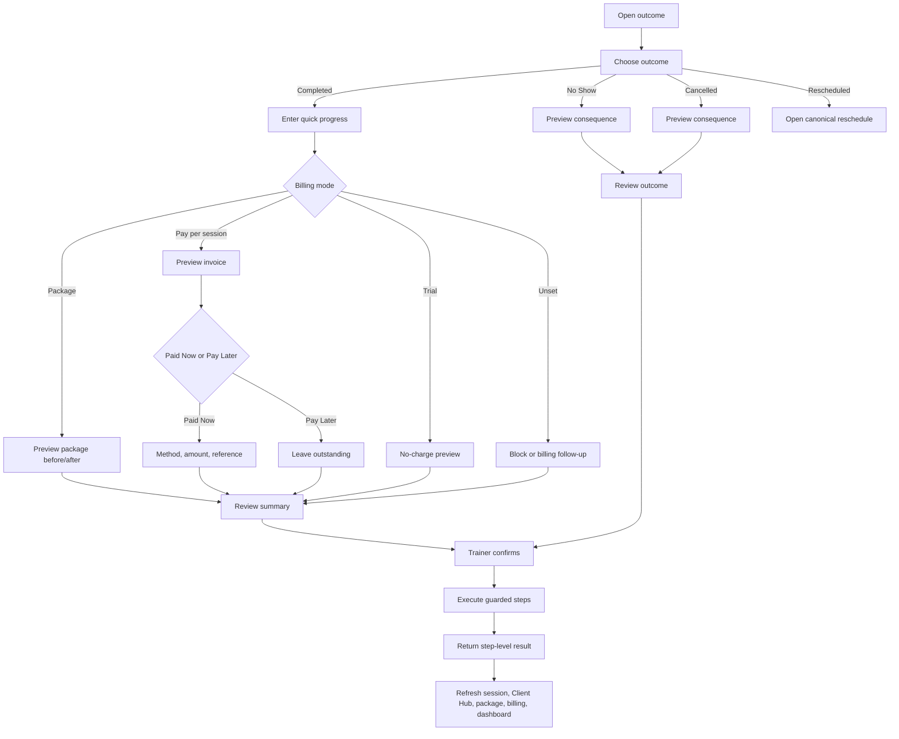

> **Status:** Target direction — adopted as canonical intent, NOT implemented state.
> **Adopted:** 2026-07-19 · **Source:** `FITDESK_SESSION_COMPLETION_FLOW_SPECIFICATION_V1.md` (documentation pack) · **sha256 (source body):** `c9937a62ad9ee40c23d75140bafb492988b80d08d91d9f1b145e7c99b25a4871`
> **Implementation reality:** see `docs/audits/FITDESK_IMPLEMENTATION_STATUS_RECONCILIATION_2026-07-19.md`
> **Rule:** This document describes intended product direction. Do not cite it as evidence
> that a capability exists. Verify against code before planning or estimating work.
>
---

# FitDesk Session Completion Flow Specification v1

```text
Product: FitDesk SaaS Platform
Document: Session Completion Flow Specification
Version: v1.0
Status: Product/domain flow specification — repository verification required
Primary flow: SessionCompletionSheet
Generated: 2026-07-18
```

> **Adoption discipline:** Verify the current completion service, progress persistence, package/invoice/payment hooks, idempotency, and UI placement before adoption.

## 1. Objective

Resolve the real session outcome, quick progress, and applicable financial consequence in one coherent trainer experience without hiding distributed-system truth.

```text
One trainer review window ≠ one opaque cross-system transaction
```

## 2. Outcomes

```text
Completed · No Show · Cancelled · Rescheduled
```

The trainer may resolve immediately or later from an unresolved-session attention item.

## 3. Entry Points

- Today session card;
- Session Detail;
- Needs Attention unresolved item;
- Client Hub Sessions;
- offline reconciliation review.

All open the same contract.

Illustrative URL state:

```text
/sessions/{sessionId}?sheet=complete
```

## 4. Preconditions

Before confirmation, resolve:

- authenticated actor/tenant;
- session identity/version;
- mutable/immutable state;
- client;
- date/time/type/location;
- billing mode;
- active package/units if Package;
- session price/currency if PPS;
- Trial/no-charge state;
- prior invoice/payment if a prior attempt may exist;
- safety/billing blockers;
- online/offline/freshness state.

## 5. Main Flow



## 6. Progress

Completed includes fast **Session progress**:

- concise note;
- performance/measurement/milestone;
- client-reported observation;
- trainer observation;
- trainer interpretation;
- pain/recovery/safety concern;
- next-session focus.

Rules:

- no mandatory long report;
- formal multi-session Progress Report remains future;
- trainer-private content is not auto-shared;
- source session/time retained;
- safety-relevant content may require acknowledgment;
- progress survives later financial failure.

Optional pilot:

```text
Short text
→ structured draft + source phrases
→ uncertainty/safety highlighting
→ trainer edits
→ canonical review
```

The parser performs no outcome/package/invoice/payment mutation.

## 7. Billing Branches

### Package

Show:

```text
Package name · Balance before · Units consumed · Balance after
```

Rules:

- no routine payment form;
- consume only after confirmed completion;
- prevent negative/duplicate consumption;
- if exhausted, preserve progress and open resolver.

Hardening resolver choices:

```text
Renew/assign package
Convert this session to PPS
Mark complimentary
Mark billing for review
Cancel completion
```

### Pay per session

Show:

```text
Session rate · Invoice amount · Paid Now / Pay Later
```

Paid Now reveals authoritative payment methods, amount, optional reference, and allocation context.

Rules:

- invoice created only on confirmed completion;
- do not silently substitute Cash/another method;
- reuse the same Record Payment contract as Invoice/Statement;
- payment uncertainty is not success.

### Trial

Explicit no-charge state. No invoice, package consumption, or payment.

### Unset / Decide later

Fail closed or create a visible billing follow-up. Never invent price or complimentary status.

## 8. No Show and Cancelled

Show normal consequence before confirmation.

Hardening may support:

- package deduction or charge per approved policy;
- one-occurrence waiver with structured reason;
- normal vs waived result;
- explicit scope and audit.

Submitted invoices or confirmed payments use financial correction, never silent edit.

## 9. Rescheduled

Open the canonical BookingSheet/reschedule contract.

Checks:

- overlap;
- buffer;
- working hours;
- location confidence;
- recurrence scope;
- timezone/DST;
- expected version;
- package/billing impact;
- idempotency.

Completion does not implement a second scheduling engine.

## 10. Review Screen

Show:

- client;
- date/time;
- current and selected outcome;
- progress/safety concern;
- next-session focus;
- package before/after;
- invoice amount/no-charge reason;
- Paid Now/Pay Later;
- payment method/amount;
- waiver/exception and reason;
- missing configuration;
- records to change.

No authoritative mutation before confirmation.

## 11. Execution Contract

Conceptual order:

```text
1. Authorize tenant, actor, session, client.
2. Validate expected session version and mutable state.
3. Validate outcome and required fields.
4. Persist/confirm outcome according to domain contract.
5. Persist progress and next-focus event.
6. Package: consume exactly one unit.
7. PPS: create exactly one session invoice.
8. Paid Now: create exactly one Payment Entry.
9. Write linked audit events.
10. Refresh authoritative and derived reads.
```

Exact ordering/transaction boundaries require audit. Result reports each step independently.

Suggested shape:

```ts
type SessionCompletionResult = {
  operationId: string;
  session: StepResult;
  progress: StepResult;
  packageConsumption?: StepResult;
  invoice?: StepResult;
  payment?: StepResult;
  audit: StepResult;
  overall: "confirmed" | "partial" | "blocked" | "uncertain";
  safeNextActions: string[];
};
```

## 12. Idempotency and Concurrency

Required inputs:

- operation/idempotency key;
- expected session version;
- tenant from authenticated context;
- actor;
- entry point;
- offline intent ID when applicable.

Guards:

- immutable completed/cancelled state;
- unique session-invoice linkage;
- unique package-consumption linkage;
- payment duplicate protection;
- stale-version rejection;
- authoritative query after timeout/uncertainty.

## 13. Partial Failure and Recovery

### Progress fails before financial steps

- preserve draft;
- do not claim saved;
- stop if policy requires progress;
- offer retry/manual correction.

### Session succeeds, package consumption fails

- show outcome truth;
- preserve progress;
- mark package unresolved;
- block duplicate completion;
- open package recovery.

### Session succeeds, invoice fails

- show outcome/progress success;
- show financial follow-up unresolved;
- prevent duplicate outcome;
- retry invoice through linked recovery operation.

### Invoice succeeds, payment fails

- keep invoice outstanding;
- do not claim payment;
- query ERP before retry if uncertain;
- create payment recovery item.

### Uncertain external result

```text
Status could not be confirmed.
Do not retry yet.
Check authoritative state first.
```

## 14. Offline Completion

Capture locally:

- intended outcome;
- progress;
- next-session focus;
- observed session/package/billing versions;
- local intent ID/time.

Not completed offline:

- authoritative outcome;
- package consumption;
- invoice;
- payment;
- message send.

Reconcile:

```text
Authenticate
→ reload authority
→ compare versions
→ recalculate consequences
→ unchanged: execute once
→ changed: revised review
→ uncertain: query and block duplicate retry
```

## 15. Trainer-Facing States

```text
Draft
Saved on this device
Waiting to sync
Checking current state
Review required
Ready to confirm
Completing
Partially completed
Payment recovery required
Result unconfirmed — do not retry
Confirmed
```

## 16. Accessibility

- Real radio/button outcome controls.
- Persistent labels.
- Currency and tabular numerals.
- Announce dynamic billing sections.
- Focus errors and restore focus after nested sheets.
- Linear screen-reader review summary.
- Announce success/partial/uncertain without color-only meaning.
- Mobile touch targets.

## 17. Acceptance Criteria

1. Package clients see no irrelevant routine payment fields.
2. PPS clients choose Paid Now/Pay Later without leaving completion.
3. Manual invoice creation is hidden.
4. Trial creates no charge.
5. Unset billing invents nothing.
6. Progress survives recoverable financial failure.
7. Duplicate submits cannot duplicate outcome/package/invoice/payment.
8. Partial/uncertain result states exactly what succeeded.
9. Reschedule reuses scheduling contract.
10. Offline intent claims no authority before reconciliation.
11. Dashboard/Client Hub refresh after confirmation.
12. Cross-tenant, stale-version, and immutable-state tests pass.

## 18. Repository Verification

- Completion sheet/equivalent.
- `actions/schedulingActions.ts` responses.
- `sessionCompletionService.ts`.
- Progress model/event path.
- Version/idempotency fields.
- Package-consumption uniqueness.
- Session-invoice linkage.
- Record Payment action/allocation.
- Unresolved-session derivation.
- Offline library/encryption.
- Unit/integration/E2E coverage.
