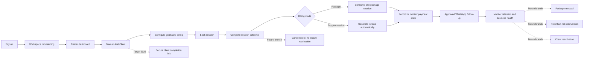

# FitDesk User Journey Map — Current MVP to Target 2026 Experience

```text
Product: FitDesk SaaS Platform
Document: User Journey Map
Version: v1.1
Status: Product-owner approved — v1.1 amendments applied
Primary user: Independent personal trainer managing their own clients
Scope: Signup through ongoing client retention
Journey posture: Current-state friction + target 2026 experience
Service-blueprint depth: Lightweight
Architecture posture: Incremental, non-rewrite, business-logic-preserving
```

---

> **Core design axiom**
>
> **Make safe actions feel fast—never make consequential actions merely appear fast.**

This axiom governs every FitDesk interaction involving billing, payments, package consumption, ERP synchronization, booking, session outcomes, cancellations, no-shows, rescheduling, and WhatsApp sending.

## 1. Executive Summary

FitDesk should feel like a calm operational command center for an independent personal trainer.

The core journey is:

```text
Signup
→ workspace provisioning
→ trainer manually adds client
→ configure goals and billing
→ book session
→ complete session
→ consume package or generate invoice
→ collect payment
→ follow up through WhatsApp
→ monitor retention and business health
```

The current/MVP onboarding path is **Trainer Manual Add Client**. A **Secure Client Completion Link** is a target 2026 enhancement and is not a blocker for the current UI/UX modernization plan.

Cancellation, no-show, package renewal, retention risk, and client reactivation are target/future branches. They should be designed into the journey architecture without delaying the core MVP journey.

The experience must preserve FitDesk’s existing business and architecture rules:

- ERPNext Customer remains the canonical client identity.
- ERP I/O continues through the existing FitDesk ERP client, Control Plane proxy, and ERP Execution Service boundary.
- Manual invoice creation remains hidden from the normal trainer workflow.
- Package and pay-per-session billing follow separate automated branches.
- Financial, scheduling, ERP, package-consumption, and WhatsApp actions are confirmed-first.
- AI suggests; the trainer reviews and approves; the system executes; the result is recorded.

---

## 2. Journey Scope Decisions

| Decision | Approved direction |
|---|---|
| User lanes | Trainer, client, and FitDesk platform operations |
| Primary persona | Independent personal trainer managing their own clients |
| Journey span | Signup through ongoing client retention |
| Perspective | Current-state problems plus target 2026 journey |
| Current client onboarding | Trainer manually creates the client |
| Target onboarding enhancement | Trainer creates the basic profile; client completes details through a secure link |
| Billing branches | Package and pay-per-session |
| Channels | Mobile, desktop, WhatsApp, and future client portal |
| Service-blueprint depth | Lightweight, not a technical architecture diagram |
| Future branches | Cancellation, no-show, renewal, retention risk, and reactivation |

---

## 3. Primary Persona

### Independent Personal Trainer

**Context**

- Runs a solo coaching business.
- Works between the gym floor, mobile phone, and desktop.
- Manages sales, scheduling, coaching, billing, payments, and communication personally.
- Often adds or updates client information during a live conversation.
- Needs the system to reduce administration rather than create additional work.

**Primary goals**

1. Know what requires attention immediately.
2. Add a client quickly and safely.
3. Book sessions without conflicts.
4. Complete session outcomes correctly.
5. Collect money without manual invoice complexity.
6. Maintain accurate package balances.
7. Communicate through approved WhatsApp actions.
8. Identify missing next sessions and retention risks.
9. Understand business health.
10. Recover safely when ERP or provisioning is unavailable.

**Core anxieties**

- “Did the client save correctly?”
- “Will I accidentally bill the client twice?”
- “Did the package balance update?”
- “Is this time slot really available?”
- “Did the WhatsApp message actually send?”
- “What do I need to do next?”

**FitDesk promise**

> FitDesk keeps the trainer in control while making the correct next action obvious.

---

## 4. Secondary Actors

### Client

The client is initially a recipient of trainer-managed actions: booking, payment requests, invoices, and WhatsApp communication. In the target journey, the client can complete profile, intake, consent, and other deferred information through a secure mobile link.

### FitDesk Platform Operations

The platform lane represents invisible system support: authentication, tenant provisioning, job orchestration, ERP execution, retries, audit logging, synchronization, and safe failure recovery. This lane should remain mostly invisible unless the trainer must act.

---

## 5. Experience Principles

### Make safe actions feel fast

FitDesk should remove friction from navigation, data entry, review, and reversible presentation state. It must not simulate speed by claiming that a consequential action succeeded before the authoritative system confirms it.

### Action before analytics

The trainer should see urgent work, session outcomes, payment collection, and client follow-up before secondary metrics.

### Progressive disclosure

Show only what is needed for the current decision. Reveal goals, billing details, safety information, and advanced options contextually.

### Mobile-first execution

Use bottom sheets, sticky action regions, large touch targets, short forms, and one-handed actions on mobile. Use contextual drawers, keyboard navigation, and denser layouts on desktop.

### Confirmed-first business actions

Do not show financial, ERP, booking, session, package, or WhatsApp actions as complete until the server confirms success.

### Human sovereignty

AI may prepare a draft or recommendation, but the trainer approves every meaningful action.

### Recoverability

Every failure state should explain what happened, what was preserved, and what the trainer can safely do next.

---

## 6. End-to-End Journey Overview



---

## 7. Detailed Journey Map

### Stage 1 — Signup and Account Creation

| Dimension | Journey detail |
|---|---|
| Trainer goal | Create an account and understand what FitDesk will do for the business. |
| Current/MVP action | Register, authenticate, and enter the onboarding route. |
| Primary touchpoints | Signup screen, authentication confirmation, onboarding entry screen. |
| Trainer thought | “How quickly can I start using this with a real client?” |
| Desired emotion | Interested → reassured. |
| Current risks | Generic SaaS signup, unclear time to workspace readiness, too much setup before value. |
| Target 2026 experience | Minimal signup, clear progress, realistic readiness expectations, one obvious next step. |
| Key UX requirements | Clear account status; no technical tenant terminology; accessible authentication; mobile-first input. |
| Success metrics | Signup completion rate; authentication failure rate; time from signup to onboarding start. |

**Lightweight backstage layer**

- Better Auth creates and validates the user session.
- FitDesk establishes the authenticated user context.
- No ERP credentials are stored in the product application.

---

### Stage 2 — Workspace Provisioning

| Dimension | Journey detail |
|---|---|
| Trainer goal | Get a usable workspace without understanding infrastructure. |
| Current/MVP action | Open `/onboarding`, select **Start Workspace**, and wait for provisioning confirmation. |
| Primary touchpoints | Onboarding status screen, progress state, retry/recovery message, completion CTA. |
| Trainer thought | “Is it working, and can I safely leave this screen?” |
| Desired emotion | Uncertain → informed → confident. |
| Current risks | Long opaque waits, duplicate clicks, technical errors, uncertainty about whether retrying creates duplicate workspaces. |
| Target 2026 experience | Real state-machine progress, an idempotent **Start Workspace** action, calm explanations, safe leave-and-return behavior, recoverable retry, and automatic transition to the next useful action. |
| Key UX requirements | Every visible step must map to an actual Control Plane state; never advance progress because a timer elapsed; disable duplicate submission; preserve state across refresh; allow the trainer to leave and return safely; distinguish waiting, blocked, failed, and completed; never expose secrets or infrastructure details. |
| Success metrics | Provisioning success rate; median workspace-ready time; duplicate-attempt rate; recovery success; support requests per provisioning. |

**Lightweight backstage layer**

- FitDesk calls the Control Plane.
- The Control Plane owns orchestration, state machines, idempotency, locking, logs, and retries.
- The Provisioning Agent remains a thin transitional bridge with no business logic.
- ERP execution happens through the ERP Execution Service.

---

### Stage 3 — First Entry into the Trainer Command Center

| Dimension | Journey detail |
|---|---|
| Trainer goal | Understand what to do first. |
| Current/MVP action | Land on the dashboard and begin the first client workflow. |
| Primary touchpoints | Daily Brief, Needs Attention, Today Timeline, Quick Actions, empty-state guidance. |
| Trainer thought | “What is the next action that gets me value?” |
| Desired emotion | Oriented and in control. |
| Current risks | Empty dashboards, analytics without action, competing CTAs, desktop-heavy navigation on mobile. |
| Target 2026 experience | Command-center empty state with a primary **Add Client** action and a short explanation of the operating loop. |
| Key UX requirements | One dominant first action; mobile FAB or bottom-sheet launcher; concise desktop quick action; calm onboarding checklist. |
| Success metrics | Time to first Add Client start; first-session booking completion; abandonment from empty dashboard. |

**Lightweight backstage layer**

- The dashboard reads tenant-scoped summaries.
- Unavailable ERP states are translated into safe trainer-facing messages.

---

### Stage 4 — Trainer Manually Adds a Client

| Dimension | Journey detail |
|---|---|
| Trainer goal | Capture the client during a live conversation without losing momentum while establishing a valid billing posture. |
| Current/MVP action | Open Add Client, complete the three-field identity step, choose the mandatory commercial mode, optionally continue to goals/context, review, and save. |
| Primary touchpoints | Mobile bottom sheet; desktop contextual drawer; identity step; billing-mode cards; phone input; duplicate warning; success state. |
| Trainer thought | “I need this person saved correctly in a few seconds, without creating an unbillable record.” |
| Desired emotion | Fast, focused, confident. |
| Current risks | Duplicate client, invalid phone, form overload, orphaned billing state, multiple Add Client implementations drifting, unclear save status. |
| Target 2026 experience | One responsive Add Client component with a short linear flow: identity, mandatory commercial setup, optional/deferrable goals and context, review, then confirmed success. |
| Key UX requirements | Identity defaults to exactly **Full name, Phone, WhatsApp preference**; billing mode is mandatory and never silently defaulted; E.164 normalization; unsaved-change protection; accessible sheet/dialog behavior; no early success before ERP and local projection succeed. |
| Success metrics | Median identity-entry time; full-flow completion time; billing-mode completion; duplicate-warning rate; duplicate override rate; create failure/recovery rate. |

**Current/MVP onboarding rule**

The trainer manually creates the client. This is the primary modernization path and must remain fully usable without a client portal or AI.

**Approved linear Add Client flow**

```text
Step 1 — Client identity
Full name
Phone
WhatsApp preference

Step 2 — Commercial setup (mandatory)
Package
or
Pay per session

Step 3 — Goals and context
Optional or deferrable where existing validation permits

Step 4 — Review and create
Show the selected billing consequence before confirmation
```

The commercial step must use plain consequences:

```text
Package
Create the package invoice now.
Choose Paid Now or Pay Later.

Pay per session
Save the session price.
Create an invoice only after a session is completed.
```

**Target 2026 enhancement — not a blocker**

After the basic client is created, FitDesk may offer a secure completion link so the client can add deferred information on their own phone. This enhancement must not delay the current Add Client modernization.

**Lightweight backstage layer**

- FitDesk validates and normalizes the input.
- Duplicate checks remain tenant-scoped.
- ERP Customer creation uses the approved ERP client and proxy path.
- Local client read-model rows are written after ERP success.
- Creating the identity record alone does not create an invoice, payment, WhatsApp send, session, or program. A package invoice is created only after the trainer explicitly confirms Package commercial setup.

---

### Stage 5 — Configure Goals and Confirm Billing Rules

| Dimension | Journey detail |
|---|---|
| Trainer goal | Capture why the client is training and confirm how the selected billing mode behaves. |
| Current/MVP action | Select one or more goals, configure each selected goal one at a time, review the full goal set, and confirm the Package or Pay-per-session consequence. |
| Primary touchpoints | Goal selector; one-goal-at-a-time configuration screen; sub-goal pills; primary-goal control; urgency selector; compact review summary; billing consequence card. |
| Trainer thought | “I need the system to understand the coaching goal and billing rule without making setup slow.” |
| Desired emotion | Structured but not overwhelmed. |
| Current risks | Too many goals at once, accordion exhaustion, hidden gesture-only controls, conflicting goals, hidden safety implications, confusion between package price and per-session rate, accidental financial side effects. |
| Target 2026 experience | **Select goals → configure one selected goal at a time → review all goals**; visible Back/Continue controls; clear single-primary rule; inline conflict and safety guidance; distinct billing branches; financial consequences explained before confirmation. |
| Key UX requirements | Mobile never depends on swiping; only one goal configuration is active at a time; every gesture has a visible control; no manual invoice creation; package and pay-per-session remain visually distinct; safety signals run at goal-save time; confirmed-first financial actions. |
| Success metrics | Goal-selection completion; per-goal configuration completion; review correction rate; billing-mode completion; safety-review rate; billing setup errors. |

#### Approved mobile goal flow

```text
Select goals
→ configure one selected goal at a time
→ continue automatically to the next selected goal
→ review all selected goals in a compact summary
→ save
```

Each goal configuration screen contains:

- Sub-goal pills.
- Set-as-primary control.
- Urgency selector.
- Optional trainer note.
- Sticky **Continue** action.

Desktop may use an accessible accordion or split-panel layout because more space is available. Swipe navigation may be offered as a secondary enhancement, but it must never be the only way to proceed.

#### Package branch

```text
Trainer chooses Package
→ selects package and commercial terms
→ FitDesk automatically generates the package invoice
→ trainer records Paid Now or Pay Later
→ package balance becomes visible after confirmed creation
```

#### Pay-per-session branch

```text
Trainer chooses Pay per session
→ stores the session price on the client record
→ no invoice is created during setup
→ invoice is generated only after a session is completed
```

**Lightweight backstage layer**

- Goal data remains structured and tenant-scoped.
- ERP-backed financial operations continue through the existing proxy path.
- Package creation and invoice generation preserve current financial hooks.
- No optimistic success is used for billing state.

---

### Stage 6 — Book a Session

| Dimension | Journey detail |
|---|---|
| Trainer goal | Find a valid time and book it without conflicts or timezone mistakes. |
| Current/MVP action | Open booking, choose client, date/time, duration, and recurrence where allowed; review conflicts; confirm. |
| Primary touchpoints | Mobile booking sheet, desktop schedule panel, availability feedback, conflict message, booking confirmation. |
| Trainer thought | “Is this slot truly available, and did it book only once?” |
| Desired emotion | Certain and efficient. |
| Current risks | Timezone/DST confusion, recurrence ambiguity, hidden conflicts, duplicate submissions, booking shown as complete before persistence. |
| Target 2026 experience | Conflict-aware flow with structured explanations, clear local time, recurrence preview, one confirmed booking result, and easy recovery. |
| Key UX requirements | Preserve scheduling engine boundaries; structured conflict responses; DST-safe display; confirmed-first persistence; no direct schedule logic inside UI components. |
| Success metrics | Booking completion rate; conflict resolution rate; duplicate booking attempts; booking error rate; time to book. |

**Lightweight backstage layer**

- The scheduling engine remains pure and conflict-aware.
- Booking orchestration stays in the booking service.
- Persistence stays in the session repository.
- Server actions expose structured results to the UI.

---

### Stage 7 — Prepare for and Deliver the Session

| Dimension | Journey detail |
|---|---|
| Trainer goal | Know who is next, what the client is working toward, and whether anything requires attention. |
| Current/MVP action | Review Today Timeline, client goal summary, package/payment status, and relevant notes. |
| Primary touchpoints | Today Timeline, client summary sheet, goal badges, safety state, quick message action. |
| Trainer thought | “What do I need to know before this client arrives?” |
| Desired emotion | Prepared. |
| Current risks | Information spread across screens, important safety note buried, no clear primary goal, excessive dashboard detail. |
| Target 2026 experience | Compact pre-session context with the next client, primary goal, relevant safety state, recent note, and one-tap actions. |
| Key UX requirements | Actionable summary, no medical overreach, clear unavailable data state, minimal scrolling on mobile. |
| Success metrics | Timeline engagement; pre-session client-summary use; missed-safety-review rate; navigation depth before session. |

**Lightweight backstage layer**

- FitDesk composes trainer-facing summaries from approved local and ERP-backed sources.
- Data remains tenant-scoped.

---

### Stage 8 — Complete the Session Outcome

| Dimension | Journey detail |
|---|---|
| Trainer goal | Record what happened and trigger the correct downstream business action. |
| Current/MVP action | Tap an outcome—or optionally swipe only to reveal it—review the exact consequence, explicitly confirm, and wait for the server-confirmed result. |
| Primary touchpoints | Timeline outcome affordance; consequence-preview sheet; confirmation action; processing state; package/invoice result; error recovery. |
| Trainer thought | “I need the session recorded and the money/package logic handled correctly.” |
| Desired emotion | Decisive → reassured. |
| Current risks | Gesture-triggered accidental execution, invalid client-side Undo assumptions, double completion, stale session version, package deduction failure, invoice duplication, unclear partial failure. |
| Target 2026 experience | **Tap or swipe to reveal → preview the exact consequence → trainer confirms → server processes → confirmed result and audit trail.** |
| Key UX requirements | Swipe may accelerate selection but never execute the mutation; preserve version checks; financial hooks remain intact; never show completion until server confirmation; no five-second Undo promise for ERP, package, invoice, payment, or message effects; explain partial failures and retry safety. |
| Success metrics | Outcome completion rate; accidental-action rate; duplicate-completion prevention; package/invoice automation success; recovery rate. |

#### Package completion branch

```text
Session completed
→ verify current session state/version
→ consume one package session
→ refresh package balance
→ show confirmed remaining balance
```

#### Pay-per-session completion branch

```text
Session completed
→ verify current session state/version
→ generate the session invoice automatically
→ show confirmed invoice/payment status
```

#### Consequence-preview examples

Package client:

```text
Complete Sarah’s session?

Package balance:
8 sessions → 7 sessions

[Cancel] [Complete and deduct]
```

Pay-per-session client:

```text
Complete Sarah’s session?

This will create a $50 invoice after completion.

[Cancel] [Complete and create invoice]
```


**Lightweight backstage layer**

- Session completion remains trainer-authorized and tenant-scoped.
- Package consumption or invoice generation happens through existing domain services.
- ERP writes continue through the Control Plane proxy path.
- Audit events record the confirmed outcome.

---

### Stage 9 — Collect or Record Payment

| Dimension | Journey detail |
|---|---|
| Trainer goal | Know what is due and record collection without accounting complexity. |
| Current/MVP action | Review invoice status, choose the supported payment route, confirm collection, or leave as outstanding. |
| Primary touchpoints | Payment sheet, invoice summary, Paid Now / Pay Later, outstanding status, receipt/confirmation. |
| Trainer thought | “Has the payment been recorded correctly?” |
| Desired emotion | Trust and closure. |
| Current risks | Manual invoice creation, ambiguous invoice status, duplicate payment entry, provider failure, stale balance. |
| Target 2026 experience | Payment action begins from the client/session context, speaks in trainer language, keeps accounting mechanics in an optional audit-details layer, and returns a confirmed result. |
| Key UX requirements | Confirmed-first; idempotent payment request; clear outstanding state; action copy such as **Record $50 cash**, **Mark as paid**, **Send payment link**, **3 sessions remaining**, and **Payment still due**; no raw ERP terminology in the primary flow; safe retry messaging. |
| Success metrics | Collection rate; payment-entry success; duplicate prevention; time from invoice to payment; overdue balance trend. |

**Lightweight backstage layer**

- Payment provider behavior remains behind the payment abstraction.
- ERP Sales Invoice and Payment Entry operations use the approved proxy path.
- Financial state is refreshed after confirmation.

---

### Stage 10 — Follow Up through WhatsApp

| Dimension | Journey detail |
|---|---|
| Trainer goal | Send a relevant, approved message with minimal effort. |
| Current/MVP action | Choose a message action, review the message, approve sending, and see the result. |
| Primary touchpoints | Message preview sheet, template/suggestion, recipient confirmation, send result, message history. |
| Trainer thought | “Is this the right client, message, and timing?” |
| Desired emotion | Helpful and in control. |
| Current risks | Silent send, wrong recipient, AI overreach, duplicate send, unclear delivery state. |
| Target 2026 experience | Contextual message suggestion, editable preview, explicit send approval, confirmed result, and recorded history. |
| Key UX requirements | AI suggests only; trainer approves; no optimistic delivery state; recipient shown clearly; retries do not duplicate messages. |
| Success metrics | Message approval rate; send success; duplicate-send prevention; response/engagement rate; time to follow up. |

**Lightweight backstage layer**

- Evolution API handles WhatsApp execution through the approved integration.
- FitDesk records the request and outcome.
- Message generation never directly triggers sending.

---

### Stage 11 — Monitor Retention and Business Health

| Dimension | Journey detail |
|---|---|
| Trainer goal | Know what needs attention today and which clients or payments may become risks. |
| Current/MVP action | Review Daily Brief, Needs Attention, Today Timeline, Business Health, Client Pulse, and Quick Actions. |
| Primary touchpoints | Trainer Command Center; client cards; overdue payment actions; missing-next-session prompts; package balance indicators. |
| Trainer thought | “What should I act on now to keep clients and revenue healthy?” |
| Desired emotion | In control, not overwhelmed. |
| Current risks | Analytics without action, too many cards, duplicate alerts, inaccurate projections, retention insights without explainability. |
| Target 2026 experience | Action-first prioritization, clear urgency, explainable signals, one-step route to the next task, and calm empty states. |
| Key UX requirements | Needs Attention remains transactional; Client Pulse remains strategic; metrics use reliable sources; AI recommendations require trainer approval. |
| Success metrics | Needs-Attention resolution time; overdue balance reduction; missing-next-session resolution; weekly active use; client retention. |

**Lightweight backstage layer**

- Local read models provide fast trainer-facing summaries.
- ERP remains authoritative for financial records.
- The Control Plane supports reliable orchestration and recovery where asynchronous jobs are introduced.

---

## 8. Cross-Journey Recovery State Model

FitDesk must map backend reality to precise, honest operator-facing states. Generic errors and unsupported reassurance are both prohibited.

| Discovered system state | Honest trainer-facing response | Required interaction behavior |
|---|---|---|
| **Request rejected before mutation** | “We couldn’t process this update. Nothing changed. Correct the issue and try again.” | Preserve all form inputs; keep the correction path available; allow safe retry. |
| **Outcome uncertain** | “Status unconfirmed. Do not retry yet. We’re checking the business record safely.” | Disable duplicate execution; show a scoped checking state; perform a targeted authoritative status query; escalate to a clear manual recovery path if status cannot be resolved. |
| **ERP succeeded; local summary is lagging** | “Session successfully completed. Your dashboard summary may take a moment to refresh.” | Allow navigation; mark only the affected summary as **Syncing**; do not roll back or repeat the completed domain action. |
| **Durable offline command queued — future only** | “Network offline. This update is in your offline queue and will sync automatically.” | Render only after a real durable outbox, idempotency keys, hosted retries, ordering rules, dead-letter handling, restart survival, and reconciliation visibility exist. |

### Recovery rules

- Never claim that data is “safely locked locally” unless durable queue infrastructure proves that statement.
- Never use a client-side timeout or toast as evidence of domain success.
- Never enable retry while the prior outcome is genuinely uncertain.
- A known confirmed domain success may coexist with a temporarily stale local projection.
- The **Syncing** state belongs to the specific affected record or metric, not as a vague global success banner.
- Consequential actions require authoritative confirmation; reversible presentation actions may remain optimistic.

---

## 9. Current/MVP Path versus Target 2026 Path

| Journey area | Current/MVP modernization | Target 2026 enhancement |
|---|---|---|
| Client creation | Trainer manually adds the client | Contact import and secure self-completion |
| Client information | Trainer captures minimum required data | Client completes deferred profile, intake, consent, and forms |
| Goals | Trainer selects goals, configures them one at a time, and reviews the set | Rich progress benchmarks and program recommendations |
| Billing | Package or pay-per-session rules configured by trainer | Self-service checkout or secure payment links where approved |
| Scheduling | Trainer books sessions | Client request/self-booking within trainer rules |
| Session outcomes | Completed outcome drives package/invoice logic | Cancellation, no-show, reschedule, and policy-aware financial branches |
| Communication | Trainer reviews and sends WhatsApp | More contextual drafts and approved automation sequences |
| Retention | Basic missing-next-session and overdue-payment awareness | Explainable retention-risk signals and interventions |
| Lifecycle | Active-client workflow | Renewal, reactivation, and structured offboarding |

---

## 10. Target/Future Journey Branches

These branches should be represented in design and data planning, but they are not blockers for the core MVP modernization.

### 10.1 Cancellation

```text
Trainer opens session
→ chooses Cancelled
→ reviews policy and financial consequence
→ confirms
→ system records outcome and applies approved business rule
→ client communication is prepared for trainer review
```

### 10.2 No-show

```text
Trainer chooses No Show
→ decides whether package session is deducted or missed session is charged
→ confirms consequence
→ system applies the correct package/invoice rule
→ follow-up message is prepared for approval
```

### 10.3 Package renewal

```text
Balance approaches threshold
→ FitDesk surfaces a renewal opportunity
→ trainer reviews package and client context
→ trainer confirms renewal offer or invoice
→ payment and package state update after confirmation
```

### 10.4 Retention-risk intervention

```text
Explainable risk signal appears
→ trainer reviews evidence
→ chooses a follow-up action
→ message or booking action is prepared
→ trainer approves execution
```

### 10.5 Client reactivation

```text
Inactive client appears in reactivation list
→ trainer reviews history and status
→ prepares a message or consultation invitation
→ trainer approves contact
→ client becomes active only after a confirmed business event
```

---

## 11. Target Secure Client Completion Link

### Purpose

Reduce trainer data-entry burden after the trainer has created the basic client record.

### Target journey

```text
Trainer creates basic client
→ FitDesk offers “Send secure completion link”
→ trainer reviews and approves WhatsApp delivery
→ client opens a secure mobile web flow
→ client completes deferred information
→ client reviews consent where applicable
→ FitDesk validates and stores the information
→ trainer is notified that onboarding is complete or needs review
```

### Deferred information examples

- Date of birth and profile details.
- Emergency contact.
- Intake questionnaire.
- Consent and waiver acknowledgements.
- Health or safety information appropriate to the approved product scope.
- Communication preferences.

### Guardrails

- The manual trainer workflow remains fully functional without the secure link.
- The link does not create financial actions automatically.
- Sensitive information uses appropriate access control, audit, and retention rules.
- Completion status is explicit: not sent, sent, in progress, completed, needs review.

---

## 12. Lightweight Service Blueprint

| Journey stage | Trainer-facing layer | Supporting system layer | Confirmed outcome / record |
|---|---|---|---|
| Signup | Signup and authentication UI | Better Auth | Authenticated user/session |
| Provisioning | Real state-machine progress and recovery | Control Plane → Provisioning Agent → ERP Execution Service | Durable workspace provisioning state |
| Dashboard | Command Center | FitDesk read models + ERP-backed summaries | Current action list and business state |
| Add Client | Bottom sheet / drawer | FitDesk server action → ERP client/proxy → ERPNext; local repository | ERP Customer plus local client projection |
| Goals | Goal selection → one-at-a-time configuration → review | Goal taxonomy, safety/conflict services, local repository | Structured goal state and audit event |
| Billing setup | Billing-mode controls | Billing services → ERP proxy | Package invoice or stored session rate |
| Booking | Booking sheet and conflict UI | Scheduling engine → booking service → session repository | Confirmed booking and versioned session state |
| Complete session | Outcome sheet | Session service → package or invoice flow → ERP proxy | Confirmed outcome, package consumption, or invoice |
| Payment | Payment sheet | Payment abstraction → ERP Sales Invoice/Payment Entry path | Confirmed payment/outstanding state |
| WhatsApp | Message preview and send result | Message generation + Evolution API | Approved send request and message audit |
| Retention | Needs Attention and Client Pulse | Local summaries, ERP-backed facts, approved risk logic | Actionable and explainable trainer tasks |

### Boundary rules

- No direct Docker execution from the Control Plane.
- No business logic is added to the Provisioning Agent.
- No ERP credentials are stored in FitDesk.
- All ERP I/O uses the existing ERP client/proxy path.
- Frontend components do not bypass domain services or repositories.

---

## 13. Emotion Curve

| Stage | Likely current emotion | Target emotion |
|---|---|---|
| Signup | Curious | Reassured |
| Provisioning | Uncertain | Informed and patient |
| First dashboard | Unsure where to start | Oriented |
| Add Client | Rushed | Fast and confident |
| Goals and billing | Cautious | Guided |
| Booking | Concerned about conflicts | Certain |
| Session completion | Worried about downstream effects | Decisive and reassured |
| Payment | Concerned about accuracy | Trusting |
| WhatsApp | Concerned about mistakes | In control |
| Retention monitoring | Overwhelmed by business tasks | Focused and proactive |

---

## 14. Highest-Priority UX Opportunities

### MVP / pilot-safe now

1. **Provisioning clarity and recoverability** — real state-machine progress, idempotent start, safe leave-and-return, safe retries, and no technical jargon.
2. **Unified Add Client surface** — mobile bottom sheet and desktop drawer using one component and one business flow.
3. **Short manual creation flow** — minimum required fields, reliable phone normalization, tenant-scoped duplicate detection.
4. **Structured goals with linear mobile focus** — select goals, configure one at a time, review all; one primary goal, urgency, conflict, and safety guidance.
5. **Unambiguous billing-mode selection** — Package versus Pay-per-session with consequences explained before confirmation.
6. **Conflict-aware booking** — structured errors, recurrence preview, DST-safe time display.
7. **Confirmed session outcome flow** — package consumption or invoice generation shown only after success.
8. **Action-first dashboard** — Needs Attention, Today Timeline, and Quick Actions before analytics.
9. **Approved WhatsApp flow** — preview, approve, send, and record.
10. **Consistent success, empty, unavailable, and recovery states** across all core routes.

### Production-hardening soon

- Accessibility acceptance and keyboard/focus verification.
- Visual regression coverage for high-risk flows.
- Core Web Vitals and route-performance baselines.
- Idempotency, outcome-locking, and authoritative status-query UX for ERP, payment, and messaging actions.
- Better partial-failure explanation, record-level syncing indicators, and repair workflows.
- Cancellation, no-show, and reschedule outcome branches.
- Package renewal prompts based on reliable balance data.

### Future platform architecture later

- Secure client completion link and client portal.
- Client self-booking within trainer-defined constraints.
- Explainable retention-risk recommendations.
- Reactivation campaigns with explicit trainer approval.
- Multi-trainer and studio-manager journey variants.
- Durable offline/outbox workflows only after idempotency keys, hosted retries, ordering, dead-letter handling, restart survival, and reconciliation visibility exist.
- More advanced automation only after audit, idempotency, and approval controls are mature.

---

## 15. Success Measurement Framework

### Activation

- Signup completion rate.
- Workspace provisioning success rate.
- Time from signup to workspace ready.
- Time from workspace ready to first client created.
- Time from first client to first session booked.

### Client management

- Median manual Add Client completion time.
- Client-create success and recovery rate.
- Duplicate detection and override rate.
- Goal and billing-mode completion rate.

### Scheduling and sessions

- Booking completion rate.
- Conflict-resolution success.
- Session outcome recording rate.
- Duplicate-completion prevention rate.

### Financial

- Package-consumption success rate.
- Pay-per-session invoice-generation success rate.
- Payment collection rate.
- Median invoice-to-payment time.
- Outstanding and overdue balance trend.

### Communication

- WhatsApp approval-to-send success rate.
- Duplicate-send prevention.
- Follow-up completion rate.

### Retention and business health

- Missing-next-session resolution rate.
- Package renewal rate when the branch is introduced.
- Client retention rate.
- Reactivation conversion when the branch is introduced.
- Needs-Attention resolution time.

### Experience quality

- Mobile completion rate for core workflows.
- Accessibility defect count.
- Core Web Vitals on key routes.
- Support requests per core journey stage.
- Trainer-reported confidence in billing and session outcomes.

---

## 16. Journey Acceptance Criteria

The target FitDesk journey is successful when an independent trainer can:

1. Create and provision a workspace without understanding infrastructure.
2. Add a client manually through a three-field identity step and a mandatory, explicit commercial setup step.
3. Configure selected goals one at a time, review them as a set, and confirm billing without triggering unintended actions.
4. Book a conflict-free session with clear time and recurrence behavior.
5. Complete the session once and see the correct confirmed package or invoice result.
6. Record or monitor payment without using manual ERP invoice screens.
7. Review and approve WhatsApp communication before sending.
8. Open the dashboard and immediately understand what requires attention.
9. Recover from rejected, uncertain, confirmed-but-stale, or unavailable system states without duplicating work or receiving false reassurance.
10. Continue using the full MVP journey even before the secure client completion link exists.

---

## 17. Product Decisions Preserved

- **Core design axiom:** make safe actions feel fast—never make consequential actions merely appear fast.
- **Current/MVP onboarding:** trainer manual Add Client.
- **Target onboarding:** secure client completion link after the basic record exists.
- **Secure link status:** enhancement, not a modernization blocker.
- **Mandatory commercial posture:** Package or Pay-per-session is explicitly selected during client creation; no silent default and no unbillable orphan state.
- **Package billing:** invoice generated automatically during package setup; trainer records Paid Now or Pay Later.
- **Pay-per-session billing:** session price stored on the client; invoice generated only after completed session.
- **Manual invoice creation:** hidden from the normal trainer journey.
- **Session outcomes:** tap/swipe may reveal an action, but explicit consequence preview and server confirmation are required before execution; no client-side Undo promise for financial effects.
- **Recovery:** copy must distinguish rejected, uncertain, confirmed-but-stale, and durably queued states.
- **WhatsApp:** trainer approval required before sending.
- **AI:** suggestion and drafting only; no autonomous execution.
- **Future branches:** cancellation, no-show, renewal, retention risk, and reactivation.
- **ERP boundary:** unchanged and authoritative.

---

## 18. Recommended Next Step

Use this journey map as the product-experience foundation for the canonical UI/UX modernization plan.

Before implementation begins, each modernization stage should reference the journey stage it improves and prove that it does not break the following critical chain:

```text
Client created
→ goals and billing mode stored
→ session booked
→ session completed
→ package decremented or invoice generated
→ payment recorded
→ WhatsApp follow-up approved
→ dashboard/action state updated
```

---

## 19. Progress Position

```text
Roadmap position: Product discovery before UI/UX modernization execution
Current artifact: User Journey Map v1.1
Current status: Product-owner approved; v1.1 amendments applied
Next artifact: Canonical FitDesk UI/UX Modernization Plan
Implementation status: Not started
```
